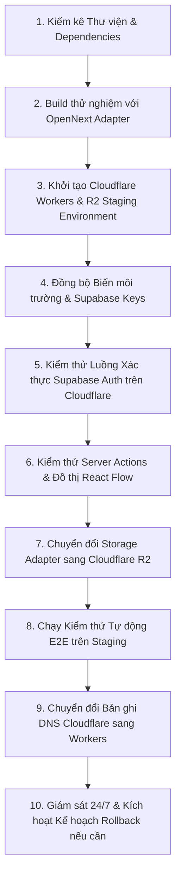

# Đánh giá Khả năng Chuyển dịch sang Cloudflare (Cloudflare Migration Readiness)

- **Mã tài liệu:** `ARCH-CLOUDFLARE-01`
- **Mã Kiến trúc liên quan:** `AR-010`, `CNT-008`, `ADR-0015`
- **Phiên bản:** `v0.1-baseline`
- **Trạng thái:** `PROVISIONAL`
- **Ngày ban hành:** 2026-08-29

---

## 1. Bảng Đánh giá Tương thích Tính năng Kỹ thuật với Cloudflare Workers

| Thành phần Kỹ thuật | Trạng thái Tương thích | Ghi chú Triển khai & Khuyến nghị |
| :--- | :---: | :--- |
| **Next.js App Router (SSR & RSC)** | `COMPATIBLE` | Hỗ trợ thông qua bộ công cụ OpenNext / `@cloudflare/next-on-pages`. |
| **Server Actions (Form Mutations)** | `COMPATIBLE` | Hoạt động chuẩn xác với cơ chế POST và CSRF tự động. |
| **Route Handlers (API / Streaming)**| `COMPATIBLE` | Tuân thủ Web Request/Response API tiêu chuẩn. |
| **Supabase SSR (`@supabase/ssr`)** | `COMPATIBLE` | Xử lý Cookie và xác thực JWT hoạt động tốt trên Edge Runtime. |
| **Web Crypto API (`crypto.subtle`)** | `COMPATIBLE` | Cloudflare Workers hỗ trợ 100% Web Crypto chuẩn. |
| **Lưu trữ Ảnh (Media Storage)** | `REQUIRES_ADAPTER` | Chuyển từ `SupabaseStorageAdapter` sang `CloudflareR2StorageAdapter`. |
| **Tác vụ Cron / Heartbeat** | `COMPATIBLE` | Hỗ trợ thông qua Cloudflare Cron Triggers hoặc GitHub Actions. |
| **Xử lý Ảnh Động (`sharp`)** | `REQUIRES_TEST` | Sử dụng Cloudflare Image Resizing hoặc resize phía trình duyệt máy khách. |

*(Lưu ý: Bảng đánh giá trên dựa trên tài liệu kỹ thuật chính thức hiện hành của Cloudflare; việc kiểm thử tương thích thực tế sẽ được chạy trong môi trường Staging ở các phase sau).*

---

## 2. Kế hoạch 10 Bước Chuyển dịch Sang Cloudflare (10-Step Migration Outline)

1. **Bước 1:** Rà soát toàn bộ `package.json`, đảm bảo không có package phụ thuộc vào C++ Node Addons.
2. **Bước 2:** Cấu hình build wrapper OpenNext cho Next.js App Router.
3. **Bước 3:** Tạo môi trường chạy thử nghiệm (Staging) trên tài khoản Cloudflare của dự án.
4. **Bước 4:** Cấu hình các biến môi trường `NEXT_PUBLIC_SUPABASE_URL`, `ANON_KEY`.
5. **Bước 5:** Kiểm tra quy trình đăng nhập, lưu cookie và làm mới phiên trên Edge.
6. **Bước 6:** Kiểm tra việc render Canvas React Flow và các Server Actions thêm/sửa/xóa.
7. **Bước 7:** Kích hoạt `CloudflareR2StorageAdapter` để lưu trữ ảnh đại diện trực tiếp trên R2.
8. **Bước 8:** Chạy toàn bộ kịch bản kiểm thử tích hợp và hiệu năng (Phase P22, P23).
9. **Bước 9:** Cập nhật bản ghi DNS của `genviet.app` trỏ trực tiếp vào Worker.
10. **Bước 10:** Theo dõi telemetry lỗi và sẵn sàng rollback DNS về Vercel trong vòng $< 60$ giây nếu có sự cố.
