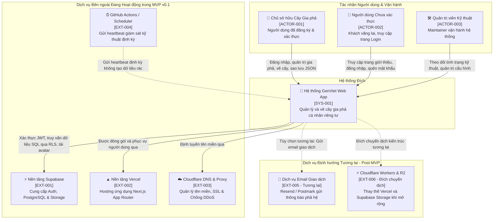

# Sơ đồ Bối cảnh Hệ thống (System Context Diagram - C4 Level 1)

- **Mã tài liệu:** `ARCH-CONTEXT-01`
- **Mã Kiến trúc liên quan:** `SYS-001`, `ACTOR-001..003`, `EXT-001..006`
- **Phiên bản:** `v0.1-baseline`
- **Trạng thái:** `PROVISIONAL`
- **Ngày ban hành:** 2026-08-29

---

## 1. Sơ đồ Bối cảnh C4 Context Diagram (Mermaid)

---

## 2. Bảng Danh mục Tác nhân & Hệ thống Bên ngoài

| Mã Thực thể | Tên Tác nhân / Hệ thống | Vai trò & Trách nhiệm trong Kiến trúc | Trạng thái MVP | Cấp độ Tin cậy (Trust Level) |
| :--- | :--- | :--- | :---: | :--- |
| **`ACTOR-001`** | **Chủ sở hữu Gia phả (Tree Owner)** | Quản trị tài khoản, tạo cây, thêm/sửa thành viên, xuất sao lưu JSON. | `ACTIVE` | `AUTHENTICATED_USER` (Được cấp quyền theo JWT) |
| **`ACTOR-002`** | **Người dùng Chưa xác thực (Guest)** | Xem trang đăng nhập, đăng ký, quên mật khẩu. | `ACTIVE` | `UNAUTHENTICATED` (Không có quyền đọc dữ liệu phả hệ) |
| **`ACTOR-003`** | **Quản trị viên Kỹ thuật (Maintainer)** | Giám sát vận hành, kiểm tra lỗi hệ thống và bảo trì hạ tầng. | `ACTIVE` | `INFRA_ADMIN` (Chỉ truy cập telemetry, không đọc trộm cây riêng tư) |
| **`SYS-001`** | **Hệ thống GenViet Web App** | Ứng dụng Next.js xử lý nghiệp vụ phả hệ, vẽ đồ thị và bảo vệ dữ liệu. | `ACTIVE` | `CORE_SYSTEM` (Vùng tin cậy ứng dụng) |
| **`EXT-001`** | **Supabase Platform** | Quản lý định danh (Auth), lưu trữ dữ liệu (Postgres RLS) và media (Storage). | `ACTIVE` | `TRUSTED_BACKEND_SERVICE` |
| **`EXT-002`** | **Vercel Platform** | Hạ tầng tính toán Serverless chạy Next.js App Router ban đầu. | `ACTIVE` | `HOSTING_PLATFORM` (Không lưu trữ dữ liệu bền vững) |
| **`EXT-003`** | **Cloudflare DNS & WAF** | Quản lý bản ghi DNS `genviet.app`, chứng chỉ SSL và bộ lọc an ninh mạng. | `ACTIVE` | `NETWORK_GATEWAY` |
| **`EXT-004`** | **GitHub Actions Scheduler** | Bắn request heartbeat kỹ thuật giữ ấm dịch vụ, không tạo dữ liệu giả. | `ACTIVE` | `AUTOMATED_HEALTH_PROBE` |
| **`EXT-005`** | **Email Provider (Resend/Postmark)**| Gửi email giao dịch (thông báo lời mời trong tương lai). | `FUTURE` | `EXTERNAL_ADAPTER` (Chưa kích hoạt trong v0.1) |
| **`EXT-006`** | **Cloudflare Workers & R2** | Đích đến chuyển dịch hạ tầng khi cần giảm chi phí và tối ưu hóa toàn cầu. | `FUTURE` | `MIGRATION_TARGET` (Được chuẩn bị qua adapter seams) |

---

## 3. Ranh giới Tin cậy Cốt lõi (Core Trust Boundaries)
1. **`TB-001` (Ranh giới Trình duyệt ↔ Next.js Server):** Người dùng gửi request qua Internet. Mọi dữ liệu đầu vào đều bị coi là chưa tin cậy và phải qua validation.
2. **`TB-002` (Ranh giới Next.js Server ↔ Supabase):** Giao tiếp qua kết nối HTTPS bảo mật bằng API Key và User JWT Session.
3. **`TB-003` (Ranh giới PostgreSQL ↔ RLS Engine):** Tầng cưỡng chế an ninh dữ liệu nội tại CSDL. Dù application layer có lỗi thì RLS vẫn ngăn chặn truy cập trái phép chéo giữa các cây gia phả.
