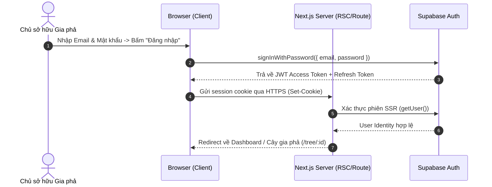
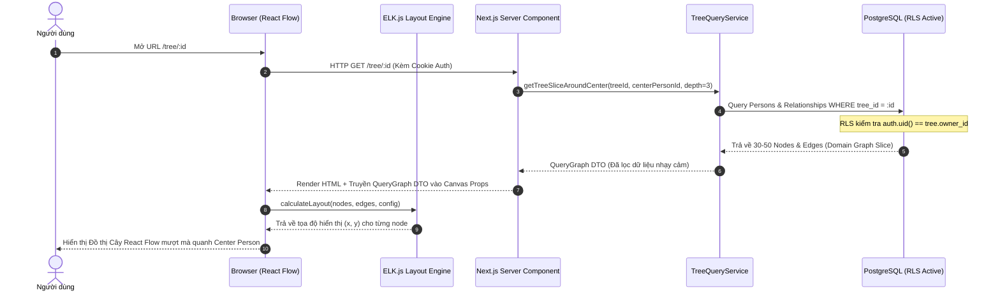
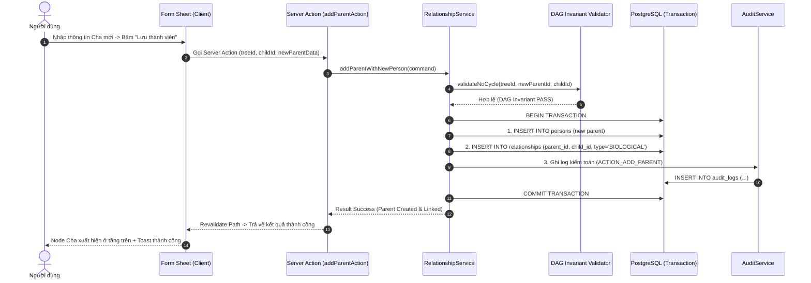
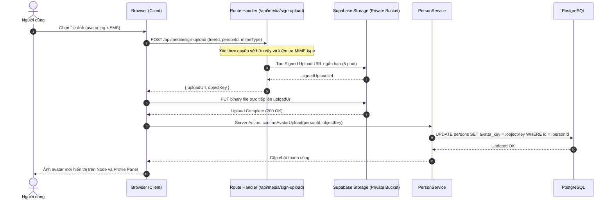
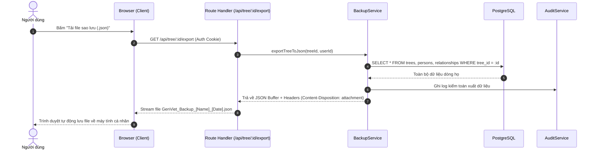
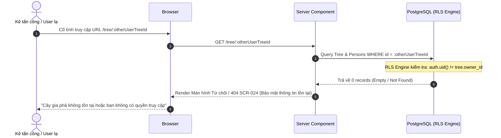

# Luồng Xử lý Yêu cầu & Dữ liệu Hệ thống (Request & Data Flow)

- **Mã tài liệu:** `ARCH-FLOW-01`
- **Mã Kiến trúc liên quan:** `DF-001..008`
- **Phiên bản:** `v0.1-baseline`
- **Trạng thái:** `PROVISIONAL`
- **Ngày ban hành:** 2026-08-29

---

## 1. Luồng 1: Đăng nhập & Xác thực Phiên làm việc (`DF-001`)

---

## 2. Luồng 2: Tải & Hiển thị Khung nhìn Cây Gia phả (`DF-002`)

---

## 3. Luồng 3: Thêm Cha/Mẹ Mới trong Transaction Nguyên tử (`DF-003`)

---

## 4. Luồng 4: Tải Lên & Cập nhật Ảnh Chân dung (Avatar Signed Flow) (`DF-004`)

---

## 5. Luồng 5: Xuất Sao lưu Dữ liệu Gia phả JSON (`DF-005`)

---

## 6. Luồng 6: Xử lý Lỗi Phân quyền & Từ chối Truy cập (RLS Denied) (`DF-006`)

