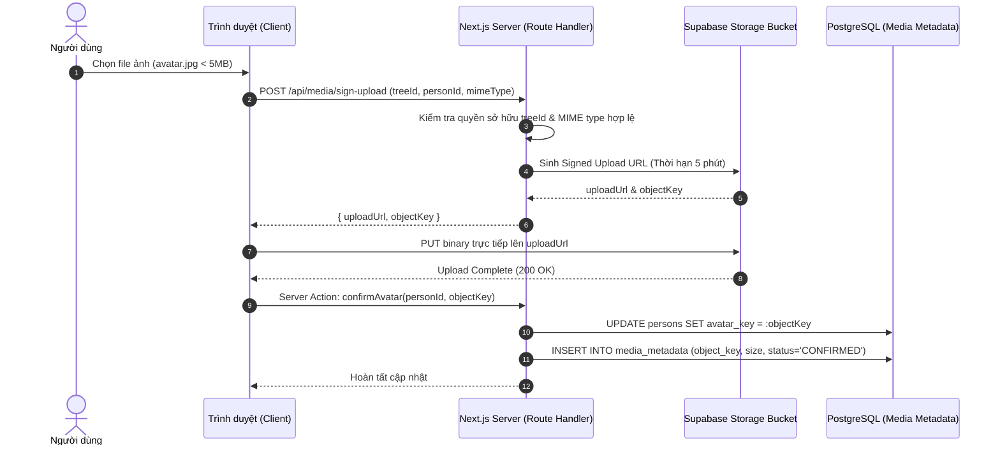

# Kiến trúc Lưu trữ Tệp tin Media (Storage Architecture)

- **Mã tài liệu:** `ARCH-STORAGE-01`
- **Mã Kiến trúc liên quan:** `AR-009`, `CNT-005`, `ADR-0007`
- **Phiên bản:** `v0.1-baseline`
- **Trạng thái:** `PROVISIONAL`
- **Ngày ban hành:** 2026-08-29

---

## 1. Lựa chọn Lưu trữ cho MVP v0.1: Supabase Storage Private Bucket

Trong giai đoạn MVP v0.1, toàn bộ hình ảnh chân dung (Avatar) của thành viên gia phả được lưu trữ tại **Supabase Storage** với các quy chuẩn bảo mật cao nhất:

1. **Khóa Mặc định Private:** Bucket `avatars` được thiết lập ở chế độ riêng tư tuyệt đối (`public = false`). Không thể truy cập ảnh qua đường dẫn tĩnh công khai mà không có token chữ ký hợp lệ.
2. **Quy ước Đặt tên Đường dẫn Tệp (Opaque Storage Keys):**
   - Định dạng đường dẫn: `avatars/{tree_id}/{person_id}_{random_uuid}.{ext}`
   - Tránh việc để lộ tên file gốc của người dùng (ví dụ: `anh_ong_noi.jpg`) nhằm bảo vệ sự riêng tư và tránh tấn công duyệt thư mục (directory traversal).
3. **Cơ chế Cấp Quyền Đọc bằng Signed URL Ngắn hạn:**
   - Khi hiển thị ảnh trên Canvas hoặc Profile Panel, hệ thống sinh Signed URL có thời hạn ngắn (TTL từ 5 đến 15 phút).
   - Trình duyệt chỉ cache hình ảnh theo thời hạn của Signed URL, không lưu trữ vĩnh viễn.

---

## 2. Quy trình Tải ảnh Lên & Xử lý File Rác (Upload & Orphan Cleanup)

### Chiến lược Dọn dẹp File Rác (Orphan Files Cleanup):
- Nếu người dùng upload ảnh lên Storage thành công nhưng tắt trình duyệt trước khi Server Action `confirmAvatar` được gọi:
  - Bản ghi trong `media_metadata` sẽ ở trạng thái `PENDING`.
  - Một tác vụ dọn dẹp định kỳ (Orphan Cleanup Task) sẽ quét các file ở trạng thái `PENDING` quá 24 giờ và xóa khỏi bucket để tiết kiệm dung lượng lưu trữ.

---

## 3. Sẵn sàng Chuyển dịch sang Cloudflare R2 (R2 Migration Seam)

Nhờ việc trừu tượng hóa qua **Storage Adapter (`IStorageAdapter`)**:
- Ứng dụng không gọi trực tiếp API độc quyền của Supabase trong Service Layer.
- Khi cần chuyển sang Cloudflare R2 trong tương lai: Đội ngũ kỹ thuật chỉ cần triển khai `CloudflareR2StorageAdapter` tuân thủ interface chuẩn mà không cần sửa đổi bất kỳ logic nghiệp vụ nào trong `PersonService`.
