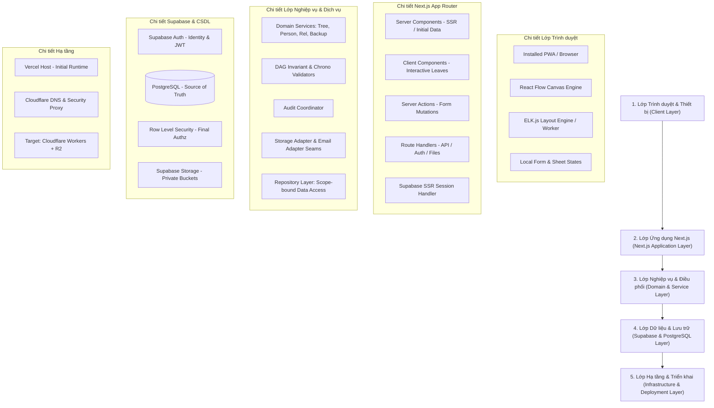

# Tổng quan Kiến trúc Kỹ thuật Hệ thống (System Architecture Overview)

- **Mã tài liệu:** `ARCH-OVERVIEW-01`
- **Phiên bản:** `v0.1-baseline`
- **Trạng thái:** `PROVISIONAL`
- **Ngày ban hành:** 2026-08-29

---

## 1. Sơ đồ Ngăn xếp Kiến trúc Tổng thể (High-Level Architecture Stack)

---

## 2. Mô tả Trách nhiệm Từng Phân tầng

### 2.1. Phân tầng Trình duyệt & Giao diện (Client Layer)
- Chịu trách nhiệm hiển thị giao diện theo chuẩn Responsive ($375\text{px}$ đến $1440\text{px}+$), bắt các tương tác chạm, vuốt Bottom Sheet, kéo Canvas (Pan), phóng to/thu nhỏ (Zoom).
- Thực thi thư viện **React Flow** để render đồ thị tương tác và **ELK.js** để tính toán tọa độ phân tầng tự động.
- Không nắm giữ bất kỳ quyền quản trị backend nào (`service_role`), chỉ gửi request kèm JWT phiên xác thực.

### 2.2. Phân tầng Ứng dụng Next.js App Router (App Layer)
- Sử dụng mô hình **Server-First**: Tải dữ liệu ban đầu bảo mật tại Server Components, giảm thiểu mã JavaScript gửi xuống máy khách.
- Xử lý các thay đổi dữ liệu (mutations) thông qua **Server Actions** có kiểm tra bảo mật CSRF và xác thực phiên đăng nhập.
- Cung cấp **Route Handlers** cho auth callback, webhook, stream xuất file sao lưu JSON và cấp URL ký tải ảnh an toàn.

### 2.3. Phân tầng Nghiệp vụ & Điều phối (Domain & Service Layer)
- Nơi tập trung toàn bộ các quy tắc phả học: Chống chu trình thế hệ (`INV-004`), xử lý ngày tháng khuyết thiếu (`INV-010`), kiểm tra niên đại bất thường, điều phối transaction nguyên tử và ghi nhật ký kiểm toán (Audit).
- Tách biệt hoàn toàn khỏi Next.js UI component: Có thể chạy độc lập trong môi trường Node.js hoặc Edge Runtime.

### 2.4. Phân tầng Dữ liệu & Lưu trữ (Data & Storage Layer)
- **PostgreSQL:** Lưu trữ toàn bộ thực thể nghiệp vụ (Cây, Thành viên, Quan hệ, Hôn nhân, Cài đặt, Audit) và là Nguồn Sự Thật duy nhất.
- **Row Level Security (RLS):** Lớp phòng thủ chiều sâu cuối cùng, đảm bảo tài khoản người dùng chỉ truy cập được đúng cây gia phả mà họ có quyền sở hữu.
- **Supabase Storage:** Lưu trữ file ảnh chân dung (Avatar) trong các Private Buckets được bảo vệ bằng Signed Access.

### 2.5. Phân tầng Hạ tầng (Infrastructure Layer)
- **Giai đoạn Hiện tại (MVP v0.1):** Host ứng dụng trên **Vercel**, quản lý tên miền và DNS qua **Cloudflare**, dữ liệu và Auth trên **Supabase**.
- **Định hướng Tương lai (Phase sau MVP):** Nhờ việc không dùng các API độc quyền của Vercel (Blob, KV, Postgres), ứng dụng có thể chuyển dịch mượt mà sang **Cloudflare Workers** và **Cloudflare R2** khi có nhu cầu tối ưu chi phí và hiệu năng toàn cầu.
