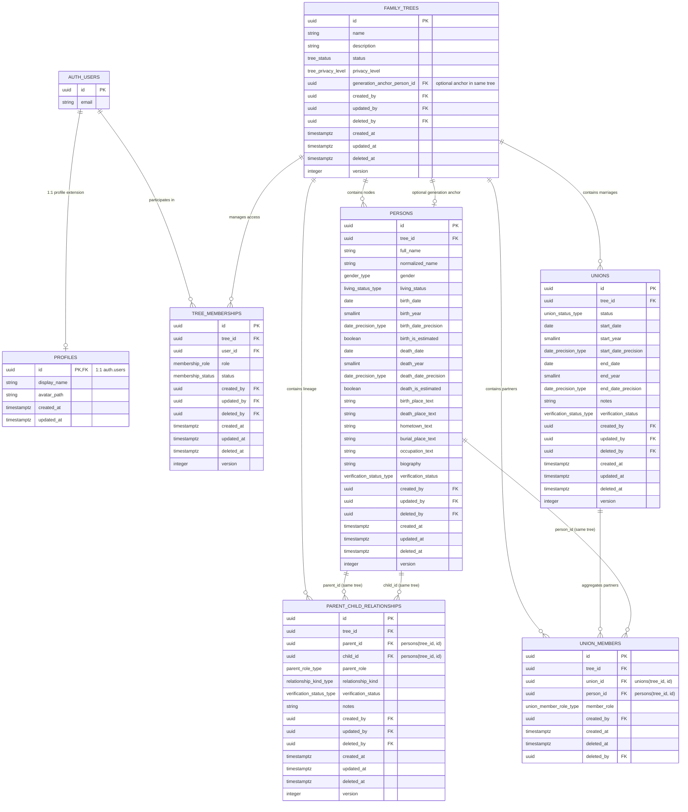

# Sơ đồ Thực thể Quan hệ CSDL (Entity Relationship Diagram - ERD)

- **Mã tài liệu:** `DB-ERD-01`
- **Phiên bản:** `v0.1-baseline`
- **Migration nguồn:** `20260829154907_p07_create_core_genealogy_schema.sql`
- **Ngày cập nhật:** 2026-08-29

---

## 1. Sơ đồ Quan hệ Tổng thể (Mermaid ERD)

---

## 2. Ghi chú Ranh giới Kiến trúc & Ràng buộc
1. **Phân quyền RLS:** Toàn bộ 7 bảng trên đã được bật Row Level Security (`deny-by-default`); các policy chi tiết theo vai trò (`owner`, `admin`, `editor`, `viewer`) sẽ được cài đặt trong Phase P08.
2. **Kiểm tra Chu trình (Cycle Detection):** Ràng buộc cấm self-link (`parent_id <> child_id`) được thực thi bằng CHECK constraint; giải thuật cycle-detection toàn đồ thị phân tán sẽ được cài đặt trong Phase P13.
