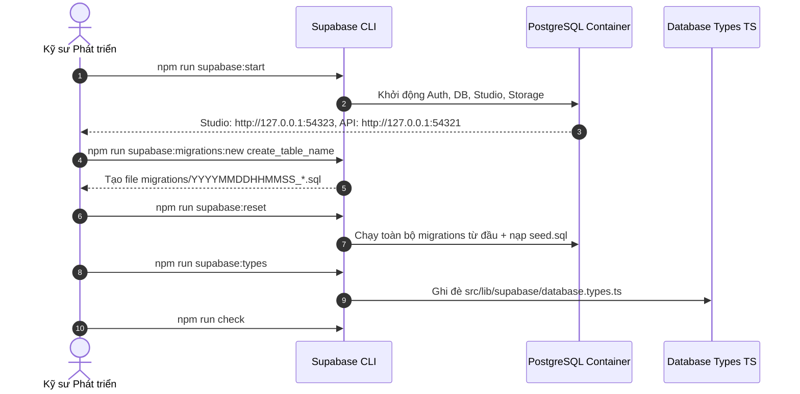

# Hướng dẫn Phát triển CSDL Cục bộ (Local Database Development)

- **Mã tài liệu:** `DB-LOCAL-01`
- **Phiên bản:** `v0.1-baseline`
- **Ngày ban hành:** 2026-08-29

---

## 1. Yêu cầu Hệ thống (Prerequisites)

- **Docker / Container Runtime:** Docker Desktop hoặc OrbStack đang hoạt động.
- **Supabase CLI:** Đã cài đặt cục bộ qua npm (`supabase@^2.116.0`).
- **Node.js:** `v20.0.0` trở lên (`.nvmrc` khuyến nghị Node 24).

---

## 2. Vòng đời Làm việc với Supabase Local (Local Development Workflow)

---

## 3. Các Lệnh Thực thi Chuẩn

| Thao tác | Lệnh npm | Mục đích & Chi tiết |
| :--- | :--- | :--- |
| **Khởi động Local Stack** | `npm run supabase:start` | Khởi chạy Docker containers cho database, auth, storage |
| **Kiểm tra Trạng thái** | `npm run supabase:status` | Xem URLs và thông tin kết nối cục bộ (không log secret) |
| **Dừng Local Stack** | `npm run supabase:stop` | Tắt và giải phóng tài nguyên container |
| **Tạo Migration Mới** | `npm run supabase:migrations:new <tên>` | Tạo file migration có timestamp tự động |
| **Reset Database Local** | `npm run supabase:reset` | Reset CSDL sạch, chạy lại toàn bộ migration và seed |
| **Sinh Typescript Types** | `npm run supabase:types` | Sinh lại `src/lib/supabase/database.types.ts` |
| **Kiểm tra Types Hợp lệ** | `npm run supabase:types:check` | Đối soát xem file types có bị stale hay thiếu type không |
| **Kiểm tra Migration** | `npm run supabase:migrations:check`| Kiểm tra cú pháp, tên, timestamp và chống lộ secret |
| **Kiểm tra Tổng thể** | `npm run supabase:check` | Chạy song song kiểm tra migration và types |
