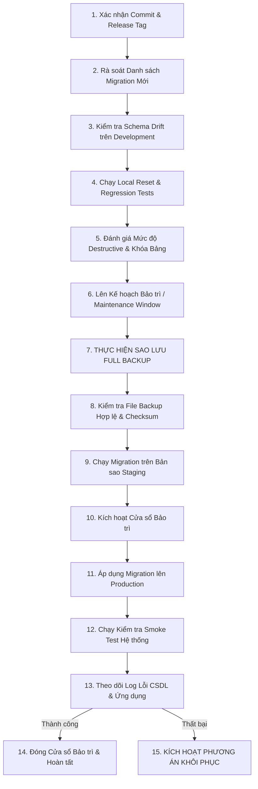

# Cẩm nang Triển khai Migration Production (Production Migration Runbook)

- **Mã tài liệu:** `DB-RUNBOOK-01`
- **Phiên bản:** `v0.1-baseline`
- **Trạng thái:** `LOCKED`

---

## 1. Quy trình 19 Bước Triển khai Migration Production An toàn

### Chi tiết các Bước Thực thi:
1. **Bước 1 (Xác nhận Commit):** Kiểm tra mã nguồn đã được merge vào `master` và vượt qua toàn bộ CI quality checks.
2. **Bước 2 (Rà soát Migration):** Liệt kê các file migration mới cần áp dụng.
3. **Bước 3 (Kiểm tra Schema Drift):** Đảm bảo không có ai chỉnh sửa bảng trực tiếp qua Supabase Dashboard SQL Editor.
4. **Bước 4 (Local Reset):** Chạy `npm run supabase:reset` và `npm run check` trên môi trường local.
5. **Bước 5 (Đánh giá Destructive):** Phân tích xem có lệnh `DROP COLUMN`, `ALTER TABLE ... TYPE` gây lock bảng lâu hay không.
6. **Bước 6 (Maintenance Window):** Thông báo thời gian bảo trì nếu migration có downtime.
7. **Bước 7 (Sao lưu):** Thực thi lệnh `supabase db dump` ra file `.backups/production_dump_*.sql`.
8. **Bước 8 (Xác minh Backup):** Kiểm tra file không rỗng và có dung lượng hợp lệ.
9. **Bước 9 (Staging Run):** Áp dụng thử trên Development Cloud (`genviet-dev`).
10. **Bước 10 (Áp dụng Production):** Người có thẩm quyền thực thi migration.
11. **Bước 11 (Smoke Test):** Kiểm tra `/api/health` và các flow đọc/ghi cơ bản.
12. **Bước 12 (Quyết định Hoàn tất hoặc Rollback):**
    - Nếu thành công: Đóng cửa sổ bảo trì, cập nhật nhật ký triển khai.
    - Nếu có sự cố: Áp dụng phương án khôi phục từ bản sao lưu bước 7 (hoặc forward-fix nếu sự cố nhỏ).
