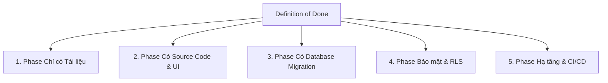

# Definition of Done (DoD) - Tiêu chuẩn Hoàn thành & Nghiệm thu

Tài liệu này xác định các điều kiện bắt buộc để một Phase hoặc Task trong dự án **GenViet** được công nhận hoàn thành, vượt qua Cổng G6/G7 và chuyển trạng thái sang `ACCEPTED`.

---

## 1. Tiêu chuẩn Definition of Done Chung (General DoD)

Mọi phase trong dự án, bất kể loại hình, bắt buộc phải thỏa mãn các tiêu chí chung sau:

1. **Đúng phạm vi (Scope Compliance):** Toàn bộ các hạng mục đã thỏa thuận trong kế hoạch phase (`02-plan.md`) đã hoàn thành; không có thay đổi trái phép ngoài phạm vi.
2. **Đối chiếu Acceptance Criteria (AC Verified):** 100% tiêu chí chấp nhận của phase đã được kiểm tra và đánh dấu `PASS`.
3. **Sạch lỗi nghiêm trọng (No Critical Findings):**
   - **BLOCKER:** 0
   - **CRITICAL:** 0
   - **MAJOR:** 0 (Trừ trường hợp được Project Owner chấp thuận bằng văn bản hoãn sang phase sau có mã `DEFERRED`).
4. **Không lộ Secret (Zero Secret Leakage):** Rà soát toàn bộ diff, đảm bảo tuyệt đối không có token, private key, mật khẩu hoặc file `.env` bị commit vào Git.
5. **Cập nhật Hồ sơ Phase đầy đủ:** Hoàn thiện toàn bộ 10 file tài liệu trong thư mục `docs/phases/PXX/`.
6. **Báo cáo Tổng kết & Bàn giao (Summary & Handover):** Có file `08-summary.md` và `09-handover.md` chất lượng cao, nêu rõ đầu vào cho phase kế tiếp.
7. **Ghi nhận Quyết định, Rủi ro & Nợ kỹ thuật:** Cập nhật `decision-log.md`, `risk-register.md`, `technical-debt.md` và `CHANGELOG.md`.
8. **Quy tắc Git an toàn:**
   - Tạo commit cục bộ sạch theo chuẩn Conventional Commits (`<type>(PXX): <mô tả>`).
   - Working tree sạch hoặc có giải thích rõ ràng.
   - **Tuyệt đối KHÔNG push lên remote, KHÔNG merge, KHÔNG tạo PR bằng AI.**

---

## 2. Tiêu chuẩn DoD Chi tiết theo Từng Loại Phase

Tùy thuộc vào đặc thù công việc của phase, áp dụng thêm các tiêu chí chuyên biệt dưới đây:



---

### 2.1. Phase chỉ có Tài liệu (Documentation-only Phase)
*Áp dụng cho các Phase như P00 (Governance), P01 (PRD), P02 (Glossary & Model Design)...*

- [ ] Toàn bộ tài liệu viết bằng định dạng Markdown chuẩn, rõ ràng, dễ đọc trên GitHub.
- [ ] Không có file rỗng hoặc tiêu đề trống không có nội dung hướng dẫn.
- [ ] Mọi liên kết nội bộ (Internal Links) đều sử dụng đường dẫn tương đối và hoạt động chính xác (không bị gãy link 404).
- [ ] Mã định danh (`PXX-TYY`, `ADR-NNNN`, `PXX-RISK-NNN`) nhất quán trong toàn bộ tài liệu.
- [ ] Không chứa dữ liệu gia phả thật của người còn sống hoặc đã mất khi chưa có sự đồng ý.

---

### 2.2. Phase có Source Code & UI (Frontend / Feature Phase)
*Áp dụng cho các Phase xây dựng component, màn hình, luồng giao diện...*

- [ ] **Build:** Dự án build thành công (`pnpm build` hoặc `npm run build`) không có lỗi.
- [ ] **Type Check:** TypeScript type check (`tsc --noEmit`) vượt qua 100% không có lỗi type nào (`any` không kiểm soát bị cấm).
- [ ] **Lint & Format:** Chạy linter (`eslint`) và formatter (`prettier`) không có cảnh báo/lỗi chưa được xử lý.
- [ ] **Unit / Component Tests:** Các component và helper quan trọng có unit test đi kèm và pass 100%.
- [ ] **Responsive & Cross-browser:** Giao diện hiển thị tốt trên Desktop, Tablet và Mobile.
- [ ] **Accessibility (a11y):** Các nút bấm, form nhập liệu có nhãn (label, aria-label) đúng quy chuẩn.

---

### 2.3. Phase có Database Migration (Database & Schema Phase)
*Áp dụng cho các Phase thay đổi bảng, cột, khóa ngoại, index, trigger...*

- [ ] File migration được đặt tên chuẩn có timestamp tại `supabase/migrations/`.
- [ ] Script migration đã được chạy thử nghiệm thành công trên môi trường local.
- [ ] **Có Rollback Script:** Bắt buộc phải có file SQL rollback tương ứng để hoàn tác cấu trúc bảng khi gặp sự cố.
- [ ] Các chỉ mục (Indexes) đã được tạo cho các cột thường xuyên dùng để tìm kiếm, lọc (ví dụ: `tree_id`, `parent_id`).
- [ ] Không chứa câu lệnh DROP TABLE / DROP COLUMN hủy hoại dữ liệu mà không có kế hoạch sao lưu.

---

### 2.4. Phase có Thay đổi Bảo mật & Phân quyền (Security & RLS Phase)
*Áp dụng cho các Phase thiết lập Auth, Token, Row Level Security, Storage Policies...*

- [ ] **Bật RLS trên mọi bảng mới:** Lệnh `ALTER TABLE ... ENABLE ROW LEVEL SECURITY;` đã được thực thi.
- [ ] **Kiểm thử chống rò rỉ dữ liệu (Cross-tenant Leakage Test):** Đã chạy test tự động chứng minh Người dùng A thuộc Cây 1 không thể đọc hoặc ghi đè dữ liệu của Cây 2.
- [ ] **Bảo vệ Service Role Key:** Không import hoặc sử dụng `SUPABASE_SERVICE_ROLE_KEY` ở bất kỳ component hay code nào chạy phía Client.
- [ ] Không ghi token, password hoặc dữ liệu nhạy cảm vào `console.log` hay telemetry.

---

### 2.5. Phase có Thay đổi Hạ tầng & Vận hành (Infrastructure & Operations Phase)
*Áp dụng cho các Phase cấu hình DNS, Vercel, Supabase Cloud, GitHub Actions...*

- [ ] Mọi cấu hình hạ tầng đều được tài liệu hóa chi tiết trong `docs/operations/`.
- [ ] Không hardcode credentials trong workflow files (`.github/workflows/`); sử dụng GitHub Secrets.
- [ ] Đã kiểm tra giới hạn định mức (Quota / Limits) của các dịch vụ Free Tier để tránh phát sinh chi phí ngoài ý muốn.
- [ ] Kế hoạch khôi phục thảm họa (Disaster Recovery / Backup) đã được cập nhật.

---

## 3. Checklist Tóm tắt Kiểm tra DoD trước khi Bàn giao

```markdown
### Bảng đối soát Definition of Done (DoD Checklist)

- [ ] **DoD-01 (Scope):** Đúng 100% phạm vi đã duyệt trong `02-plan.md`.
- [ ] **DoD-02 (AC):** Toàn bộ Acceptance Criteria đạt `PASS`.
- [ ] **DoD-03 (Findings):** 0 BLOCKER, 0 CRITICAL; các MAJOR đã sửa hoặc có mã DEFERRED.
- [ ] **DoD-04 (Build/Lint):** Build, TypeCheck, Lint pass 100% (nếu có code).
- [ ] **DoD-05 (Tests):** Tất cả Test Cases trong `05-test-plan.md` đạt yêu cầu.
- [ ] **DoD-06 (Security):** Diff sạch, không chứa secret, không vi phạm RLS.
- [ ] **DoD-07 (Docs):** Bộ 10 tài liệu phase hoàn tất, liên kết tương đối chuẩn xác.
- [ ] **DoD-08 (Summary & Handover):** Có `08-summary.md` và `09-handover.md` chi tiết.
- [ ] **DoD-09 (Git):** Đang ở đúng nhánh phase, đã commit cục bộ Conventional Commits, KHÔNG push/merge.

**Kết luận DoD:** `ACCEPTED` (Đủ điều kiện đóng phase) | `NEEDS_FIX` (Cần khắc phục lỗi)
```
