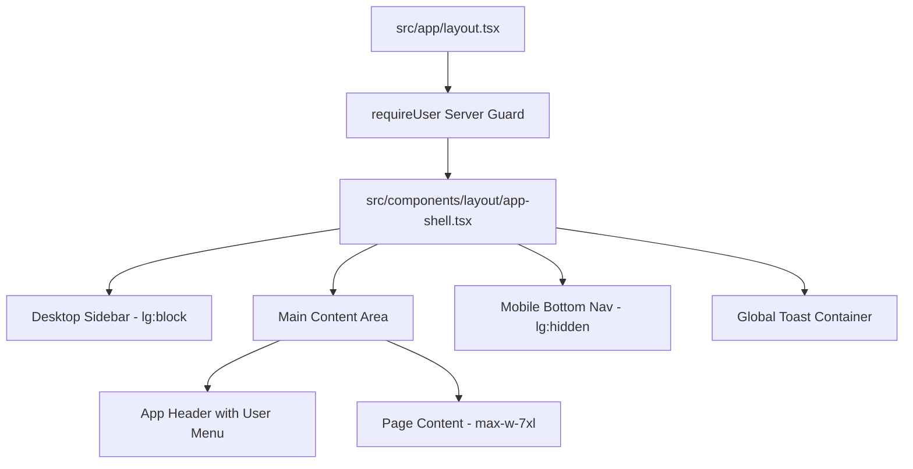

# Khung Giao diện Điều hướng (Navigation & App Shell) - Phase P10

- **Mã tài liệu:** `DS-SHELL-01`
- **Phiên bản:** `v0.1-baseline`

---

## 1. Cấu trúc Khung Giao diện (App Shell Architecture)

## 2. Quy tắc Điều hướng & Phân định Breakpoint
- Trên màn hình lớn ($\ge 1024\text{px}$ - `lg`): Hiển thị Sidebar cố định (`w-64`), ẩn thanh Bottom Nav.
- Trên màn hình nhỏ ($< 1024\text{px}$): Ẩn Sidebar, hiển thị Bottom Navigation 4 tabs với chiều cao `64px` và touch targets $\ge 44\times 44\text{px}$.
- Nội dung chính luôn có khoảng đệm đáy `pb-24 lg:pb-8` để không bao giờ bị thanh điều hướng che lấp.
