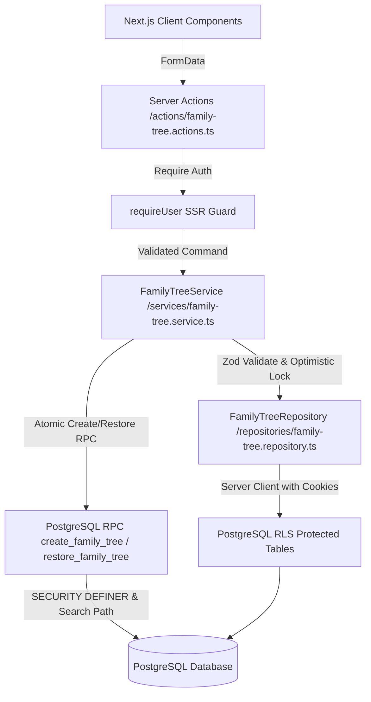

# Luồng Dữ liệu Phân hệ Quản lý Gia phả (Data Flow) - Phase P11

- **Mã tài liệu:** `FT-DF-01`
- **Phiên bản:** `v0.1-baseline`

---

## 1. Kiến trúc Luồng Xử lý Dữ liệu

## 2. Nguyên tắc Bất biến Luồng Dữ liệu

1. **Server-Side Authentication:** Mọi Server Action và Page Server Component đều xác thực `auth.uid()` qua `requireUser()` trước khi truy xuất dữ liệu.
2. **Không tin cậy Client:** Không bao giờ nhận `owner_user_id` hay `role` từ client; toàn bộ quyền hạn được kiểm tra động từ cơ sở dữ liệu `tree_memberships`.
3. **Optimistic Concurrency Control:** Các thao tác sửa tên, mô tả, mốc số đời đều yêu cầu `expectedVersion` để ngăn ngừa tình trạng ghi đè mất mát dữ liệu đồng thời (Lost Updates).
