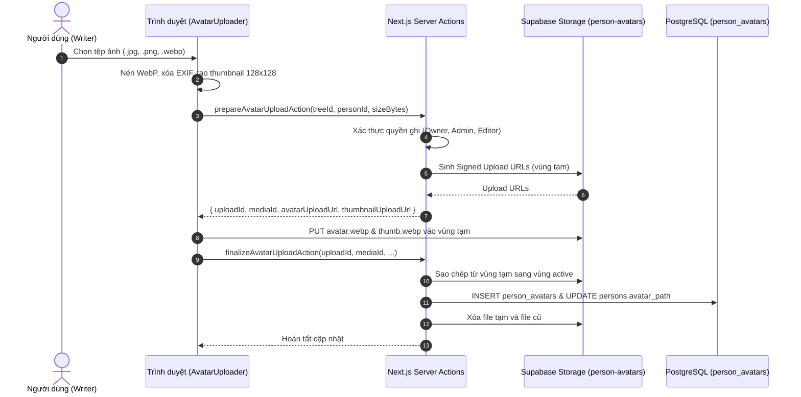

# Quy Trình Tải Lên Ảnh Đại Diện (Upload Workflow)

## 1. Các Bước Thực Hiện

```mermaid
sequenceDiagram
    autonumber
    actor User as Người dùng (Writer)
    participant Client as Trình duyệt (AvatarUploader)
    participant Server as Next.js Server Actions
    participant Storage as Supabase Storage (person-avatars)
    participant DB as PostgreSQL (person_avatars)

    User->>Client: Chọn tệp ảnh (.jpg, .png, .webp)
    Client->>Client: Nén WebP, xóa EXIF, tạo thumbnail 128x128
    Client->>Server: prepareAvatarUploadAction(treeId, personId, sizeBytes)
    Server->>Server: Xác thực quyền ghi (Owner, Admin, Editor)
    Server->>Storage: Sinh Signed Upload URLs (vùng tạm)
    Storage-->>Server: Upload URLs
    Server-->>Client: { uploadId, mediaId, avatarUploadUrl, thumbnailUploadUrl }
    Client->>Storage: PUT avatar.webp & thumb.webp vào vùng tạm
    Client->>Server: finalizeAvatarUploadAction(uploadId, mediaId, ...)
    Server->>Storage: Sao chép từ vùng tạm sang vùng active
    Server->>DB: INSERT person_avatars & UPDATE persons.avatar_path
    Server->>Storage: Xóa file tạm và file cũ
    Server-->>Client: Hoàn tất cập nhật
```
