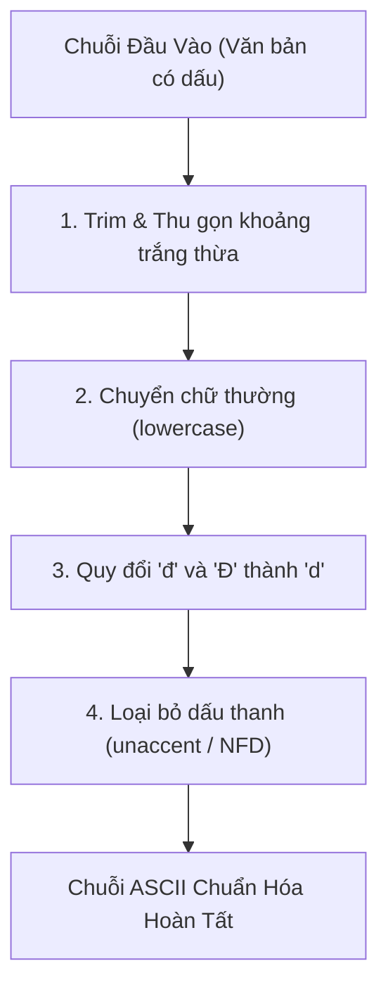

# 02 - Quy Chuẩn & Thuật Toán Chuẩn Hóa Tiếng Việt (Vietnamese Normalization)

## 1. Mục Tiêu
Chuẩn hóa chuỗi họ tên người Việt thành dạng ASCII không dấu thống nhất để phục vụ so khớp tìm kiếm chính xác, loại bỏ hoàn toàn các sai lệch do bộ gõ tiếng Việt (Telex, VNI), mã ký tự Unicode (Dựng sẵn NFC vs Tổ hợp NFD) và dấu cách thừa.

---

## 2. Các Bước Xử Lý Chuẩn Hóa

### 2.1. Quy đổi ký tự 'đ' và 'Đ'
Do bảng mã unaccent tiêu chuẩn không phải lúc nào cũng chuyển đổi chữ `đ/Đ` thành `d`, hàm chuẩn hóa chủ động thực hiện thay thế trước:
- `Đ` $\rightarrow$ `d`
- `đ` $\rightarrow$ `d`

### 2.2. Xử lý khoảng trắng
- Loại bỏ khoảng trắng đầu và cuối chuỗi (`trim`).
- Thu gọn các ký tự tab (`\t`), xuống dòng (`\n`, `\r`), khoảng trắng liên tiếp và Non-breaking space (NBSP) thành đúng **1 dấu cách đơn**.

---

## 3. Tính Đồng Bộ 100% Giữa SQL và TypeScript

| Trường hợp | Đầu vào gốc | Kết quả SQL (`_system.normalize_person_name`) | Kết quả TypeScript (`normalizeVietnamese`) |
| :--- | :--- | :--- | :--- |
| Họ tên có dấu | `Nguyễn Văn An` | `nguyen van an` | `nguyen van an` |
| Ký tự đ/Đ | `Đặng Tiến Đạo` | `dang tien dao` | `dang tien dao` |
| Khoảng trắng thừa | `  Lê  \t  Thị   Hương  ` | `le thi huong` | `le thi huong` |
| Ký tự hoa thường | `VŨ THỊ HƯỜNG` | `vu thi huong` | `vu thi huong` |
| Giá trị NULL | `NULL` | `""` | `""` |
