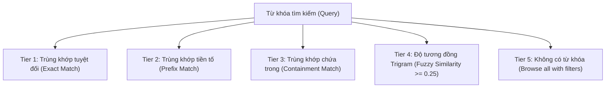

# 04 - Thuật Toán Xếp Hạng & Độ Khớp (Matching & Ranking Algorithm)

## 1. Phân Tầng Độ Khớp (Match Tiers)

Mỗi kết quả tìm kiếm được gán một phân tầng độ khớp (`match_tier`) từ 1 đến 5 để đảm bảo các kết quả chính xác nhất luôn xuất hiện đầu tiên:

---

## 2. Công Thức Xếp Hạng Deterministic

Thứ tự sắp xếp được tính toán theo 5 tiêu chí:
1. `match_tier ASC`: Ưu tiên phân tầng cao nhất.
2. `similarity_score DESC`: Độ tương đồng trigram cao hơn xếp trước.
3. `normalized_name ASC`: Tên theo bảng chữ cái.
4. `birth_year ASC NULLS LAST`: Năm sinh tăng dần (người lớn tuổi hơn xếp trước).
5. `id ASC`: UUID tie-breaker đảm bảo thứ tự luôn ổn định tuyệt đối.
