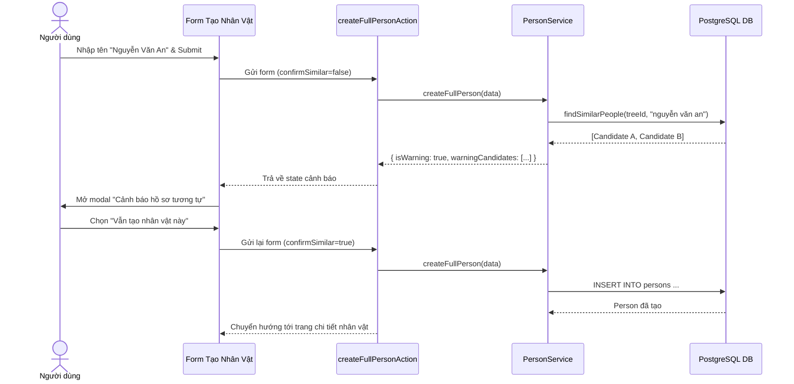

# Similar Profile Warning Flow (Cảnh Báo Hồ Sơ Tương Tự)

## 1. Mục Đích Nghiệp Vụ
Trong các dòng họ Việt Nam, nhiều người có thể trùng họ và tên (ví dụ: con cháu đặt tên theo các bậc tiền nhân hoặc trùng tên giữa các chi phái). Hệ thống cần:
- Cảnh báo người nhập liệu khi có khả năng trùng lặp hồ sơ.
- **Không bao giờ tự ý gộp (No Auto-merge) hoặc tự động liên kết (No Auto-link)** vì có thể làm sai lệch dữ liệu thế thứ.
- Cung cấp luồng xác nhận rõ ràng (Explicit Confirmation Flow).

## 2. Luồng Xử Lý

