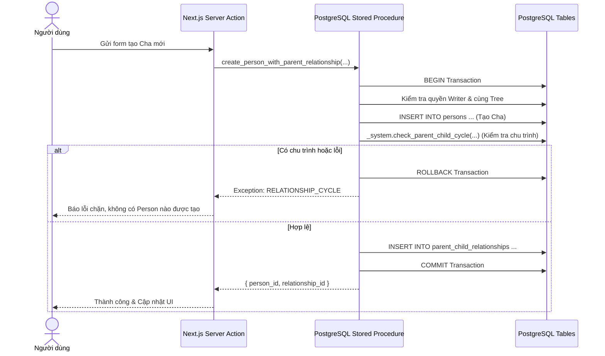

# Transaction Model: Relationship Management

## 1. Nguyên Tắc Bất Biến Nguyên Tử (Atomicity Principle)
Trong cây gia phả, việc tạo người thân mới và liên kết quan hệ không thể tách rời thành hai lệnh INSERT độc lập ở phía client. Nếu một bước thất bại, toàn bộ thao tác phải được rollback để không tạo ra các "hồ sơ Person rác" (Orphan Persons) hay "Union rỗng" (Empty Unions).

## 2. Danh Mục Các Transactional RPCs Đã Xây Dựng
1. `create_person_with_parent_relationship`: Tạo Person mới + quan hệ cha/mẹ trong cùng transaction.
2. `link_existing_parent`: Liên kết cha/mẹ đã có kèm kiểm tra chu trình và cảnh báo cha/mẹ ruột.
3. `create_person_with_child_relationship`: Tạo Person con mới + quan hệ với cha/mẹ (và tùy chọn cha/mẹ thứ hai).
4. `link_existing_child`: Liên kết con đã có.
5. `create_union_with_new_person`: Tạo Person phối ngẫu mới + Union + 2 Union Members.
6. `create_union_with_existing_person`: Tạo Union + 2 Union Members giữa 2 Person đã có.
7. `end_union`: Kết thúc quan hệ hôn nhân và cập nhật version.
8. `soft_delete_parent_child_relationship`: Xóa mềm quan hệ huyết thống an toàn.
9. `soft_delete_union`: Xóa mềm Union và các thành viên.
10. `replace_parent_relationship`: Thay thế nguyên tử quan hệ cũ bằng quan hệ mới.
