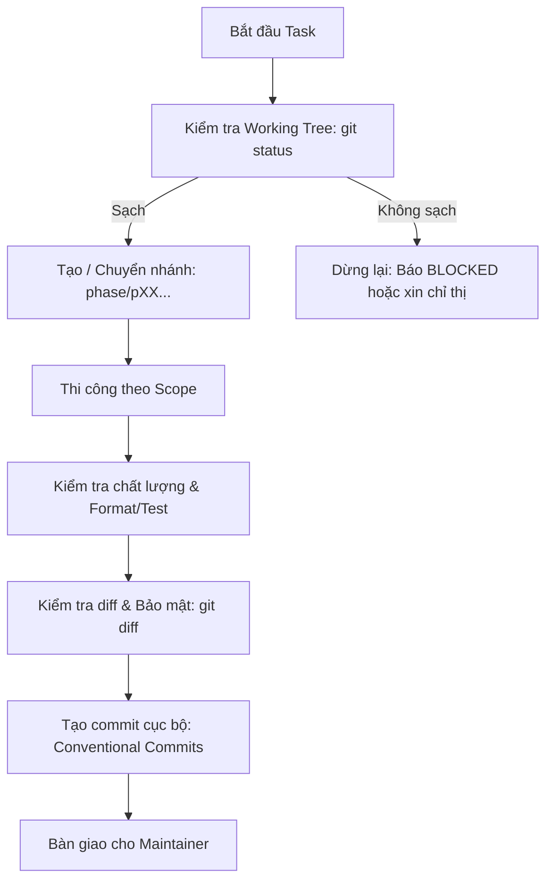

# Quy trình Quản lý Git & Phân nhánh GenViet

Tài liệu này xác lập quy trình làm việc chuẩn với Git, quy tắc phân nhánh, commit, kiểm soát an toàn và quy trình bàn giao/merge mã nguồn cho dự án **GenViet**.

---

## 1. Chiến lược phân nhánh (Branching Strategy)

Dự án áp dụng mô hình phân nhánh hướng Phase (Phase-Driven Branching Model) nhằm cô lập các rủi ro, cho phép thi công độc lập và kiểm soát chất lượng qua từng cổng kiểm thử.

```text
main ─────────────────────────────────────────────────────────────► (Ổn định, Production-ready)
       \                                                   /
        \─ phase/p00-project-governance ──────────────────/ (Merge do con người)
             \                                    /
              \─ feature/p00-t03-docs-structure ─/
```

### 1.1. Các loại nhánh chuẩn:

1. **Nhánh chính (`main`):**
   - Đại diện cho trạng thái ổn định nhất của dự án.
   - Được bảo vệ (Protected Branch): Không được commit trực tiếp lên `main`.
   - Chỉ được cập nhật thông qua Pull Request sau khi phase đã được nghiệm thu (DoD Pass).
2. **Nhánh Phase (`phase/pXX-short-name`):**
   - Nhánh tích hợp chính cho toàn bộ phase `PXX`.
   - Được tạo từ `main` khi bắt đầu phase.
   - Ví dụ: `phase/p00-project-governance`, `phase/p01-requirements-prd`.
3. **Nhánh Feature / Task (`feature/pXX-tYY-short-name`):**
   - Sử dụng khi một task trong phase cần được phát triển độc lập hoặc tách nhỏ để tránh xung đột.
   - Được tạo từ nhánh `phase/pXX-...`.
   - Ví dụ: `feature/p00-t05-git-workflow`.
4. **Nhánh Sửa lỗi (`fix/pXX-bug-NNN-short-name`):**
   - Sử dụng để sửa các lỗi phát sinh trong quá trình review của phase.
   - Được tạo từ nhánh phase tương ứng.
   - Ví dụ: `fix/p00-bug-001-fix-relative-links`.
5. **Nhánh Tài liệu độc lập (`docs/pXX-short-name`):**
   - Sử dụng cho các đợt cập nhật tài liệu lớn không đi kèm code chức năng.
   - Ví dụ: `docs/p00-update-security-guide`.

---

## 2. Quy tắc đặt tên nhánh

- Chỉ sử dụng chữ cái thường (`a-z`), số (`0-9`), dấu gạch nối (`-`) và dấu gạch chéo (`/`) cho tiền tố.
- Cấm tuyệt đối: Khoảng trắng, ký tự có dấu, ký tự đặc biệt (`_`, `@`, `$`, `*`).
- Cấu trúc bắt buộc: `<loại>/<mã-phase>[-<mã-task>]-<mô-tả-ngắn>`

---

## 3. Quy trình thực hiện Task từng bước



### Bước 1: Khảo sát & Kiểm tra điều kiện an toàn
- Chạy `git status --short`, `git branch --show-current`.
- Đảm bảo working tree sạch trước khi thao tác.

### Bước 2: Tạo hoặc chuyển nhánh
```bash
git checkout -b phase/pXX-short-name
```

### Bước 3: Thi công trong đúng phạm vi
- Chỉ sửa/tạo các file thuộc phạm vi task/phase.
- Tuyệt đối không thay đổi các file không liên quan.

### Bước 4: Kiểm tra trước commit (Pre-commit Verification)
- Chạy formatter / linter nếu có.
- Kiểm tra diff để chắc chắn không chứa token, API key hoặc file tạm:
```bash
git diff --check
git status
```

### Bước 5: Tạo commit cục bộ
- Sử dụng cú pháp Conventional Commits: `<type>(PXX): <mô tả ngắn>`
```bash
git add <các file đã thay đổi>
git commit -m "docs(P00): define git workflow and branching strategy"
```

---

## 4. Quy tắc an toàn bắt buộc đối với AI Agents

Để đảm bảo an toàn tuyệt đối cho repository, các trợ lý AI bắt buộc phải tuân thủ:

| Hành động | Quyền hạn của AI | Ghi chú |
| :--- | :--- | :--- |
| Đọc mã nguồn / Khảo sát repo | **ĐƯỢC PHÉP** | Được khuyến khích trước khi sửa file. |
| Tạo nhánh cục bộ | **ĐƯỢC PHÉP** | Theo đúng quy chuẩn tên nhánh. |
| Sửa / Tạo file trong phạm vi | **ĐƯỢC PHÉP** | Đúng phạm vi được giao. |
| Commit cục bộ | **ĐƯỢC PHÉP** | Đúng chuẩn Conventional Commits. |
| `git push` lên remote | **CẤM TUYỆT ĐỐI** | Chỉ con người (Maintainer) mới được push. |
| `git merge` nhánh | **CẤM TUYỆT ĐỐI** | Tránh gây xung đột hoặc merge chưa qua review. |
| Tạo Pull Request từ xa (CLI/API) | **CẤM TUYỆT ĐỐI** | Không tự ý gọi `gh pr create` hoặc GitHub API. |
| `git rebase` / Force push | **CẤM TUYỆT ĐỐI** | Cấm làm thay đổi lịch sử commit chia sẻ. |
| Xóa file chưa commit của người dùng | **CẤM TUYỆT ĐỐI** | Cấm dùng `git clean -fd`, `git restore .`. |
| Bỏ qua Git Hooks (`--no-verify`)| **CẤM TUYỆT ĐỐI** | Mọi commit phải vượt qua kiểm tra tự động. |

---

## 5. Xử lý Working Tree không sạch (Unclean Working Tree)

Nếu khi bắt đầu phiên làm việc phát hiện working tree có thay đổi chưa commit:
1. **Không xóa, không ghi đè, không tự ý `git stash`.**
2. Phân tích danh sách file thay đổi:
   - Nếu thay đổi thuộc phạm vi phiên làm việc: Có thể tiếp tục và gộp vào commit hợp lệ.
   - Nếu thay đổi thuộc công việc dang dở của người dùng hoặc ngoài phạm vi: Dừng lại ngay lập tức, báo trạng thái `BLOCKED` và liệt kê danh sách file cản trở để người dùng quyết định.

---

## 6. Xử lý thay đổi ngoài phạm vi (Out-of-Scope Changes)

- Nếu trong quá trình thi công phát hiện cần sửa một file ngoài phạm vi đã duyệt:
  1. Không tự ý sửa file đó.
  2. Ghi nhận vấn đề vào danh sách **Technical Debt** (`docs/phases/PXX/issues/technical-debt.md`) hoặc đề xuất mở rộng trong review.
  3. Chỉ sửa nếu có yêu cầu bổ sung rõ ràng từ Project Owner.

---

## 7. Quy trình Review & Re-Review

1. **Self-Review:** Người/AI thi công tự kiểm tra toàn bộ diff so với Acceptance Criteria và ghi nhận vào `docs/phases/PXX/06-review.md`.
2. **Review độc lập (Peer Review / Lead Review):**
   - Kiểm tra mã nguồn/tài liệu trên nhánh phase.
   - Phân loại lỗi theo severity: `BLOCKER`, `CRITICAL`, `MAJOR`, `MINOR`, `SUGGESTION`.
3. **Re-Review (Nếu có lỗi):**
   - Tạo nhánh `fix/...` hoặc commit sửa lỗi trên nhánh phase.
   - Cập nhật biên bản re-review vào `docs/phases/PXX/07-re-review.md`.

---

## 8. Quy trình Merge do con người thực hiện (Human-Controlled Merge)

Khi phase đã hoàn thành và đạt đầy đủ tiêu chí Definition of Done:
1. Maintainer kiểm tra và đẩy nhánh phase lên GitHub:
   ```bash
   git push origin phase/pXX-short-name
   ```
2. Maintainer mở Pull Request trên giao diện GitHub web với tiêu đề chuẩn: `[PXX] Tên phase`.
3. Điền đầy đủ thông tin theo mẫu `.github/PULL_REQUEST_TEMPLATE.md`.
4. Sau khi các checks CI/CD pass và phê duyệt hoàn tất: Maintainer thực hiện **Squash and Merge** hoặc **Rebase and Merge** vào `main`.

---

## 9. Quy trình Xử lý Xung đột (Conflict Resolution)

- Xung đột nhánh chỉ được giải quyết bởi Maintainer con người.
- Khi nhánh `main` có cập nhật mới trong lúc phase đang phát triển:
  1. Maintainer checkout nhánh phase.
  2. Kéo cập nhật mới từ `main` vào nhánh phase (`git merge main` hoặc `git rebase main` cục bộ).
  3. Xử lý xung đột thủ công, kiểm tra lại toàn bộ test suite.
  4. Tạo commit giải quyết xung đột.

---

## 10. Quy trình Rollback & Khôi phục khẩn cấp

Nếu một commit hoặc bản release gặp sự cố nghiêm trọng trên production:
1. **Không sửa đè trực tiếp trên production.**
2. Tạo commit hoàn tác bằng lệnh `git revert`:
   ```bash
   git revert <commit-hash-gây-lỗi> -m "revert(PXX): revert changes due to incident #NNN"
   ```
3. Nếu cần rollback migration database: Chạy script rollback tương ứng đã được chuẩn bị trong tài liệu bàn giao của phase.
4. Ghi nhận sự cố vào tài liệu Incident Log và cập nhật Risk Register.
