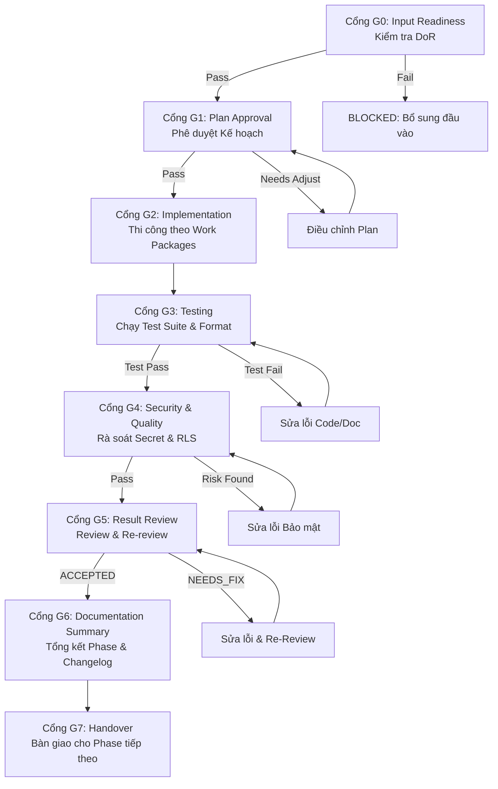

# Vòng đời Phase & Các Cổng Kiểm soát Chất lượng (Phase Lifecycle & Quality Gates)

Để đảm bảo tính độc lập, khả năng kiểm thử và khả năng thi công an toàn bằng cả kỹ sư con người lẫn AI Agents, dự án **GenViet** áp dụng quy trình kiểm soát chất lượng qua **8 Cổng kiểm soát (Gates G0 - G7)** cho mọi phase.

---

## 1. Sơ đồ Vòng đời Phase

---

## 2. Chi tiết 8 Cổng Kiểm soát (Quality Gates)

### Cổng G0: Kiểm tra đầu vào (Input Readiness)
- **Mục đích:** Đảm bảo toàn bộ tiền đề, tài liệu bàn giao từ phase trước và yêu cầu kỹ thuật đã rõ ràng trước khi tốn tài nguyên thi công.
- **Tiêu chuẩn kiểm tra:** Đối chiếu với [Definition of Ready](./definition-of-ready.md).
- **Hồ sơ đầu ra:** `docs/phases/PXX/01-input-readiness.md`.
- **Điều kiện qua cổng:** Toàn bộ checklist DoR đạt `READY`. Nếu thiếu thông tin quan trọng hoặc có blocker chưa giải quyết $\rightarrow$ Phase ở trạng thái `BLOCKED`.

### Cổng G1: Phê duyệt kế hoạch (Plan Approval)
- **Mục đích:** Thống nhất danh sách task, file sẽ tạo/sửa, phạm vi (in-scope / out-of-scope) và kế hoạch kiểm thử.
- **Hồ sơ đầu ra:** `docs/phases/PXX/02-plan.md` và `docs/phases/PXX/03-task-breakdown.md`.
- **Điều kiện qua cổng:** Kế hoạch được Project Owner hoặc Tech Lead phê duyệt.

### Cổng G2: Thi công (Implementation)
- **Mục đích:** Thực hiện tạo/sửa file theo đúng kế hoạch đã duyệt trên nhánh riêng `phase/pXX-...`.
- **Nguyên tắc:** Chỉ sửa file trong phạm vi; không chạm vào file không liên quan; tuân thủ quy tắc Git an toàn (không push, không merge).

### Cổng G3: Kiểm thử kỹ thuật (Testing)
- **Mục đích:** Xác minh chất lượng kỹ thuật của sản phẩm bàn giao.
- **Hồ sơ đầu ra:** `docs/phases/PXX/05-test-plan.md` (kèm kết quả thực thi).
- **Tiêu chuẩn:** Chạy format, lint, type check, unit tests, kiểm tra liên kết Markdown. 100% tests phải pass.

### Cổng G4: Kiểm tra Bảo mật & Toàn vẹn (Security & Quality Review)
- **Mục đích:** Rà soát không để lộ lọt bí mật, token, key và đảm bảo tính toàn vẹn dữ liệu.
- **Tiêu chuẩn:** Kiểm tra diff, quét secret, kiểm tra RLS (nếu có database), kiểm tra không chứa dữ liệu cá nhân thật.

### Cổng G5: Đánh giá kết quả (Result Review & Re-review)
- **Mục đích:** Đánh giá độc lập toàn bộ kết quả thi công so với Acceptance Criteria của phase.
- **Hồ sơ đầu ra:** `docs/phases/PXX/06-review.md` (và `07-re-review.md` nếu có lỗi cần sửa).
- **Phân loại kết quả:**
  - `ACCEPTED`: Đạt toàn bộ tiêu chí.
  - `ACCEPTED_WITH_MINOR_FIXES`: Cho phép bàn giao sau khi sửa các lỗi nhỏ (MINOR/SUGGESTION).
  - `NEEDS_FIX`: Có lỗi MAJOR hoặc CRITICAL; bắt buộc phải sửa và tiến hành re-review.
  - `REJECTED`: Không đạt yêu cầu hoặc lệch phạm vi nghiêm trọng.

### Cổng G6: Tổng kết tài liệu (Documentation Summary)
- **Mục đích:** Đóng gói toàn bộ tài liệu, cập nhật nhật ký quyết định, rủi ro, nợ kỹ thuật và changelog.
- **Hồ sơ đầu ra:** `docs/phases/PXX/08-summary.md`, `CHANGELOG.md`, `docs/decisions/decision-log.md`, `docs/risks/risk-register.md`.

### Cổng G7: Bàn giao (Handover)
- **Mục đích:** Cung cấp gói đầu vào hoàn chỉnh, tường minh cho phase tiếp theo.
- **Hồ sơ đầu ra:** `docs/phases/PXX/09-handover.md`.
- **Nội dung bàn giao:** Danh sách tài liệu bắt buộc đọc, các quyết định đã khóa, các câu hỏi mở còn lại, khuyến nghị cho phase kế tiếp.

---

## 3. Quy định về Trạng thái & Xử lý Ngoại lệ

### 3.1. Khi nào một Phase bị đánh dấu `BLOCKED`?
Một phase rơi vào trạng thái `BLOCKED` khi gặp một trong các tình huống:
1. Thiếu thông tin đầu vào quan trọng tại cổng G0 không thể tự suy diễn.
2. Phát hiện lỗi nghiêm trọng (BLOCKER/CRITICAL) ở phase trước chưa được giải quyết.
3. Working tree không sạch hoặc repository ở trạng thái không an toàn (đang rebase/merge dở, detached HEAD).
4. Phát hiện lộ secret trong Git history cần sự can thiệp của Maintainer.

### 3.2. Khi nào một Phase được công nhận `ACCEPTED`?
1. 100% Acceptance Criteria của phase đạt `PASS`.
2. Không còn bất kỳ finding nào ở mức `BLOCKER` hoặc `CRITICAL`.
3. Toàn bộ hồ sơ 10 tài liệu chuẩn từ `00-` đến `09-` đã được điền đầy đủ và đối soát.
4. Đã tạo commit cục bộ sạch theo chuẩn Conventional Commits.

### 3.3. Điều kiện được hoãn hạng mục (`DEFERRED`)
Một tính năng hoặc issue chỉ được đánh dấu `DEFERRED` khi:
1. Không thuộc luồng nghiệp vụ cốt lõi của MVP.
2. Không gây rủi ro bảo mật (`BLOCKER` / `CRITICAL` không bao giờ được phép defer).
3. Đã được ghi nhận vào `docs/phases/PXX/issues/deferred.md` có đầy đủ lý do, tác động và phase dự kiến giải quyết.
4. Được Project Owner phê duyệt chấp nhận rủi ro.

### 3.4. Thẩm quyền chấp nhận rủi ro (Risk Acceptance Authority)
- **Project Owner / Lead Maintainer** là người duy nhất có quyền chấp nhận rủi ro hoặc quyết định hoãn một hạng mục.
- AI Agents hoặc Developer không được tự ý hoãn việc mà không ghi nhận rõ ràng vào hồ sơ phase.

### 3.5. Khi nào bắt buộc phải lập Architecture Decision Record (ADR)?
Bắt buộc phải tạo file ADR mới trong `docs/decisions/` khi:
1. Có sự thay đổi về công nghệ cốt lõi hoặc thư viện nền tảng (ví dụ: thay đổi thư viện vẽ đồ thị, đổi provider hosting).
2. Có sự thay đổi về mô hình dữ liệu quan hệ gia phả có ảnh hưởng sâu rộng.
3. Có sự thay đổi về cơ chế xác thực hoặc chính sách bảo mật RLS.

### 3.6. Cập nhật tài liệu của các Phase trước (Backward Updates)
- Khi một phase sau phát hiện thông tin của phase trước không còn chính xác (nhưng không làm thay đổi bản chất đã hoàn thành), cần tạo một commit bổ sung ghi chú rõ (ví dụ: `docs(PXX): note update on P00 governance`).
- Không tự ý xóa lịch sử hoặc sửa đổi biên bản review cũ nhằm che giấu sai sót; phải giữ tính minh bạch lịch sử.
