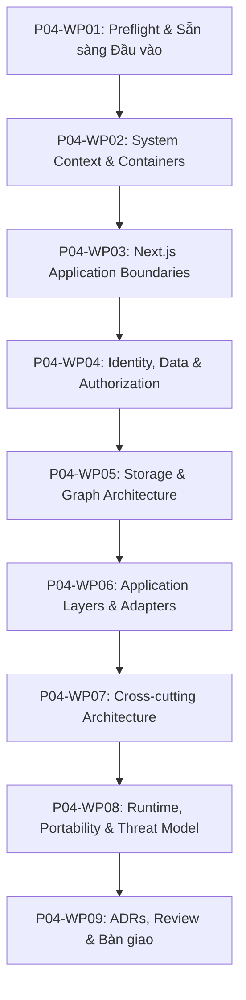

# Kế hoạch Thi công Chi tiết: Phase P04 (Phase Plan - Cổng G1)

- **Mã Phase:** `P04`
- **Tên Phase:** Thiết kế kiến trúc (System Architecture)
- **Trạng thái Kế hoạch:** `ACCEPTED`
- **Nhánh thi công:** `phase/p04-system-architecture`
- **Starting Commit:** `d0f0dc97ecb8fcf6ebda5cfdb7a7ebcfbc00072b`

---

## 1. Phân chia 9 Gói Công việc (Work Packages Breakdown)

- **`P04-WP01`:** Preflight, đánh giá DoR, tra cứu tài liệu chính thức $\rightarrow$ `docs/phases/P04/01-input-readiness.md`, `02-plan.md`, `03-task-breakdown.md`, `docs/architecture/system-overview.md`, `architecture-principles.md`.
- **`P04-WP02` (Tasks T01, T02):** Bối cảnh hệ thống & Containers C4 $\rightarrow$ `docs/architecture/context-diagram.md`, `container-diagram.md`, `component-boundaries.md`, `request-and-data-flow.md`, `docs/security/trust-boundaries.md`.
- **`P04-WP03` (Tasks T03, T04, T05):** Ranh giới Next.js App Router, Server/Client Components, Server Actions & Route Handlers $\rightarrow$ `rendering-architecture.md`, `server-client-boundaries.md`, `actions-and-route-handlers.md`.
- **`P04-WP04` (Tasks T06, T07, T08):** Định danh, CSDL & Phân quyền RLS $\rightarrow$ `authentication-architecture.md`, `data-ownership.md`, `authorization-architecture.md`.
- **`P04-WP05` (Tasks T09, T10, T11, T12):** Lưu trữ Media & Kiến trúc Đồ thị 4 Lớp $\rightarrow$ `storage-architecture.md`, `graph-architecture.md`.
- **`P04-WP06` (Tasks T13, T14, T15, T16):** Lớp Repositories, Services, Transaction & Adapters $\rightarrow$ `repository-layer.md`, `service-layer.md`, `transaction-boundaries.md`, `adapter-architecture.md`, `email-architecture.md`.
- **`P04-WP07` (Tasks T17, T18, T19):** Chiến lược Caching, Xử lý Lỗi & Kiểm toán Audit $\rightarrow$ `caching-strategy.md`, `error-strategy.md`, `audit-architecture.md`.
- **`P04-WP08` (Tasks T20, T21, T22, T23):** Runtime Profile, Chống Vercel Lock-in, Sẵn sàng Cloudflare & Threat Model $\rightarrow$ `runtime-profile.md`, `platform-portability.md`, `cloudflare-readiness.md`, `docs/security/threat-model.md`, `security-requirements.md`.
- **`P04-WP09` (Task T24):** 16 ADRs, Ma trận Truy vết, Self-Review, Hồ sơ Phase & Bàn giao Kỹ thuật $\rightarrow$ `docs/decisions/ADR-*.md`, `architecture-traceability-matrix.md`, `assumptions.md`, `open-questions.md`, `docs/phases/P04/` (00-overview đến 09-handover và issues/), `CHANGELOG.md`, `decision-log.md`.

---

## 2. Danh mục 16 ADRs Dự kiến Thiết lập

1. `ADR-0001`: Lựa chọn Next.js App Router làm Kiến trúc Định tuyến & Render chính.
2. `ADR-0002`: Quy tắc Server-First Rendering và Phân định Ranh giới Client Components.
3. `ADR-0003`: Phân định Rạch ròi giữa Server Actions (Form Mutations) và Route Handlers (HTTP/Files).
4. `ADR-0004`: Sử dụng Supabase Auth làm Nền tảng Định danh (Identity Provider) cho MVP v0.1.
5. `ADR-0005`: PostgreSQL (Supabase) là Nguồn Sự Thật Duy Nhất (Single Source of Truth) của Dữ liệu Nghiệp vụ.
6. `ADR-0006`: Row Level Security (RLS) là Lớp Cưỡng chế Phân quyền Dữ liệu Cuối cùng tại CSDL.
7. `ADR-0007`: Sử dụng Supabase Storage Private Bucket cho Avatar & Media trong MVP v0.1.
8. `ADR-0008`: Sử dụng React Flow làm Thư viện Trình bày Đồ thị Tương tác (Canvas Presentation).
9. `ADR-0009`: Sử dụng ELK.js làm Thuật toán Tính toán Bố cục Phân tầng Tự động (Layered Layout).
10. `ADR-0010`: Phân tách Triệt để 4 Lớp Đồ thị: Domain Graph, Query Graph, Layout Graph, Presentation Graph.
11. `ADR-0011`: Kiến trúc Phân tầng Ứng dụng: Repository Layer (Data Access) và Service Layer (Use Cases).
12. `ADR-0012`: Thiết kế Adapter Seams cho Lưu trữ Media (Storage) và Gửi Email Thông báo.
13. `ADR-0013`: Chiến lược Bộ nhớ Đệm (Caching) Cách ly Dữ liệu Riêng tư theo Ngữ cảnh Người dùng.
14. `ADR-0014`: Nguyên tắc Không Phụ thuộc vào Dịch vụ Dữ liệu Độc quyền của Vercel (Blob, KV, Postgres).
15. `ADR-0015`: Giữ Vững Tính Linh động Runtime (Runtime Portability) và Sẵn sàng Chuyển sang Cloudflare.
16. `ADR-0016`: Kiến trúc Ghi nhận Nhật ký Kiểm toán Nghiệp vụ (Business Audit Log).

---

## 3. Ràng buộc Kỹ thuật & Cam kết An toàn

1. **Không Viết Mã Nguồn Production:** Toàn bộ contracts, interfaces và pseudocode chỉ nhằm mục đích giải thích kiến trúc (`NON-PRODUCTION ARCHITECTURE EXAMPLE`).
2. **Không Viết DDL SQL / Migration:** Ranh giới chi tiết CSDL thuộc về Phase P07 & P08.
3. **Cam kết Git:** 100% commit cục bộ trên `phase/p04-system-architecture`, không push, không merge, không tạo PR từ xa.
