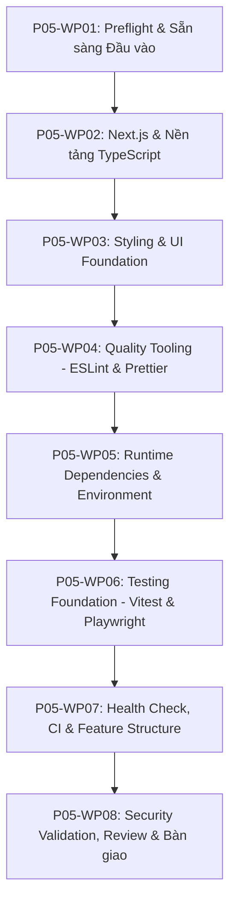

# Kế hoạch Thi công Chi tiết: Phase P05 (Phase Plan - Cổng G1)

- **Mã Phase:** `P05`
- **Tên Phase:** Khởi tạo mã nguồn (Source Bootstrap & Project Scaffolding)
- **Trạng thái Kế hoạch:** `ACCEPTED`
- **Nhánh thi công:** `phase/p05-source-bootstrap`
- **Starting Commit:** `b1aaa9f55e5331ec41e1762193b22e1b12b591ae`

---

## 1. Phân chia 8 Gói Công việc (Work Packages Breakdown)

- **`P05-WP01`:** Preflight, kiểm tra môi trường, đánh giá DoR $\rightarrow$ `docs/phases/P05/01-input-readiness.md`, `02-plan.md`, `03-task-breakdown.md`.
- **`P05-WP02` (Tasks T01, T02, T03, T08):** Tạo Next.js project với App Router, TypeScript strict, package manager `npm`, cấu hình alias `@/*` $\rightarrow$ `package.json`, `tsconfig.json`, `src/app/`.
- **`P05-WP03` (Tasks T04, T05):** Cấu hình Tailwind CSS, khởi tạo cấu hình shadcn/ui, thêm smoke component `Button` $\rightarrow$ `globals.css`, `components.json`, `src/components/ui/button.tsx`.
- **`P05-WP04` (Tasks T06, T07):** Cấu hình ESLint và Prettier, ignore files, scripts `lint`, `format`, `format:check` $\rightarrow$ `eslint.config.mjs`, `.prettierrc`, `.prettierignore`.
- **`P05-WP05` (Tasks T09, T10, T11, T12, T13, T14, T15):** Cài đặt các thư viện nền tảng (React Hook Form, Zod, Supabase SDK, React Flow, ELK.js), xây dựng validation biến môi trường Zod $\rightarrow$ `src/lib/env/index.ts`.
- **`P05-WP06` (Tasks T16, T17):** Thiết lập Vitest (Unit tests) và Playwright (E2E tests) kèm smoke tests có ý nghĩa $\rightarrow$ `vitest.config.ts`, `playwright.config.ts`, `tests/`.
- **`P05-WP07` (Tasks T18, T19, T20, T21):** Tạo Route Handler `/api/health`, file `.env.example`, GitHub Actions CI workflow, cấu trúc thư mục feature-based theo P04 $\rightarrow$ `src/app/api/health/route.ts`, `.env.example`, `.github/workflows/ci.yml`, `docs/architecture/source-structure.md`.
- **`P05-WP08` (Task T22):** Chạy kiểm toán bảo mật framework (`npm audit`), tự đánh giá review chất lượng, tổng kết và lập gói bàn giao P06 $\rightarrow$ `docs/security/dependency-security-baseline.md`, `docs/phases/P05/` (04 đến 09 và issues/), `CHANGELOG.md`, `README.md`.

---

## 2. Ràng buộc Kỹ thuật & Cam kết An toàn Tuyệt đối

1. **Không Viết Logic Nghiệp vụ:** Trang chủ chỉ là scaffold landing kỹ thuật tối thiểu, không vẽ cây gia phả thật, không tạo form nhập người thân.
2. **Không Thiết lập Database:** Không chạy `supabase init`, không tạo bảng SQL, không viết migration.
3. **Cam kết An toàn Git:** 100% commit cục bộ trên `phase/p05-source-bootstrap`, không push, không merge, không tạo PR từ xa.
