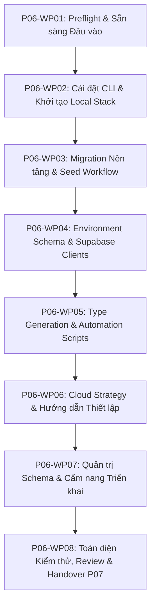

# Kế hoạch Thi công Chi tiết: Phase P06 (Phase Plan - Cổng G1)

- **Mã Phase:** `P06`
- **Tên Phase:** Thiết lập Supabase & Môi trường Ban đầu
- **Trạng thái Kế hoạch:** `ACCEPTED`
- **Nhánh thi công:** `phase/p06-supabase-foundation`
- **Starting Commit:** `a2a3657`

---

## 1. Phân chia 8 Gói Công việc (Work Packages Breakdown)

- **`P06-WP01`:** Preflight, kiểm tra môi trường, đánh giá DoR $\rightarrow$ `docs/phases/P06/01-input-readiness.md`, `02-plan.md`, `03-task-breakdown.md`.
- **`P06-WP02` (Tasks T02, T03):** Cài đặt `supabase@^2.116.0`, chạy `supabase init` $\rightarrow$ `package.json`, `supabase/config.toml`.
- **`P06-WP03` (Tasks T04, T05, T06):** Tạo migration đầu tiên, seed, migration policy $\rightarrow$ `supabase/migrations/20260829152230_*.sql`, `supabase/seed.sql`, `docs/database/migration-policy.md`.
- **`P06-WP04` (Tasks T08, T09, T10, T11, T12):** Cập nhật Zod env, browser/server/admin clients $\rightarrow$ `src/lib/env/index.ts`, `src/lib/supabase/client.ts`, `server.ts`, `admin.ts`.
- **`P06-WP05` (Tasks T13, T14, T15, T16):** Database types và scripts kiểm tra $\rightarrow$ `src/lib/supabase/database.types.ts`, `scripts/supabase/`, `package.json`.
- **`P06-WP06` (Tasks T01, T07):** Phân tách môi trường và hướng dẫn cloud project $\rightarrow$ `docs/database/environment-strategy.md`, `supabase-cloud-setup.md`.
- **`P06-WP07` (Tasks T17, T18):** Chính sách cấm sửa schema ngoài migration, cẩm nang sao lưu và triển khai production $\rightarrow$ `docs/database/schema-change-policy.md`, `backup-before-migration.md`, `production-migration-runbook.md`, `credential-management.md`.
- **`P06-WP08`:** Full quality gate verification, self-review, summary và handover $\rightarrow$ `docs/phases/P06/06-review.md` đến `09-handover.md`, `issues/`, `CHANGELOG.md`.

---

## 2. Cam kết An toàn Kỹ thuật
- Không tạo bảng hay logic nghiệp vụ của P07/P08/P09.
- Không commit file `.env.local` hoặc secret thật vào Git repository.
- Không push, merge hoặc tạo PR từ xa.
