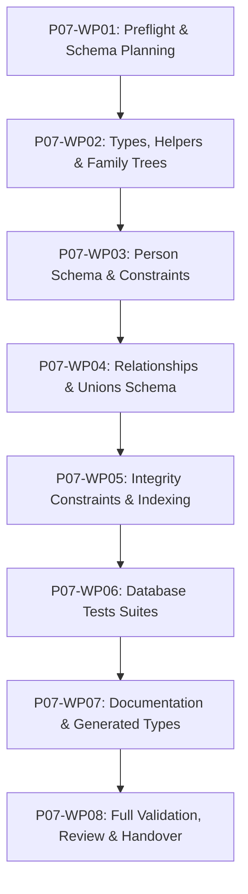

# Kế hoạch Thi công Chi tiết: Phase P07 (Phase Plan - Cổng G1)

- **Mã Phase:** `P07`
- **Tên Phase:** Thiết lập Cơ sở Dữ liệu Lõi
- **Trạng thái Kế hoạch:** `ACCEPTED`
- **Nhánh thi công:** `phase/p07-core-database-schema`
- **Starting Commit:** `70d18a6`

---

## 1. Phân chia 8 Gói Công việc (Work Packages Breakdown)

- **`P07-WP01`:** Git preflight, xác minh DoR $\rightarrow$ `docs/phases/P07/01-input-readiness.md`, `02-plan.md`, `03-task-breakdown.md`.
- **`P07-WP02` (Tasks T01..T06):** Helper functions, Enum types, `profiles`, `family_trees`, `tree_memberships`.
- **`P07-WP03` (Tasks T07..T18):** `persons`, partial dates, `normalized_name` trigger, living status, version, soft delete.
- **`P07-WP04` (Tasks T19..T21):** `parent_child_relationships`, `unions`, `union_members`.
- **`P07-WP05` (Tasks T22..T29):** Enum decisions, composite foreign keys, check constraints, partial unique indexes, graph indexes, updated_at triggers, RLS deny-by-default.
- **`P07-WP06` (Task T30):** 5 pgTAP test suites (`00000_*.sql` đến `00400_*.sql`).
- **`P07-WP07` (Tasks T31..T32):** Sơ đồ ERD, Data Dictionary, sinh lại `database.types.ts` và unit tests.
- **`P07-WP08`:** Full validation, quality gates, self-review, summary và handover cho Phase P08.
