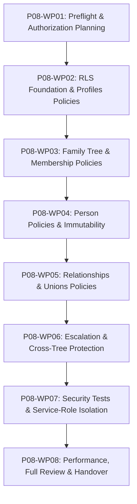

# Kế hoạch Thi công Chi tiết: Phase P08 (Phase Plan - Cổng G1)

- **Mã Phase:** `P08`
- **Tên Phase:** RLS và Phân quyền
- **Trạng thái Kế hoạch:** `ACCEPTED`
- **Nhánh thi công:** `phase/p08-rls-authorization`
- **Starting Commit:** `ef25d32`

---

## 1. Phân chia 8 Gói Công việc (Work Packages Breakdown)

- **`P08-WP01`:** Git preflight, xác minh DoR $\rightarrow$ `docs/phases/P08/01-input-readiness.md`, `02-plan.md`, `03-task-breakdown.md`.
- **`P08-WP02` (Tasks T01..T03):** RLS enablement, table grants baseline, `profiles` policies & tests.
- **`P08-WP03` (Tasks T04..T09):** `family_trees` & `tree_memberships` policies, owner protection, recursion handling.
- **`P08-WP04` (Tasks T10..T13):** `persons` read/create/update/soft-delete policies, immutable trigger.
- **`P08-WP05` (Tasks T14..T15):** `parent_child_relationships`, `unions`, `union_members` policies & same-tree tests.
- **`P08-WP06` (Tasks T16..T19):** Chặn đổi `tree_id`, chặn Viewer ghi, cưỡng chế Owner-only actions.
- **`P08-WP07` (Tasks T20..T24):** Owner, Viewer, Outsider, Cross-Tree, Service-Role isolation tests.
- **`P08-WP08` (Task T25):** Policy query-plan review, supporting indexes, full validation, summary và handover cho Phase P09.
