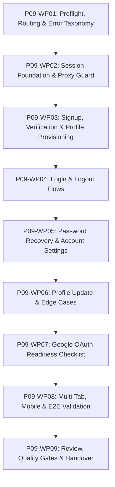

# Kế hoạch Thi công Chi tiết: Phase P09 (Phase Plan - Cổng G1)

- **Mã Phase:** `P09`
- **Tên Phase:** Xác thực người dùng
- **Trạng thái Kế hoạch:** `ACCEPTED`
- **Nhánh thi công:** `phase/p09-user-authentication`
- **Starting Commit:** `8627d78`

---

## 1. Phân chia 9 Gói Công việc (Work Packages Breakdown)

- **`P09-WP01`:** Preflight, hằng số route, Zod schemas, safe redirect helper, error taxonomy.
- **`P09-WP02` (Tasks T07..T09):** Next.js 16 Proxy, `requireUser` server guard, protected dashboard shell layout.
- **`P09-WP03` (Tasks T01, T02, T10):** Signup page, email confirmation callback, DB trigger provisioning profile.
- **`P09-WP04` (Tasks T03, T04):** Login page, signout action, session synchronization.
- **`P09-WP05` (Tasks T05, T06, T12):** Forgot password, password recovery callback, update password, change password.
- **`P09-WP06` (Tasks T11, T13, T14):** Profile display name update, session expiration, error page.
- **`P09-WP07` (Task T15):** Google OAuth configuration checklist (`DEFERRED / MANUAL_ACTION_REQUIRED`).
- **`P09-WP08` (Tasks T16..T18):** E2E testing, multi-tab simulation, mobile viewports, preview redirect tests.
- **`P09-WP09`:** Full quality gates, security review, summary và handover cho Phase P10 & P11.
