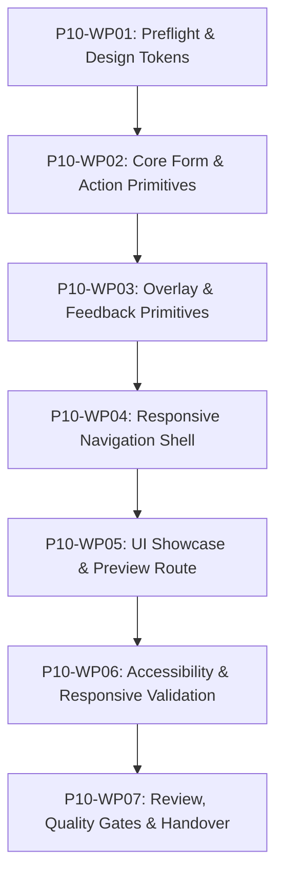

# Kế hoạch Thi công Chi tiết: Phase P10 (Phase Plan - Cổng G1)

- **Mã Phase:** `P10`
- **Tên Phase:** Khung giao diện responsive
- **Trạng thái Kế hoạch:** `ACCEPTED`
- **Nhánh thi công:** `phase/p10-responsive-ui-shell`
- **Starting Commit:** `f804c0e`

---

## 1. Phân chia 7 Gói Công việc (Work Packages Breakdown)

- **`P10-WP01` (Tasks T01..T04):** Design tokens màu sắc, kiểu chữ, khoảng cách, breakpoints, CSS variables.
- **`P10-WP02` (Tasks T05..T08):** Button, Input, Select, PartialDateInput.
- **`P10-WP03` (Tasks T09..T15):** Dialog, Drawer, BottomSheet, Toast, Skeleton, EmptyState, ErrorState.
- **`P10-WP04` (Tasks T16..T19):** Desktop Sidebar, Mobile Navigation, App Header, App Breadcrumb, AppShell integration.
- **`P10-WP05`:** Trang trưng bày component `/ui-preview`.
- **`P10-WP06` (Tasks T20..T23):** Keyboard navigation audit, Focus ring visibility, Color contrast check, Small-screen verification.
- **`P10-WP07`:** Full quality gates, Design system docs, Summary và Handover cho Phase P11, P12, P15.
