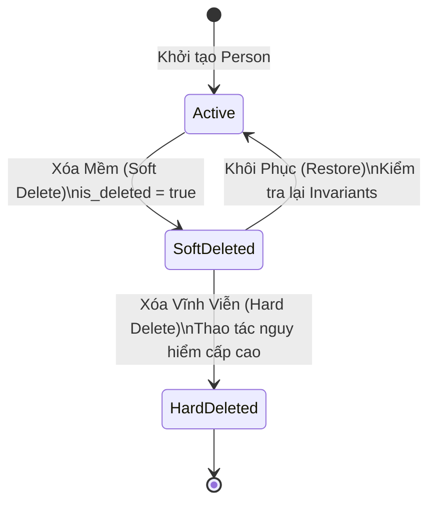

# Quy tắc Xóa mềm & Khôi phục Dữ liệu Phả hệ (Deletion & Recovery Rules)

- **Mã tài liệu:** `DOM-DELETION-01`
- **Phiên bản:** `v0.1-baseline`
- **Trạng thái:** `PROVISIONAL`
- **Ngày ban hành:** 2026-08-29

---

## 1. Phân biệt 4 Cấp độ Thao tác Xóa & Phục hồi

| Cấp độ thao tác | Trạng thái Dữ liệu | Hiển thị trên Cây | Khả năng Khôi phục |
| :--- | :--- | :---: | :---: |
| **Xóa Mềm (Soft Delete)** | Đánh dấu `is_deleted = true` trên bản ghi Person và các liên kết trực tiếp. | Ẩn hoàn toàn khỏi Canvas đồ thị và Tìm kiếm. | **100% Khôi phục được** từ Thùng rác. |
| **Gỡ Liên kết (Unlink)** | Chỉ xóa bản ghi trong bảng `relationships`, Person vẫn tồn tại. | Person tách thành node tự do (hoặc cụm rời). | Có thể liên kết lại bất cứ lúc nào. |
| **Khôi phục (Restore)** | Đặt lại `is_deleted = false`. | Xuất hiện trở lại trên cây sau khi kiểm tra Invariants. | Đưa về trạng thái hoạt động bình thường. |
| **Xóa Vĩnh viễn (Hard Delete)** | Xóa vật lý bản ghi khỏi CSDL PostgreSQL. | Biến mất hoàn toàn khỏi hệ thống. | **KHÔNG THỂ HOÀN TÁC**. |

---

## 2. Các Quy tắc Xóa Mềm Cốt lõi

### `DEL-001`: Cấm Tự ý Xóa Lan Truyền (No Silent Cascading Delete)
- **Mức độ:** `MUST` (Invariant `INV-015`)
- **Định nghĩa:** Khi xóa một Person (ví dụ: Xóa Người Cha), hệ thống **tuyệt đối không được tự động xóa các Con, Vợ/Chồng hoặc Cha Mẹ của người đó**.
- **Hành vi hệ thống:** Chỉ xóa Person được chọn và ngắt các đường liên kết trực tiếp nối tới người đó. Các con cháu vẫn tồn tại nguyên vẹn trên cây.

### `DEL-002`: Bảng Xem trước Ảnh hưởng (Impact Preview)
- **Mức độ:** `MUST`
- **Định nghĩa:** Trước khi xác nhận xóa một Person có quan hệ, giao diện bắt buộc hiển thị hộp thoại cảnh báo:
  > *"Xóa thành viên này sẽ ngắt kết nối với 1 người vợ, 3 người con và 2 phụ mẫu. Các thành viên liên quan vẫn được giữ nguyên vẹn."*

### `DEL-003`: Xử lý khi Xóa các Người Mốc Đặc biệt
- **Khi xóa Người Trung tâm (`Center Person`):** Hệ thống tự động chuyển trọng tâm hiển thị sang một người thân gần nhất (Cha/Mẹ $\rightarrow$ Vợ/Chồng $\rightarrow$ Con $\rightarrow$ Node đầu tiên còn lại trong cây).
- **Khi xóa Mốc Đánh số đời (`Generation Anchor`):** Hệ thống hiển thị thông báo yêu cầu người dùng chọn một Mốc số đời mới, hoặc tạm thời ẩn nhãn số đời trên giao diện.
- **Khi xóa Thủy tổ (`Founding Ancestor`):** Cờ đánh dấu Thủy tổ được gỡ bỏ; cây trở về trạng thái chưa xác định Thủy tổ.

---

## 3. Quy tắc Khôi phục Dữ liệu An toàn (Safe Recovery Rules)

### `DEL-004`: Kiểm tra lại Invariants khi Khôi phục (Re-validation on Restore)
- **Mức độ:** `MUST`
- **Định nghĩa:** Khi người dùng bấm "Khôi phục" một nhân vật từ thùng rác, hệ thống bắt buộc chạy lại toàn bộ các bài kiểm tra logic:
  - Các quan hệ cũ của người này có làm phát sinh **chu trình vòng lặp thế hệ (`INV-004`)** với các thay đổi mới trên cây hay không?
  - Người này có bị trùng liên kết cha/mẹ với một người mới được thêm trong lúc người này bị xóa hay không?
- **Xử lý xung đột khi Khôi phục:** Nếu phát hiện xung đột $\rightarrow$ Hệ thống khôi phục Person về dạng node tự do (hoặc khôi phục kèm cảnh báo `WARN-006: Một số quan hệ cũ bị xung đột cần kiểm tra lại`).
