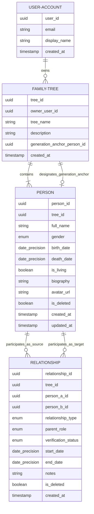

# Mô hình Dữ liệu Khái niệm (Conceptual Domain Model)

- **Mã tài liệu:** `DOM-MODEL-01`
- **Phiên bản:** `v0.1-baseline`
- **Trạng thái:** `PROVISIONAL`
- **Ngày ban hành:** 2026-08-29

---

## 1. Sơ đồ Thực thể Nghiệp vụ (Conceptual Entity-Relationship Diagram)

---

## 2. Đặc tả Các Thuộc tính Khái niệm của Thực thể

### 2.1. Thực thể Person (Nhân vật Gia phả)
- **`person_id` (UUID):** Định danh duy nhất toàn cầu cho nhân vật.
- **`tree_id` (UUID):** Định danh cây gia phả chứa nhân vật này.
- **`full_name` (String - Bắt buộc):** Họ và tên đầy đủ của nhân vật (Hỗ trợ tiếng Việt Unicode có dấu).
- **`gender` (Enum: `MALE`, `FEMALE`, `OTHER`, `UNKNOWN`):** Giới tính sinh học / phả hệ của nhân vật.
- **`birth_date` (DatePrecision):** Cấu trúc ngày sinh (Chính xác, Tháng/Năm, Chỉ năm, Khoảng năm, Ước tính).
- **`death_date` (DatePrecision):** Cấu trúc ngày mất (Hỗ trợ ngày không đầy đủ).
- **`is_living` (Boolean):** Trạng thái còn sống hay đã mất. Mặc định là `true` nếu không có ngày mất, hoặc `false` nếu đã khai báo ngày mất.
- **`biography` (String - Tùy chọn):** Tiểu sử, sự nghiệp, công đức hoặc ghi chú cuộc đời.
- **`avatar_url` (String - Tùy chọn):** Đường dẫn ảnh chân dung (Supabase Storage).
- **`is_deleted` (Boolean):** Cờ đánh dấu xóa mềm (Mặc định `false`).

### 2.2. Thực thể Relationship (Mối quan hệ Phả hệ)
- **`relationship_id` (UUID):** Định danh duy nhất cho liên kết.
- **`person_a_id` (UUID) & `person_b_id` (UUID):** Hai nhân vật tham gia quan hệ (Trong quan hệ Cha/Mẹ-Con: Person A là Parent, Person B là Child).
- **`relationship_type` (Enum):** Loại quan hệ (`BIOLOGICAL_PARENT_CHILD`, `ADOPTIVE_PARENT_CHILD`, `MARRIAGE`, `GUARDIAN`).
- **`parent_role` (Enum: `FATHER`, `MOTHER`, `PARENT_UNSPECIFIED`):** Vai trò phụ mẫu của Person A đối với Person B.
- **`verification_status` (Enum: `VERIFIED`, `UNVERIFIED`, `DISPUTED`):** Trạng thái độ tin cậy của thông tin quan hệ.
- **`start_date` & `end_date` (DatePrecision - Tùy chọn):** Thời gian bắt đầu / kết thúc (Dành cho quan hệ hôn nhân hoặc giám hộ).

---

## 3. Phân biệt Quan hệ Nguồn (Source) vs Quan hệ Suy ra (Derived)

| Loại quan hệ | Định nghĩa | Cách lưu trữ & Xử lý |
| :--- | :--- | :--- |
| **Quan hệ Nguồn (Source Fact)** | Các liên kết trực tiếp do người dùng chủ động tạo (Cha-Con, Mẹ-Con, Vợ-Chồng, Con nuôi). | Lưu trực tiếp thành bản ghi trong bảng `relationships`. |
| **Quan hệ Suy ra (Derived Fact)** | Các quan hệ gián tiếp được tính toán tự động qua đồ thị: Anh chị em ruột (cùng cha mẹ), Ông bà - Cháu, Cô dì chú bác. | **KHÔNG LƯU TRỰC TIẾP**; hệ thống tự động suy ra khi truy vấn đồ thị. |
| **Cha mẹ Kế (Step-parent)** | Quan hệ giữa một người với con riêng của người phối ngẫu. | Mặc định là quan hệ suy ra từ Hôn nhân + Cha/Mẹ ruột. |
