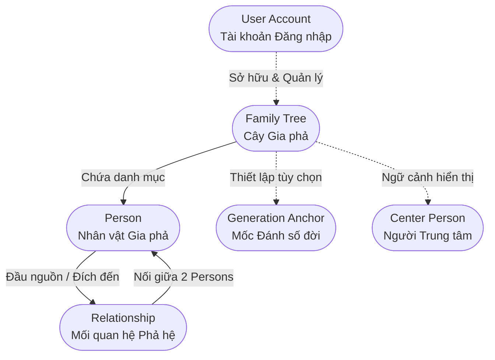

# Tổng quan Mô hình Nghiệp vụ Gia phả GenViet (Domain Overview)

- **Mã tài liệu:** `DOM-OVERVIEW-01`
- **Phiên bản:** `v0.1-baseline`
- **Trạng thái:** `PROVISIONAL` (Chờ nghiệm thu Phase P02)
- **Ngày ban hành:** 2026-08-29
- **Phạm vi áp dụng:** GenViet MVP v0.1

---

## 1. Bối cảnh & Tuyên bố Sứ mệnh Nghiệp vụ

GenViet là hệ thống quản lý và trực quan hóa cây phả hệ gia đình, được thiết kế nhằm đáp ứng tính đặc thù của văn hóa phả hệ Việt Nam trong kỷ nguyên số:
1. **Tôn trọng tính chân thực lịch sử:** Dữ liệu gia phả được thu thập dần dần, chấp nhận các thông tin khuyết thiếu (chỉ biết năm, không nhớ ngày mất) hoặc dữ liệu truyền khẩu chưa xác minh.
2. **Linh hoạt cấu trúc phả hệ:** Không ép buộc phải bắt đầu từ Thủy tổ; cho phép người dùng khởi tạo từ bất kỳ thành viên nào (ví dụ: từ chính bản thân hoặc ông bà) và mở rộng đa chiều (lên tổ tiên, xuống hậu duệ, sang hôn phối).
3. **Bảo mật tuyệt đối (Private by Default):** Mọi cây gia phả là một ốc đảo dữ liệu riêng tư độc lập; tách biệt hoàn toàn giữa danh tính tài khoản đăng nhập (User) và nhân vật lịch sử trong cây (Person).

---

## 2. Các Thực thể Nghiệp vụ Cốt lõi (Core Domain Entities)

| Mã Thực thể | Tên Thực thể | Định nghĩa Khái niệm | Ý nghĩa Nghiệp vụ |
| :--- | :--- | :--- | :--- |
| **`ENT-001`** | **User Account** | Tài khoản thực tế dùng để xác thực và sở hữu dữ liệu. | Có email, mật khẩu; thực hiện các thao tác thêm, sửa, xóa trên cây. |
| **`ENT-002`** | **Family Tree** | Không gian quản trị và phạm vi dữ liệu gia phả khép kín. | Ranh giới cách ly dữ liệu và quyền riêng tư (Single-Owner trong v0.1). |
| **`ENT-003`** | **Person** | Thực thể đại diện cho một con người cụ thể trong gia phả. | Có thể còn sống hoặc đã mất; không bắt buộc có tài khoản hay email. |
| **`ENT-004`** | **Relationship** | Liên kết có hướng hoặc vô hướng nối giữa hai Person. | Xác định quan hệ huyết thống (Cha/Mẹ/Con) hoặc hôn phối (Vợ/Chồng). |

---

## 3. Các Nguyên tắc Nghiệp vụ Bất biến Nền tảng

1. **`INV-001`:** User và Person là hai khái niệm hoàn toàn độc lập. Xóa User không mặc định xóa Person và xóa Person không ảnh hưởng đến User.
2. **`INV-002` & `INV-003`:** Một Person không thể có quan hệ Cha/Mẹ - Con với chính mình và không thể kết hôn với chính mình.
3. **`INV-004`:** Đồ thị huyết thống (Parent-Child) là đồ thị có hướng không chu trình (Directed Acyclic Graph - DAG); nghiêm cấm mọi liên kết tạo thành vòng lặp thế hệ.
4. **`INV-005`:** Trong phạm vi v0.1, các liên kết trực tiếp chỉ được thiết lập giữa các Person thuộc cùng một Family Tree (No cross-tree links).
5. **`INV-006`:** Thứ tự tạo bản ghi không quyết định thế hệ hay vai trò huyết thống của Person.
