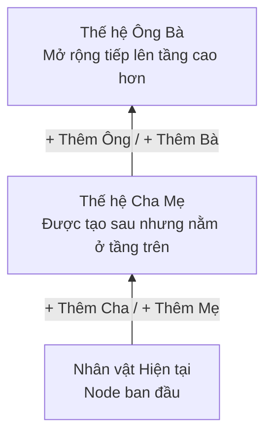

# Quy tắc Nghiệp vụ Cốt lõi: Mở rộng Tổ tiên & Liên kết Hồ sơ (Domain Rules)

- **Mã tài liệu:** `DOM-RULES-01`
- **Phiên bản:** `v0.1-baseline`
- **Trạng thái:** `PROVISIONAl`
- **Ngày ban hành:** 2026-08-29

---

## 1. Quy tắc Mở rộng Tổ tiên từ Bất kỳ Node nào (Ancestor Expansion) - `P02-T19`

Đây là một trong những nguyên tắc thiết kế quan trọng nhất của GenViet: **Cây gia phả là một đồ thị động có thể phát triển vô hạn về cả 2 chiều (quá khứ và tương lai)**.

### Các Quy tắc Chi tiết:
1. **`BR-EX-001` (Tự do Mở rộng Tổ tiên):** Mọi Person hợp lệ trong cây đều có thể được chọn để thêm Cha (`+ Thêm Cha`) hoặc thêm Mẹ (`+ Thêm Mẹ`) bất kỳ lúc nào, kể cả khi nhân vật đó đã được tạo từ lâu.
2. **`BR-EX-002` (Không bắt buộc Dựng lại Cây):** Khi thêm một cụ tổ mới ở đời cao hơn, hệ thống tự động tái tính toán vị trí phân tầng của đồ thị. Người dùng **tuyệt đối không bao giờ phải xóa đi vẽ lại cây từ đầu**.
3. **`BR-EX-003` (Bảo toàn Ngữ cảnh Quan sát):** Khi thêm tổ tiên mới phía trên Người trung tâm (`Center Person`), khung nhìn hiện tại vẫn giữ nguyên trọng tâm vào Người trung tâm, không làm người dùng bị mất dấu vị trí đang làm việc.
4. **`BR-EX-004` (Không Tự động Thay đổi Thủy tổ & Mốc Đời):** Việc thêm một cụ tổ đời cao hơn không tự động thay đổi nhãn Thủy tổ (`Founding Ancestor`) hay Mốc đánh số đời (`Generation Anchor`) trừ khi người dùng chủ động điều chỉnh.

---

## 2. Quy tắc Liên kết Người Đã Tồn tại trong Cây (Existing Person Linking) - `P02-T20`

Khi thiết lập quan hệ Cha/Mẹ hoặc Vợ/Chồng, thay vì tạo mới một Person, người dùng có thể chọn liên kết tới một Person đã có sẵn trong cây:

### Các Quy tắc Chi tiết:
1. **`BR-LK-001` (Phạm vi Cùng Cây - Same-Tree Only):** Chỉ cho phép tìm kiếm và liên kết các Person thuộc cùng một `tree_id`. Không hỗ trợ liên kết chéo sang cây của tài khoản khác hoặc cây khác của cùng tài khoản trong v0.1.
2. **`BR-LK-002` (Kiểm tra Bất biến trước khi Liên kết):** Trước khi xác nhận liên kết Person A làm Cha/Mẹ của Person B, hệ thống bắt buộc thực hiện kiểm tra:
   - Person A có trùng với Person B không? (Chống Self-link $\rightarrow$ Chặn `ERR-001`).
   - Person A có phải là con/cháu/hậu duệ của Person B không? (Chống Chu trình $\rightarrow$ Chặn `ERR-002`).
   - Person B đã có Cha/Mẹ ruột đã xác nhận chưa? (Nếu có $\rightarrow$ Hiển thị cảnh báo `WARN-001`).
3. **`BR-LK-003` (Không Thay đổi Dữ liệu Cá nhân khi Liên kết):** Thao tác liên kết chỉ tạo một bản ghi quan hệ mới trong bảng `relationships`, tuyệt đối không ghi đè hay thay đổi họ tên, ngày sinh của Person được chọn.
4. **`BR-LK-004` (Hủy Thao tác An toàn):** Nếu người dùng mở form liên kết rồi nhấn "Hủy bỏ", hệ thống không tạo bất kỳ bản ghi rác nào trong CSDL.
