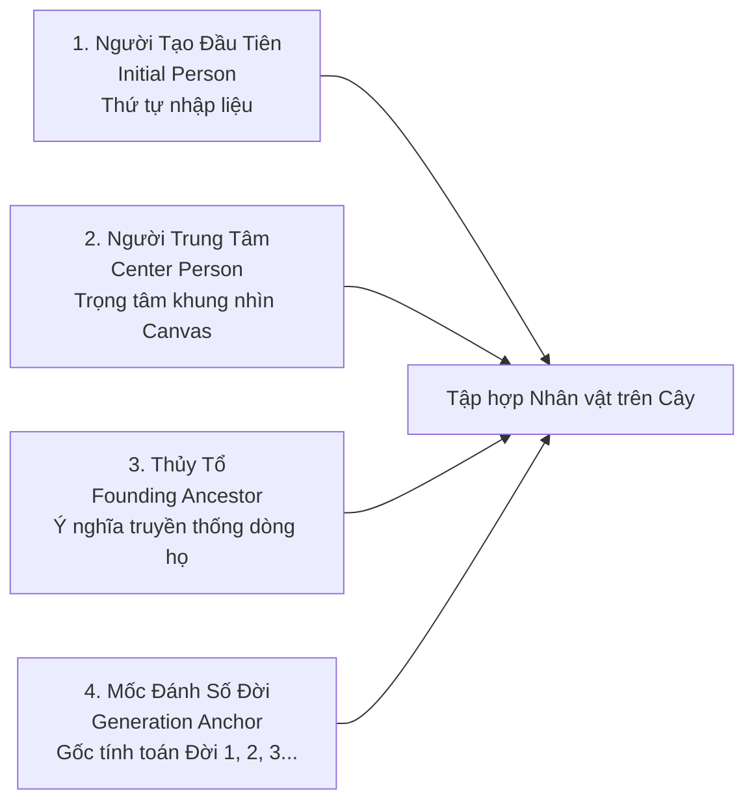

# Các Khái niệm Cốt lõi về Cây Gia phả & Người Mốc (Family Tree Concepts)

- **Mã tài liệu:** `DOM-TREE-01`
- **Phiên bản:** `v0.1-baseline`
- **Trạng thái:** `PROVISIONAL`
- **Ngày ban hành:** 2026-08-29

---

## 1. Khái niệm Cây Gia phả (Family Tree) - `P02-T02`

### Định nghĩa Nghiệp vụ:
**Cây Gia phả (Family Tree)** là một không gian dữ liệu khép kín, đóng vai trò là ranh giới quản trị và bảo mật chứa tập hợp các Nhân vật (`Person`) và các Mối quan hệ (`Relationship`) thuộc cùng một gia đình, dòng họ hoặc chi nhánh.

### Các Quy tắc Quản trị Gia phả:
1. **`BR-TR-001` (Ranh giới Cách ly Tuyệt đối):** Các quan hệ phả hệ trực tiếp chỉ được liên kết giữa các Person trong cùng một Family Tree. Nghiêm cấm liên kết trực tiếp giữa 2 Person thuộc 2 cây gia phả khác nhau (No cross-tree links).
2. **`BR-TR-002` (Hỗ trợ Nhiều Cụm Rời - Multi-cluster Support):** Trong quá trình nhập liệu, một cây gia phả có thể chứa các nhân vật hoặc cụm nhánh chưa kịp nối vào cây chính. Hệ thống công nhận đây là trạng thái dữ liệu hợp lệ và không chặn lưu.
3. **`BR-TR-003` (Trạng thái Rỗng vs Có Dữ liệu):**
   - *Cây Rỗng (Empty Tree):* Cây có 0 nhân vật. Giao diện hiển thị hướng dẫn tạo thành viên đầu tiên (`US-B03`).
   - *Cây Đã Khởi tạo:* Cây có $\ge 1$ nhân vật.
4. **`BR-TR-004` (Đa Dòng họ trong Một Cây):** Tên cây gia phả (ví dụ: "Gia phả họ Lê") chỉ mang tính chất định danh; các nhân vật trong cây có thể mang nhiều họ khác nhau (họ của dâu, rể, con nuôi).

---

## 2. Phân định 4 Loại "Người Mốc" trong Phả hệ

Để tránh sự nhập nhằng trong thiết kế thuật toán và giao diện, GenViet phân định rạch ròi 4 khái niệm người mốc:

| Khái niệm | Mã | Mục đích Nghiệp vụ | Có cố định không? | Ảnh hưởng Huyết thống? |
| :--- | :---: | :--- | :---: | :---: |
| **Người Tạo Đầu Tiên** *(Initial Person)* | `CONCEPT-001` | Ghi nhận node đầu tiên người dùng nhập vào hệ thống (`P02-T04`). | Cố định theo lịch sử | **KHÔNG** |
| **Người Trung Tâm** *(Center Person)* | `CONCEPT-002` | Điểm hội tụ của khung nhìn đồ thị đang hiển thị (`P02-T03`). | Thay đổi tự do bất kỳ lúc nào | **KHÔNG** |
| **Thủy Tổ** *(Founding Ancestor)* | `CONCEPT-003` | Điểm khởi đầu phả hệ theo quy ước văn hóa của gia đình (`P02-T05`). | Người dùng gán tùy chọn | **KHÔNG** |
| **Mốc Đánh Số Đời** *(Generation Anchor)* | `CONCEPT-004` | Node được chọn làm chuẩn Thế hệ 1 để tính số đời tương đối (`P02-T06`). | Người dùng cấu hình | **KHÔNG** |

---

## 3. Chi tiết Từng Loại Người Mốc

### 3.1. Người Trung Tâm (Center Person / Focus Node) - `P02-T03`
- **Bản chất:** Là trạng thái quan sát của phiên làm việc hiện tại, xác định người nào đang nằm ở giữa màn hình Canvas React Flow.
- **Quy tắc:**
  - `BR-CP-001`: Người trung tâm **KHÔNG PHẢI** là root kỹ thuật bất biến của đồ thị.
  - `BR-CP-002`: Người dùng có thể nhấp đúp vào bất kỳ Person nào trên cây hoặc chọn từ thanh tìm kiếm để đổi thành Người trung tâm mới.
  - `BR-CP-003`: Khi thêm cha mẹ mới phía trên người trung tâm, vị trí Người trung tâm hiện tại được giữ nguyên (không bị nhảy khung nhìn đột ngột).
  - `BR-CP-004` (Xóa Center Person): Nếu Người trung tâm bị xóa mềm, hệ thống tự động chọn một fallback phù hợp (ví dụ: cha/mẹ, vợ/chồng, con hoặc node đầu tiên còn lại).

### 3.2. Người Tạo Đầu Tiên (Initial Person) - `P02-T04`
- **Bản chất:** Nhân vật đầu tiên được tạo khi khởi tạo cây rỗng (`US-C01`).
- **Quy tắc:**
  - `BR-IP-001`: Người tạo đầu tiên chỉ phản ánh **thứ tự thời gian nhập liệu**, không mặc định là Thủy tổ và không mặc định là Đời 1.
  - `BR-IP-002`: Người dùng có toàn quyền thêm Cha, Mẹ, Ông, Bà lên phía trên Người tạo đầu tiên bất kỳ lúc nào.
  - `BR-IP-003`: Người tạo đầu tiên có thể bị xóa mềm hoặc thay đổi thông tin theo quy trình chung.

### 3.3. Thủy Tổ (Founding Ancestor) - `P02-T05`
- **Bản chất:** Nhân vật được gia đình tôn kính xem là cụ tổ phát tích dòng họ.
- **Quy tắc:**
  - `BR-FA-001`: Thủy tổ là nhãn mang ý nghĩa danh dự / truyền thống do người dùng chủ động gán, hệ thống **không tự ý suy diễn**.
  - `BR-FA-002`: Một cây có thể chưa xác định Thủy tổ hoặc có nhiều nhánh với các Thủy tổ khác nhau.
  - `BR-FA-003`: Khi phát hiện thêm cụ tổ đời cao hơn người đang được đánh dấu Thủy tổ, hệ thống giữ nguyên nhãn cũ và cho phép người dùng chuyển nhãn nếu muốn.

### 3.4. Mốc Đánh Số Đời (Generation Anchor) - `P02-T06`
- **Bản chất:** Điểm mốc tham chiếu để hiển thị nhãn "Đời thứ X" cho các thành viên trong cây.
- **Quy tắc:**
  - `BR-GA-001`: Mốc đánh số đời được quy ước là **Đời 1 (Generation 1)**.
  - `BR-GA-002`: Con ruột của Mốc là **Đời 2**, Cháu ruột là **Đời 3**...
  - `BR-GA-003`: Việc thay đổi Mốc đánh số đời chỉ tính toán lại số đời hiển thị trên giao diện, **tuyệt đối không làm thay đổi hay xáo trộn các mối quan hệ huyết thống**.
  - `BR-GA-004`: Các nhân vật không có liên kết huyết thống tới Mốc sẽ mang trạng thái số đời là `UNDETERMINED` (Không xác định).
