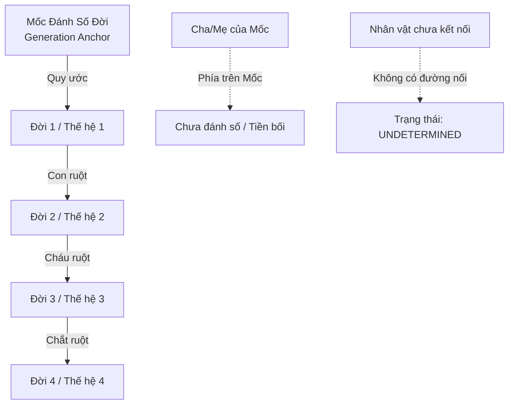

# Quy tắc Tính toán Thế hệ & Số đời Phả hệ (Generation Calculation Rules)

- **Mã tài liệu:** `DOM-GEN-01`
- **Phiên bản:** `v0.1-baseline`
- **Trạng thái:** `PROVISIONAL`
- **Ngày ban hành:** 2026-08-29

---

## 1. Bản chất của Khái niệm "Số đời" trong GenViet

Trong phả học truyền thống Việt Nam, số đời ("Đời thứ 1", "Đời thứ 2"...) luôn được tính toán **tương đối theo một vị tiền bối được chọn làm mốc**. GenViet chuẩn hóa cơ chế này bằng khái niệm **Mốc Đánh số đời (Generation Anchor)**.

---

## 2. Thuật toán Tính Số đời Khái niệm (Relative Generation Logic)

### `GEN-001`: Quy ước Mốc Đời 1 (Generation 1 Anchor Rule)
- **Định nghĩa:** Person được người dùng chọn làm Mốc (`Generation Anchor`) được gán giá trị **`Generation = 1`**.
- **Nếu chưa chọn Mốc:** Mặc định hệ thống sử dụng **Người tạo đầu tiên** làm mốc tạm thời, hoặc hiển thị chế độ phân tầng tương đối không gắn số đời.

### `GEN-002`: Quy tắc Lan truyền Hậu duệ Huyết thống (Descendant Generation Rule)
- Với mọi Person B là Con ruột của Person A (`ParentChild(A, B)`):
  $$\text{Generation}(B) = \text{Generation}(A) + 1$$
- Cháu ruột là Đời 3, Chắt ruột là Đời 4...

### `GEN-003`: Xử lý Nhân vật Phía trên Mốc (Ancestors above Anchor)
- Khi người dùng thêm Cha/Mẹ phía trên Mốc Đời 1:
  - Về mặt trực quan: Node cha mẹ được xếp ở hàng trên của Mốc.
  - Về mặt số đời hiển thị: Gắn nhãn `Tiền bối của Mốc` hoặc `Đời 0` (tùy cấu hình hiển thị).
  - Khuyến nghị người dùng: Nếu muốn các cụ tổ mang nhãn Đời 1, người dùng chỉ cần nhấp chuột chọn cụ tổ làm Mốc mới (`BR-GA-003`).

### `GEN-004`: Quy tắc Số đời cho Người Phối ngẫu (Spouse Generation Rule)
- Người phối ngẫu (Vợ/Chồng) được vẽ ở **cùng hàng ngang thế hệ** với nhân vật chính để đảm bảo mỹ thuật đồ thị.
- Tuy nhiên, về mặt số đời huyết thống: Người phối ngẫu **không nhận số đời kế thừa** nếu không có đường dẫn huyết thống riêng trong dòng họ.

### `GEN-005`: Quy tắc Xử lý Xung đột Nhiều Đường dẫn (Conflicting Generation Paths)
- Trong trường hợp hôn nhân họ hàng phức tạp dẫn đến việc một người có 2 đường dẫn thế hệ khác nhau tới Mốc (ví dụ: một đường cho kết quả Đời 4, một đường cho kết quả Đời 5):
  - Hệ thống **tuyệt đối không tự ý chọn bừa một đường**.
  - Gắn nhãn trạng thái: `GENERATION_CONFLICT` và hiển thị chi tiết 2 đường dẫn để người dùng tự quyết định cách xưng hô.

### `GEN-006`: Trạng thái Chưa Xác định (Undetermined Generation)
- Với các nhân vật hoặc cụm nhánh rời chưa có đường liên kết huyết thống tới Mốc:
  - Giá trị số đời hiển thị là **`UNDETERMINED`** (Không hiển thị nhãn "Đời thứ X" sai lệch).
