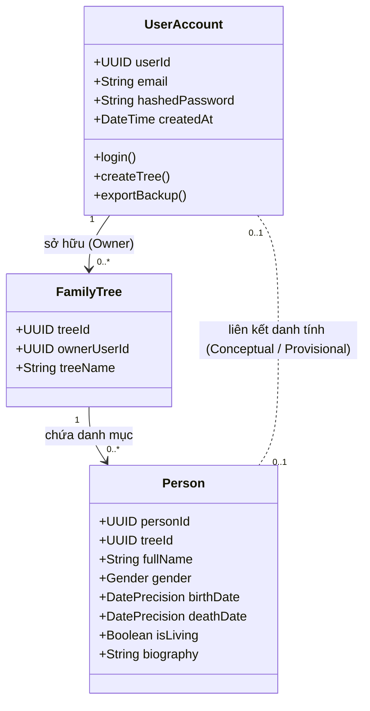

# Mô hình Định danh: Tách biệt User & Person (Identity Model)

- **Mã tài liệu:** `DOM-IDENTITY-01`
- **Phiên bản:** `v0.1-baseline`
- **Trạng thái:** `PROVISIONAL`
- **Ngày ban hành:** 2026-08-29

---

## 1. Bản chất Khác biệt giữa User và Person

Một trong những sai lầm phổ biến nhất trong các phần mềm gia phả là đồng nhất tài khoản đăng nhập với nhân vật trong phả hệ. GenViet phân định rạch ròi 2 thực thể này:

---

## 2. Bảng So sánh Chi tiết: User Account vs Person Node

| Tiêu chí so sánh | Tài khoản Người dùng (User Account) | Nhân vật Gia phả (Person) |
| :--- | :--- | :--- |
| **Mục đích thực thể** | Xác thực, phân quyền và lưu vết phiên đăng nhập. | Đại diện cho một con người thực tế trong dòng họ. |
| **Trạng thái sinh học** | Luôn là người còn sống đang sử dụng web. | Có thể còn sống, đã khuất nhiều thế kỷ trước, hoặc thai nhi. |
| **Thông tin xác thực** | Bắt buộc có Email và Mật khẩu. | **Tuyệt đối KHÔNG** yêu cầu email, mật khẩu hay tài khoản. |
| **Vị trí trong Đồ thị** | Không có vị trí trên cây phả hệ. | Là một node đồ thị có quan hệ Cha, Mẹ, Vợ/Chồng, Con. |
| **Quy mô số lượng** | 1 tài khoản quản lý toàn bộ cây. | Hàng chục đến hàng trăm/nghìn nhân vật trong 1 cây. |
| **Tác động khi Xóa** | Hủy phiên đăng nhập, khóa quyền quản trị. | Đánh dấu xóa mềm (`is_deleted = true`), giữ an toàn đồ thị. |

---

## 3. 10 Quy tắc Định danh Cốt lõi (Identity Rules)

1. **`BR-ID-001` (Thực thể Độc lập):** User và Person là 2 thực thể hoàn toàn riêng biệt. Không bao giờ gộp chung bảng dữ liệu hay dùng chung khóa chính.
2. **`BR-ID-002` (Không tự động tạo User cho Person):** Khi người dùng tạo một nhân vật mới trên cây, hệ thống tuyệt đối không tự động sinh tài khoản hay gửi email mời.
3. **`BR-ID-003` (Không ép buộc Email cho Person):** Nhân vật gia phả chỉ cần Họ tên và Giới tính để khởi tạo; không thu thập email của các thành viên dòng họ.
4. **`BR-ID-004` (User không bắt buộc liên kết Person):** Một User có thể tạo và quản lý cây mà không cần chỉ định nhân vật nào trên cây là "chính mình".
5. **`BR-ID-005` (Person không bắt buộc liên kết User):** 99.9% nhân vật trong gia phả (các cụ tổ, người đã khuất, trẻ em) tồn tại độc lập mà không liên kết tới bất kỳ tài khoản nào.
6. **`BR-ID-006` (Liên kết Tùy chọn trong v0.1):** Trong phiên bản v0.1, cơ chế liên kết User với 1 Person (để đánh dấu "Tôi trên cây này") chỉ mang ý nghĩa trải nghiệm cá nhân (đổi vị trí Focus mặc định), không tạo thêm ràng buộc quyền hạn.
7. **`BR-ID-007` (Không suy diễn Quyền hạn từ Huyết thống):** Quyền xem/sửa cây được xác định bởi quyền sở hữu cây (`owner_id`), không phụ thuộc vào việc User có quan hệ là con hay cha của ai trên cây.
8. **`BR-ID-008` (Bảo toàn Person khi User bị khóa/xóa):** Việc xóa hoặc đóng băng tài khoản User không làm mất đi các nhân vật trong phả hệ nếu dữ liệu được chuyển nhượng quyền sở hữu.
9. **`BR-ID-009` (Tách biệt Dữ liệu Đăng nhập):** Mật khẩu, token xác thực thuộc phân hệ bảo mật Supabase Auth, tuyệt đối không xuất hiện trong file sao lưu gia phả JSON hay profile nhân vật.
10. **`BR-ID-010` (Thông tin Hồ sơ Khác biệt):** Tên tài khoản hiển thị (ví dụ: `nguyenvana_tech`) và Họ tên thật của nhân vật trên cây (ví dụ: `Nguyễn Văn A`) hoàn toàn độc lập và có thể khác nhau.
