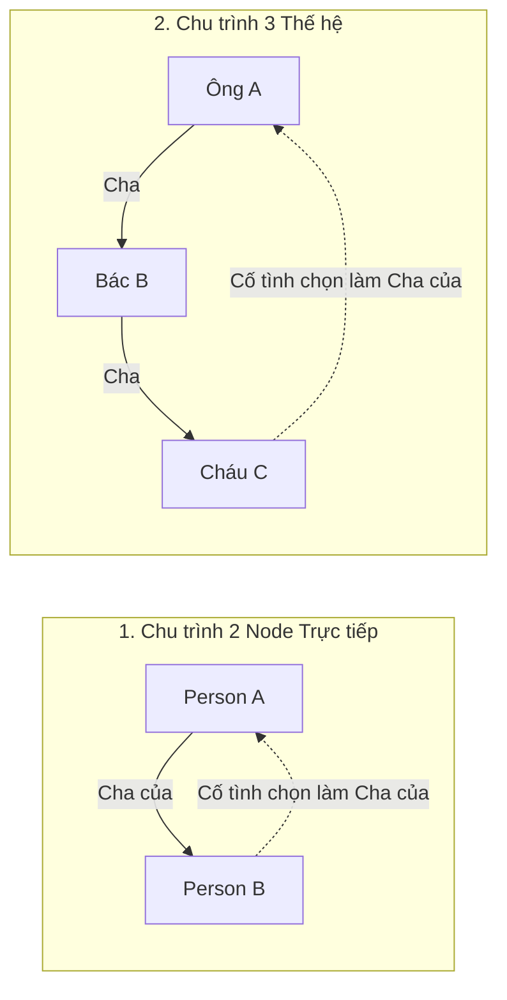

# Danh mục Các Quy tắc Bất biến Nghiệp vụ (Domain Invariants)

- **Mã tài liệu:** `DOM-INVARIANTS-01`
- **Phiên bản:** `v0.1-baseline`
- **Trạng thái:** `PROVISIONAL`
- **Ngày ban hành:** 2026-08-29

---

## 1. Bản chất của Domain Invariant

**Domain Invariant** là các điều kiện toán học và quy tắc nghiệp vụ thiêng liêng **KHÔNG BAO GIỜ ĐƯỢC PHÉP BỊ VI PHẠM** trong bất kỳ hoàn cảnh nào. Mọi thao tác người dùng (Thêm, Sửa, Liên kết, Gộp, Khôi phục) nếu vi phạm Invariant đều phải bị hệ thống **chặn đứng ngay lập tức (`BLOCKING_ERROR`)**.

---

## 2. Bảng 20 Domain Invariants Bắt buộc (The 20 Core Invariants)

| Mã Invariant | Tên Bất biến | Định nghĩa Khái niệm | Mức phạt vi phạm | Test Scenario |
| :--- | :--- | :--- | :---: | :---: |
| **`INV-001`** | Độc lập User & Person | User Account và Person là 2 thực thể độc lập, không dùng chung ID hay bảng. | `BLOCKING_ERROR` | `RTC-001`, `RTC-002` |
| **`INV-002`** | Chống Tự làm Cha/Mẹ | Một Person không thể là Cha hoặc Mẹ ruột/nuôi của chính mình. | `BLOCKING_ERROR: ERR-001` | `RTC-018` |
| **`INV-003`** | Chống Tự Kết hôn | Một Person không thể thiết lập quan hệ hôn nhân với chính mình. | `BLOCKING_ERROR: ERR-003` | `RTC-030` |
| **`INV-004`** | Đồ thị Huyết thống Không Chu trình (DAG) | Chuỗi liên kết Cha/Mẹ - Con không được tạo thành vòng lặp thế hệ (Cycles). | `BLOCKING_ERROR: ERR-002` | `RTC-023`..`RTC-027` |
| **`INV-005`** | Ranh giới Cùng Cây Gia phả | Quan hệ trực tiếp trong v0.1 chỉ nối giữa các Person trong cùng 1 `tree_id`. | `BLOCKING_ERROR: ERR-004` | `RTC-004` |
| **`INV-006`** | Độc lập Thứ tự Tạo bản ghi | Thời điểm tạo bản ghi không xác định số đời hay vai trò thế hệ. | `BLOCKING_ERROR` | `RTC-012` |
| **`INV-007`** | Người Trung tâm không phải Root | Người trung tâm chỉ là ngữ cảnh hiển thị, không phải root bất biến. | `BLOCKING_ERROR` | `RTC-010`, `RTC-011` |
| **`INV-008`** | Người Tạo đầu không mặc định là Thủy tổ | Node đầu tiên nhập liệu không tự động bị ép thành Thủy tổ đời 1. | `BLOCKING_ERROR` | `RTC-012` |
| **`INV-009`** | Tọa độ Canvas không phải Dữ liệu Nghiệp vụ | Tọa độ $(X, Y)$ của node do ELK.js tính toán, không lưu làm quan hệ. | `BLOCKING_ERROR` | `RTC-077` |
| **`INV-010`** | Cấm Tự động Điền Ngày giả | Không tự điền `01/01` khi chỉ biết năm sinh; giữ nguyên precision. | `BLOCKING_ERROR` | `RTC-049` |
| **`INV-011`** | Minh bạch Dữ liệu Chưa xác minh | Dữ liệu `UNVERIFIED` không được hiển thị mập mờ như sự thật đã chứng thực. | `BLOCKING_ERROR` | `RTC-021` |
| **`INV-012`** | Gộp Hồ sơ An toàn (Safe Merge) | Thao tác gộp 2 hồ sơ không được tạo ra Self-link hoặc Cycle mới. | `BLOCKING_ERROR: ERR-007..008` | `RTC-057`, `RTC-026` |
| **`INV-013`** | Xóa User không Xóa Person | Xóa tài khoản người dùng không mặc định xóa sạch nhân vật trong cây. | `BLOCKING_ERROR` | `RTC-003` |
| **`INV-014`** | Xóa Person không Xóa User | Xóa nhân vật trong cây không ảnh hưởng đến quyền đăng nhập tài khoản. | `BLOCKING_ERROR` | `RTC-003` |
| **`INV-015`** | Cấm Tự ý Xóa Lan truyền | Xóa 1 Person không được tự ý xóa cha mẹ, vợ chồng hoặc con cái của họ. | `BLOCKING_ERROR` | `RTC-061`..`RTC-063` |
| **`INV-016`** | Hôn nhân không Tự sinh Con | Quan hệ hôn phối không tự động biến con riêng thành con chung. | `BLOCKING_ERROR` | `RTC-034` |
| **`INV-017`** | Phụ Mẫu - Tử Tức là Nguồn Huyết thống | Quan hệ Parent-Child là nguồn sự thật duy nhất xác định dòng dõi. | `BLOCKING_ERROR` | `RTC-013`..`RTC-017` |
| **`INV-018`** | Số đời Tương đối theo Mốc | Số đời là giá trị tính toán theo Mốc (Anchor), không phải thuộc tính cố định. | `BLOCKING_ERROR` | `RTC-069`..`RTC-076` |
| **`INV-019`** | Giám hộ không Tạo Huyết thống | Người giám hộ không làm phát sinh quan hệ cha mẹ ruột hay tổ tiên. | `BLOCKING_ERROR` | `RTC-039`, `RTC-040` |
| **`INV-020`** | Cha Mẹ Kế không phải Cha Mẹ Ruột | Cha mẹ kế không được gán nhãn huyết thống hay cha mẹ sinh học. | `BLOCKING_ERROR` | `RTC-038` |

---

## 3. Đặc tả Chi tiết Cơ chế Phát hiện Chu trình (Cycle Detection Invariant - `INV-004`)

### Các Tình huống Chu trình Điển hình:

1. **Chu trình 2 Node Trực tiếp ($A \rightarrow B \rightarrow A$):**
   - *Tình huống:* A là Cha của B. Người dùng cố tình mở hồ sơ A và chọn B làm Cha của A.
   - *Hành vi:* Hệ thống chặn ngay lập tức (`ERR-002: Không thể chọn B làm Cha vì B đang là con của A`).
2. **Chu trình Đa Thế hệ ($A \rightarrow B \rightarrow C \rightarrow \dots \rightarrow A$):**
   - *Tình huống:* A là tổ tiên của C (qua chuỗi $A \rightarrow B \rightarrow C$). Người dùng chọn C làm Cha/Mẹ của A.
   - *Hành vi:* Hệ thống duyệt đồ thị phả hệ, phát hiện C là hậu duệ của A $\rightarrow$ Chặn đứng (`ERR-002`).
3. **Phân định Quan hệ Hôn phối (Spouse Edge Non-cycle):**
   - Đường nối hôn phối giữa Vợ và Chồng là đường liên kết ngang, **không tham gia vào chuỗi đồ thị có hướng Parent-Child**, do đó không gây ra chu trình thế hệ.
