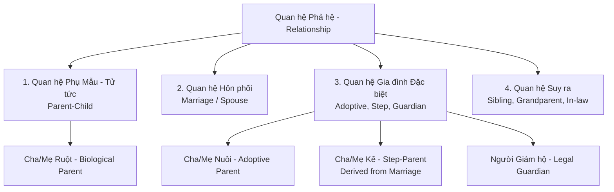

# Mô hình Các Loại Quan hệ Phả hệ (Relationship Model)

- **Mã tài liệu:** `DOM-RELMODEL-01`
- **Phiên bản:** `v0.1-baseline`
- **Trạng thái:** `PROVISIONAL`
- **Ngày ban hành:** 2026-08-29

---

## 1. Phân loại Các Mối quan hệ trong GenViet

GenViet phân loại các mối quan hệ thành 4 nhóm chính:

---

## 2. Đặc tả Chi tiết Từng Loại Quan hệ

### 2.1. Quan hệ Cha, Mẹ và Con Ruột (Biological Parent-Child) - `P02-T07`
- **Mã định danh loại:** `REL-001: BIOLOGICAL_PARENT_CHILD`
- **Bản chất:** Quan hệ huyết thống trực tiếp từ Cha/Mẹ (Parent) tới Con (Child).
- **Quy tắc hướng:** Luôn có hướng một chiều: `Parent -> Child`.
- **Ràng buộc vai trò:**
  - `FATHER`: Cha ruột (Giới tính `MALE`).
  - `MOTHER`: Mẹ ruột (Giới tính `FEMALE`).
  - `PARENT_UNSPECIFIED`: Chưa rõ là cha hay mẹ (Giới tính `UNKNOWN`).
- **Giới hạn số lượng:** Mặc định một Person chỉ có tối đa **1 Cha ruột đã xác nhận** và **1 Mẹ ruột đã xác nhận** (`BR-PC-001`).

---

### 2.2. Quan hệ Cha Mẹ Nuôi & Con Nuôi (Adoptive Parent-Child) - `P02-T08`
- **Mã định danh loại:** `REL-002: ADOPTIVE_PARENT_CHILD`
- **Bản chất:** Quan hệ nhận con nuôi hợp pháp hoặc theo phong tục gia đình, không mang tính huyết thống sinh học.
- **Quy tắc đặc thù:**
  - `BR-AD-001`: Cha mẹ nuôi **không thay thế** và có thể **đồng thời tồn tại** cùng cha mẹ ruột.
  - `BR-AD-002`: Không suy ra huyết thống tổ tiên từ nhánh cha mẹ nuôi.
  - `BR-AD-003`: Quan hệ con nuôi vẫn phải tuân thủ quy tắc chống chu trình trong đồ thị hiển thị gia đình.

---

### 2.3. Quan hệ Cha Mẹ Kế (Step-Parent) - `P02-T09`
- **Mã định danh loại:** `REL-003: STEP_PARENT` (Derived / Optional Source)
- **Bản chất:** Quan hệ giữa một người với con riêng của vợ/chồng mình.
- **Quy tắc đặc thù:**
  - `BR-SP-001`: Mặc định là **quan hệ suy ra (Derived)** từ liên kết `Marriage(Person A, Person B)` và `ParentChild(Person B, Person C)`.
  - `BR-SP-002`: Cha/Mẹ kế **tuyệt đối không được coi là Cha/Mẹ ruột** và không tham gia tính toán dòng dõi huyết thống.
  - `BR-SP-003`: Khi hôn nhân chấm dứt (ly hôn/hủy hôn), quan hệ cha mẹ kế trên giao diện tự động ẩn hoặc gắn nhãn lịch sử.

---

### 2.4. Quan hệ Người Giám hộ (Guardian) - `P02-T10`
- **Mã định danh loại:** `REL-004: GUARDIAN`
- **Bản chất:** Người chịu trách nhiệm chăm sóc, nuôi dưỡng hoặc đại diện pháp lý cho một thành viên khi cha mẹ vắng mặt hoặc đã mất.
- **Quy tắc đặc thù:**
  - `BR-GU-001`: Người giám hộ **không tạo ra quan hệ huyết thống hay tổ tiên**.
  - `BR-GU-002`: Người giám hộ không làm thay đổi số đời (Generation Number) của người được giám hộ.
  - `BR-GU-003`: Trong phiên bản v0.1, thông tin giám hộ được lưu trữ ở dạng ghi chú hồ sơ chi tiết (Profile notes), không vẽ đường nối trên cây đồ thị chính.

---

### 2.5. Quan hệ Hôn nhân & Hôn phối (Marriage / Spouse) - `P02-T11` & `P02-T12`
- **Mã định danh loại:** `REL-005: MARRIAGE`
- **Bản chất:** Quan hệ vợ chồng giữa 2 Person.
- **Quy tắc đặc thù:**
  - `BR-MA-001` (Chống Self-Spouse): Một Person **không thể kết hôn với chính mình**.
  - `BR-MA-002` (Không tự sinh con): Quan hệ hôn nhân không tự động gán các con đã có của mỗi người thành con chung. Muốn có con chung, bắt buộc phải có quan hệ Parent-Child từ cả hai người tới đứa con đó.
  - `BR-MA-003` (Bảo toàn Lịch sử khi Kết thúc Hôn nhân): Ly hôn hoặc người phối ngẫu qua đời chỉ cập nhật trạng thái (`status = DIVORCED` hoặc `WIDOWED`), không xóa bản ghi quan hệ và không làm mất con cái.
  - `BR-MA-004` (Nhiều lần Kết hôn - Multiple Spouses): Một Person có thể có nhiều mối quan hệ hôn nhân qua các thời kỳ khác nhau. Hệ thống hỗ trợ hiển thị danh sách các người phối ngẫu theo thứ tự thời gian.
