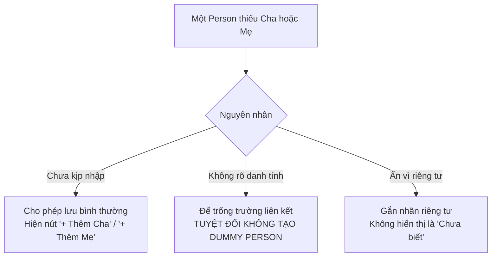

# Quy tắc Xử lý Dữ liệu Khuyết thiếu, Chưa xác minh & Mâu thuẫn (Uncertain & Conflicting Data Rules)

- **Mã tài liệu:** `DOM-UNCERTAIN-01`
- **Phiên bản:** `v0.1-baseline`
- **Trạng thái:** `PROVISIONAL`
- **Ngày ban hành:** 2026-08-29

---

## 1. Quy tắc Chưa Xác định Cha hoặc Mẹ (Unknown Parent Handling) - `P02-T13`

Trong gia phả truyền thống, rất nhiều trường hợp chỉ nhớ tên người cha mà không rõ tên người mẹ (hoặc ngược lại). GenViet xử lý các tình huống này theo nguyên tắc tôn trọng thực tế:

### Các Quy tắc Chi tiết:
1. **`UDR-001` (Cấm tạo Nhân vật Giả "Không rõ"):** Hệ thống **tuyệt đối không tạo các bản ghi Person giả** mang tên "Không rõ", "Chưa biết", "Vô danh" để lấp chỗ trống trên cây. Nếu không rõ cha hoặc mẹ, chỉ cần không tạo bản ghi quan hệ tương ứng.
2. **`UDR-002` (Tính Hợp lệ của Node Khuyết Phụ Mẫu):** Việc một Person không có Cha hoặc Mẹ (hoặc thiếu cả hai) không làm cho Person đó bị coi là lỗi. Đồ thị vẫn hiển thị và phân tầng bình thường quanh nhân vật này.
3. **`UDR-003` (Không Tự ý Đoán Giới tính / Vai trò):** Nếu người dùng chỉ biết nhân vật B là đấng sinh thành của A nhưng chưa rõ là cha hay mẹ, hệ thống lưu với vai trò `PARENT_UNSPECIFIED`, không tự tiện ép thành Cha (`FATHER`) hay Mẹ (`MOTHER`).

---

## 2. Quy tắc Trạng thái Xác minh Quan hệ (Verification States) - `P02-T14`

| Trạng thái | Mã Enum | Ý nghĩa Nghiệp vụ | Hiển thị trên UI |
| :--- | :---: | :--- | :--- |
| **Đã Xác minh** | `VERIFIED` | Thông tin chính thức, có gia phả chữ ký hoặc người lớn tuổi chứng thực. | Nét liền chuẩn (`Solid line`). |
| **Chưa Xác minh** | `UNVERIFIED` | Thông tin phỏng đoán, truyền khẩu cần kiểm chứng lại. | Nét đứt (`Dashed line`) kèm biểu tượng dấu hỏi. |
| **Đang Tranh chấp** | `DISPUTED` | Có nhiều giả thuyết khác nhau giữa các nhánh dòng họ. | Nét đứt màu cam kèm biểu tượng cảnh báo. |
| **Bị Bác bỏ** | `REJECTED` | Giả thuyết đã được chứng minh là sai sau khi đối chiếu tư liệu. | Ẩn khỏi cây chính, lưu trong lịch sử hồ sơ. |

### Quy tắc Invariant cho Quan hệ Chưa Xác minh:
- **`UDR-004` (Chống Chu trình với Quan hệ Chưa xác minh):** Dù quan hệ ở trạng thái `UNVERIFIED` hay `DISPUTED`, liên kết đó **vẫn bắt buộc phải tuân thủ 100% quy tắc chống chu trình (`INV-004`) và chống self-link (`INV-002`)**.

---

## 3. Quy tắc Dữ liệu Mâu thuẫn (Conflicting Data Rules) - `P02-T15`

### Phân loại Mâu thuẫn:
1. **Mâu thuẫn Niên đại:** Năm sinh của con lớn hơn năm mất của mẹ, hoặc khoảng cách tuổi giữa hai thế hệ $< 12$ năm hoặc $> 80$ năm.
2. **Mâu thuẫn Huyết thống:** Nhánh A nói Cụ X là con Cụ Y, nhưng Nhánh B nói Cụ X là con Cụ Z.
3. **Mâu thuẫn Trạng thái Sống:** Một hồ sơ ghi "Đã mất năm 1975", một hồ sơ khác ghi "Còn sống tại Pháp".

### Nguyên tắc Xử lý:
- **`UDR-005` (Không Tự động Ghi đè):** Khi phát hiện dữ liệu nhập mới mâu thuẫn với dữ liệu cũ, hệ thống **không tự ý chọn một bên để xóa bên kia**.
- **`UDR-006` (Cảnh báo thay vì Chặn với Mâu thuẫn Lịch sử):** Nếu mâu thuẫn chỉ thuộc về tính hợp lý lịch sử (ví dụ: mẹ sinh con năm 13 tuổi hay cha 75 tuổi mới sinh con), hệ thống lưu lại và hiển thị cảnh báo `WARN-002: Khoảng cách thế hệ bất thường`, không chặn thao tác lưu của người dùng.
