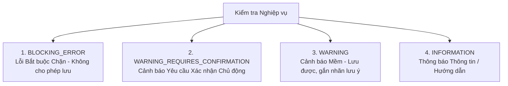

# Danh mục Phân cấp Lỗi & Cảnh báo Nghiệp vụ (Validation Severity Catalogue)

- **Mã tài liệu:** `DOM-SEVERITY-01`
- **Phiên bản:** `v0.1-baseline`
- **Trạng thái:** `PROVISIONAL`
- **Ngày ban hành:** 2026-08-29

---

## 1. Định nghĩa 4 Mức độ Kiểm tra Nghiệp vụ (Validation Severities)

---

## 2. Danh mục Chi tiết Các Quy tắc Kiểm tra

### 2.1. Nhóm Lỗi Bắt buộc Chặn (BLOCKING_ERROR - 8 Mã lỗi Cốt lõi)
*Vi phạm các Bất biến Nghiệp vụ (Domain Invariants). Hệ thống từ chối lưu dữ liệu và hiển thị thông báo lỗi cụ thể.*

| Mã Lỗi | Tên Lỗi | Điều kiện Kích hoạt | Hậu quả / Thông báo Người dùng | Invariant liên quan |
| :--- | :--- | :--- | :--- | :---: |
| **`ERR-001`** | Tự làm Cha/Mẹ của chính mình | Chọn Person A làm Cha hoặc Mẹ của chính Person A. | *"Một người không thể là cha hoặc mẹ của chính mình."* | `INV-002` |
| **`ERR-002`** | Chu trình Vòng lặp Huyết thống | Thiết lập liên kết khiến Person B (hậu duệ) trở thành Cha/Mẹ của Person A (tổ tiên). | *"Không thể thiết lập quan hệ vì gây ra vòng lặp thế hệ phi logic."* | `INV-004` |
| **`ERR-003`** | Tự Kết hôn với chính mình | Chọn Person A làm Vợ hoặc Chồng của chính Person A. | *"Một người không thể tự kết hôn với chính mình."* | `INV-003` |
| **`ERR-004`** | Liên kết Chéo Cây Gia phả | Cố tình truyền `tree_id` khác trong request tạo quan hệ. | *"Không thể liên kết thành viên thuộc hai cây gia phả khác nhau."* | `INV-005` |
| **`ERR-005`** | Ngày Mất Trước Ngày Sinh | Khai báo `death_date < birth_date` với 2 ngày chính xác (`EXACT`). | *"Ngày mất không thể diễn ra trước ngày sinh."* | `INV-010` |
| **`ERR-006`** | Quan hệ Hôn nhân Trùng lặp | Tạo thêm bản ghi kết hôn giữa A và B khi quan hệ cũ vẫn đang `ACTIVE`. | *"Hai thành viên này đã có mối quan hệ hôn nhân đang hoạt động."* | `INV-016` |
| **`ERR-007`** | Gộp Hồ sơ Tạo Self-link | Gộp 2 hồ sơ mà sau khi gộp tạo ra liên kết tự kết hôn hoặc tự làm cha mẹ. | *"Không thể gộp vì tạo ra quan hệ tự liên kết phi lý."* | `INV-012` |
| **`ERR-008`** | Gộp Hồ sơ Tạo Chu trình | Gộp 2 hồ sơ thuộc 2 nhánh làm phát sinh chu trình kín. | *"Không thể gộp vì gây ra xung đột chu trình thế hệ."* | `INV-012` |

---

### 2.2. Nhóm Cảnh báo Yêu cầu Xác nhận (WARNING_REQUIRES_CONFIRMATION - 7 Mã cảnh báo)
*Các trường hợp dữ liệu phức tạp hoặc thao tác có nguy cơ mất mát. Hệ thống yêu cầu người dùng đọc và nhấn nút "Xác nhận tiếp tục" trước khi ghi vào CSDL.*

| Mã Cảnh báo | Tên Cảnh báo | Điều kiện Kích hoạt | Hộp thoại Xác nhận |
| :--- | :--- | :--- | :--- |
| **`WARN-001`** | Thêm Cha/Mẹ Ruột thứ 2 Đã xác minh | Nhân vật đã có Cha ruột `VERIFIED`, người dùng chọn thêm Cha ruột mới. | *"Nhân vật này đã có Cha ruột là [Tên]. Bạn có muốn thay thế hay lưu dưới dạng Chưa xác minh?"* |
| **`WARN-002`** | Khoảng cách Thế hệ Bất thường | Khoảng cách tuổi giữa Cha/Mẹ và Con $< 12$ tuổi hoặc $> 80$ tuổi. | *"Khoảng cách tuổi giữa phụ mẫu và con là [X] năm (bất thường). Bạn có chắc chắn thông tin này chính xác?"* |
| **`WARN-003`** | Hôn nhân Chồng lấn Thời gian | Nhập 2 cuộc hôn nhân cùng có trạng thái `ACTIVE` mà không có ngày kết thúc. | *"Thành viên này đang có nhiều cuộc hôn nhân cùng hiệu lực. Bạn có muốn tiếp tục lưu?"* |
| **`WARN-004`** | Ngày Mất Ước tính Nghi vấn | Năm mất ước tính xấp xỉ hoặc nghi ngờ trước năm sinh. | *"Cần kiểm tra lại khoảng thời gian sinh và mất của nhân vật."* |
| **`WARN-005`** | Phát hiện Hồ sơ Khả năng Trùng cao | Thêm mới người có họ tên, năm sinh và cha mẹ trùng với người đã có. | *"Tìm thấy hồ sơ [Tên cụ thể] có thông tin tương đồng. Bạn muốn tạo người mới hay liên kết hồ sơ có sẵn?"* |
| **`WARN-006`** | Khôi phục Nhân vật có Quan hệ Xung đột | Khôi phục node từ thùng rác nhưng quan hệ cũ bị trùng với node mới thêm. | *"Một số quan hệ cũ của nhân vật bị xung đột và sẽ được chuyển sang dạng Cần kiểm tra."* |
| **`WARN-007`** | Xóa Nhân vật có Nhiều Quan hệ | Bấm xóa nhân vật đang nối với nhiều người thân trên cây. | *"Xóa nhân vật này sẽ ngắt kết nối với [N] người thân. Các người thân vẫn được giữ nguyên vẹn."* |

---

### 2.3. Nhóm Cảnh báo Mềm & Thông báo Thông tin (WARNING & INFORMATION)

| Mã | Cấp độ | Tên Thông báo | Ý nghĩa Nghiệp vụ |
| :--- | :---: | :--- | :--- |
| **`WARN-008`** | `WARNING` | Hồ sơ Thiếu Năm sinh | Hiển thị biểu tượng nhỏ nhắc người dùng bổ sung năm sinh khi có thông tin. |
| **`WARN-009`** | `WARNING` | Quan hệ Chưa Xác minh | Gắn nhãn `UNVERIFIED` (nét đứt) trên đường nối đồ thị. |
| **`INFO-001`** | `INFORMATION` | Thành viên Chưa có Cha/Mẹ | Hiển thị nút `+ Thêm Cha`, `+ Thêm Mẹ` mờ tiện ích. |
| **`INFO-002`** | `INFORMATION` | Số đời Chưa Xác định (`UNDETERMINED`) | Thông báo nhân vật này chưa có đường kết nối tới Mốc đánh số đời. |
| **`INFO-003`** | `INFORMATION` | Cây có Nhiều Cụm Rời | Thông báo có các nhánh nhỏ chưa được nối vào phả hệ chính. |
