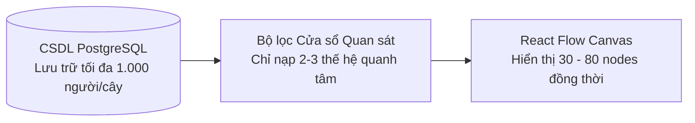

# Ràng buộc Sản phẩm, Quy mô & Tương thích (Product Constraints)

- **Mã tài liệu:** `PROD-CONSTRAINTS-01`
- **Phiên bản:** `v0.1-baseline`
- **Trạng thái:** `PROPOSED_FOR_APPROVAL`
- **Ngày ban hành:** 2026-08-29

---

## 1. Ràng buộc về Quy mô Cây Gia phả (Capacity & Scale Constraints)

Để đảm bảo hiệu năng mượt mà và không làm tràn bộ nhớ trình duyệt (đặc biệt là trên điện thoại cấu hình yếu), hệ thống xác lập các ngưỡng quy mô:

### Chi tiết Các Ngưỡng Quy mô:
| Chỉ số quy mô | Ngưỡng mục tiêu (Target) | Trạng thái kiểm chứng | Ý nghĩa thiết kế |
| :--- | :---: | :---: | :--- |
| **Số lượng thành viên lưu trữ trong 1 cây** | `1.000` người | `Target (Chưa stress-test)` | Cấu trúc CSDL PostgreSQL hoàn toàn đáp ứng tốt hàng nghìn bản ghi. |
| **Quy mô sử dụng điển hình trong thực tế** | `100 - 500` người | `Target` | Bao phủ hầu hết các gia đình và nhánh dòng họ tại Việt Nam (4 - 7 thế hệ). |
| **Quy mô kiểm thử chức năng tối thiểu v0.1** | `500` người | `Target (Phase P23/Test)` | Tiêu chuẩn để nghiệm thu kiểm thử tải của phiên bản MVP. |
| **Số thế hệ hiển thị đồng thời mặc định** | `2 - 3` thế hệ | `Target` | Mặc định chỉ bung 1 đời tiền bối (Cha/Mẹ), đời hiện tại (Bản thân/Vợ/Chồng) và 1 đời hậu duệ (Con). |
| **Số node đồ thị hiển thị đồng thời tối đa** | `50 - 80` nodes | `Target` | Đảm bảo duy trì tốc độ khung hình $\ge$ 45 - 60 FPS khi vuốt chạm trên mobile. |
| **Dung lượng ảnh đại diện tối đa cho phép** | `2 MB` / ảnh | `Target` | Tự động resize/nén ảnh trước khi lưu vào Supabase Storage. |

> **Nguyên tắc cốt lõi:** Không bao giờ render toàn bộ 1.000 node lên màn hình cùng một lúc. Hệ thống áp dụng cơ chế **Lazy Loading** theo người trung tâm (Focus Node).

---

## 2. Chính sách Hỗ trợ Thiết bị (Device Support Matrix)

| Loại thiết bị | Kích thước Viewport | Mức độ hỗ trợ | Trải nghiệm tối ưu |
| :--- | :--- | :---: | :--- |
| **Máy tính để bàn / Laptop** | $\ge 1024\text{px}$ (Desktop) | **`Supported`** | Toàn diện: Quan sát cây rộng, phím tắt, chuột cuộn zoom, nhập liệu nhiều người liên tục. |
| **Điện thoại thông minh (Smartphones)** | $360\text{px} - 767\text{px}$ (Mobile) | **`Supported`** | Ưu tiên cao: Chạm 2 ngón để zoom (Pinch-to-zoom), vuốt kéo (Pan), xem hồ sơ qua Bottom Drawer. |
| **Máy tính bảng (Tablets)** | $768\text{px} - 1023\text{px}$ (Tablet) | **`Supported`** | Co giãn linh hoạt theo tỷ lệ màn hình (Portrait & Landscape). |
| **Màn hình xoay ngang điện thoại** | Landscape mode | **`Best Effort`** | Tự động mở rộng không gian ngang cho đồ thị. |
| **Điện thoại cơ bản (Feature phones)** | N/A | **`Not Supported`** | Không hỗ trợ các dòng máy không chạy trình duyệt web hiện đại. |
| **Smart TV / Màn hình phụ** | N/A | **`Not Supported`** | Không thuộc đối tượng phục vụ của sản phẩm. |

---

## 3. Chính sách Hỗ trợ Trình duyệt (Browser Compatibility Matrix)

GenViet áp dụng chính sách hỗ trợ **2 phiên bản ổn định gần nhất** (Last 2 stable versions) của các trình duyệt hiện đại:

| Trình duyệt | Nền tảng hệ điều hành | Mức độ hỗ trợ | Ghi chú kỹ thuật |
| :--- | :--- | :---: | :--- |
| **Google Chrome** | Windows, macOS, Android | **`Supported`** | Hỗ trợ 2 phiên bản mới nhất, trải nghiệm chuẩn mực. |
| **Apple Safari** | iOS (iPhone/iPad), macOS | **`Supported`** | Hỗ trợ Safari iOS 16.0+, xử lý tốt Touch Gestures. |
| **Microsoft Edge** | Windows, macOS | **`Supported`** | Hỗ trợ nền tảng Chromium mới nhất. |
| **Mozilla Firefox** | Windows, macOS, Linux | **`Supported`** | Hỗ trợ 2 phiên bản ổn định mới nhất. |
| **Samsung Internet** | Android | **`Best Effort`** | Trải nghiệm tương đồng Google Chrome. |
| **Trình duyệt nhúng (In-app WebView)** | Zalo, Facebook Messenger | **`Best Effort`** | Khuyến khích người dùng mở ra trình duyệt ngoài để có trải nghiệm tốt nhất. |
| **Internet Explorer (Mọi phiên bản)** | Windows | **`Not Supported`** | **Cấm tuyệt đối**. Không hỗ trợ IE11 hoặc Edge Legacy. |
