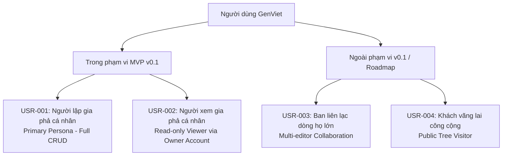

# Đối tượng Sử dụng & Chân dung Người dùng (Target Users & Personas)

- **Mã tài liệu:** `PROD-USERS-01`
- **Phiên bản:** `v0.1-baseline`
- **Trạng thái:** `PROPOSED_FOR_APPROVAL`
- **Ngày ban hành:** 2026-08-29

---

## 1. Phân định Khái niệm Cốt lõi

Để tránh nhầm lẫn nghiêm trọng trong thiết kế sản phẩm, GenViet phân định rạch ròi giữa 2 khái niệm:

1. **Tài khoản Đăng nhập (User Account):** Người thực tế sử dụng ứng dụng web, có email, mật khẩu và quyền quản trị cây gia phả.
2. **Nhân vật Gia phả (Person / Family Member Node):** Một thực thể dữ liệu đại diện cho một con người trong cây phả hệ (có thể là người đang sống, người đã khuất nhiều thế kỷ trước, hoặc trẻ sơ sinh). Nhân vật này **KHÔNG** bắt buộc phải có tài khoản đăng nhập.

---

## 2. Danh mục Nhóm Người dùng (User Groups)

---

## 3. Chân dung Người dùng Chi tiết

### USR-001: Người lập gia phả cá nhân (Individual Family Maintainer) - *Primary Persona (v0.1)*
- **Mã:** `USR-001`
- **Mức độ ưu tiên:** `P0 (Bắt buộc trong v0.1)`
- **Thuộc MVP v0.1:** **CÓ**
- **Đặc điểm:**
  - Là người chủ động trong gia đình muốn số hóa cây gia phả của gia đình nhỏ, nhánh chi hoặc dòng họ của mình.
  - Có kiến thức sử dụng máy tính và điện thoại thông minh ở mức cơ bản đến trung bình.
  - Thu thập dữ liệu gia phả từ trí nhớ người lớn tuổi, sổ tay ghi chép cũ hoặc qua các buổi giỗ chạp.
- **Mục tiêu cốt lõi:**
  - Tạo một cây gia phả riêng tư nhanh chóng.
  - Nhập từng thành viên (ông bà, cha mẹ, cô chú, con cháu) bất cứ khi nào có thông tin.
  - Xem lại cấu trúc cây trực quan để kiểm tra tính đúng đắn của các nhánh.
  - Xuất file sao lưu về máy để không sợ mất dữ liệu.
- **Khó khăn hiện tại (Pain points):**
  - Các phần mềm hiện có quá phức tạp, giao diện cổ lỗ sĩ hoặc bắt buộc phải biết rõ Thủy tổ đời 1 mới cho vẽ cây.
  - Vẽ trên giấy hoặc Excel rất khó mở rộng và khó xem trên màn hình điện thoại.
  - Lo ngại lộ thông tin riêng tư gia đình lên mạng xã hội.
- **Bối cảnh thiết bị:**
  - Sử dụng **Laptop / Desktop** khi nhập liệu số lượng lớn thành viên.
  - Sử dụng **Smartphone** khi đi gặp họ hàng, đi đám giỗ hoặc tra cứu nhanh thông tin.

---

### USR-002: Thành viên xem gia phả cá nhân (Solo Family Viewer) - *Secondary Persona (v0.1)*
- **Mã:** `USR-002`
- **Mức độ ưu tiên:** `P1`
- **Thuộc MVP v0.1:** **CÓ (Thông qua cùng tài khoản quản trị)**
- **Đặc điểm:** Người thân trong gia đình muốn xem cây gia phả để biết nguồn gốc tổ tiên, ngày giỗ chạp, quan hệ họ hàng gần xa.
- **Mục tiêu cốt lõi:**
  - Tìm kiếm một người trong họ để xem thông tin tiểu sử, ngày sinh, ngày mất.
  - Phóng to/thu nhỏ xem mối quan hệ giữa các nhánh thế hệ.
- **Bối cảnh thiết bị:** Chủ yếu là **Smartphone (Mobile Web)**.

---

### USR-003: Ban liên lạc dòng họ lớn (Extended Clan Admin) - *Roadmap (Post-MVP)*
- **Mã:** `USR-003`
- **Mức độ ưu tiên:** `P2`
- **Thuộc MVP v0.1:** **KHÔNG (Dành cho phiên bản v0.2+)**
- **Nhu cầu:** Cần phân quyền nhiều người cùng quản trị (Trưởng tộc duyệt, các chi nhánh tự cập nhật), quản lý quỹ dòng họ, ngày giỗ tập trung.

---

### USR-004: Khách vãng lai công cộng (Public Visitor) - *Out of Scope*
- **Mã:** `USR-004`
- **Mức độ ưu tiên:** `P3`
- **Thuộc MVP v0.1:** **KHÔNG**
- **Lý do loại trừ:** Vi phạm chính sách bảo mật riêng tư mặc định (Privacy by Default) của giai đoạn MVP.
