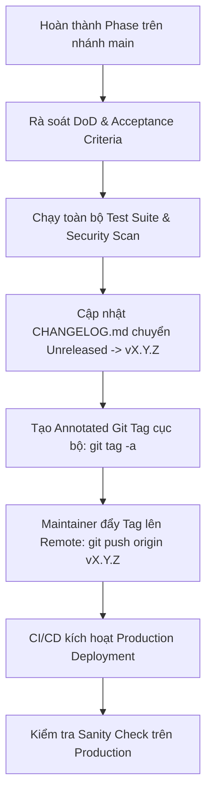

# Quy trình Đóng gói & Phát hành Phiên bản (Release Process)

Tài liệu này quy định quy trình chuẩn bị, đánh giá, tạo tag và phát hành phiên bản chính thức (Production Release) cho dự án **GenViet**.

---

## 1. Nguyên tắc Phát hành Cốt lõi

1. **Phát hành do Con người Kiểm soát (Human-Driven Releases):**
   - Các trợ lý AI **tuyệt đối không được tự ý** tạo Git Tag, tạo GitHub Release hoặc trigger quy trình deploy production.
   - Chỉ có Project Owner / Lead Maintainer mới có thẩm quyền thực hiện lệnh `git tag` và đẩy tag lên remote.
2. **Không tạo Release trong Phase Quản trị (P00):**
   - Phase P00 chỉ thiết lập quy trình và hồ sơ quản trị, không tạo tag phiên bản (`v0.1.0`), không tạo release trên GitHub và không publish bất kỳ package nào.
3. **Tuân thủ Định hướng Semantic Versioning (`vMAJOR.MINOR.PATCH`):**
   - `MAJOR`: Thay đổi lớn phá vỡ tính tương thích ngược (Breaking Changes, ví dụ: Viết lại toàn bộ mô hình CSDL gia phả).
   - `MINOR`: Thêm tính năng mới có tính tương thích ngược (ví dụ: Thêm tính năng xuất PDF cây gia phả).
   - `PATCH`: Sửa lỗi (Bug fixes) hoặc cập nhật tài liệu/bảo mật tương thích ngược.

---

## 2. Quy trình Phát hành Từng bước



### Bước 1: Chuẩn bị & Đối soát (Pre-Release Audit)
- Kiểm tra toàn bộ code trên nhánh `main` đã vượt qua 100% tiêu chí trong [Release Checklist Template](./templates/release-checklist-template.md).
- Xác minh không có lỗi `BLOCKER` hoặc `CRITICAL`.
- Xác minh toàn bộ SQL Migrations đã sẵn sàng và có script rollback tương ứng.

### Bước 2: Cập nhật CHANGELOG & Tài liệu
- Đổi tiêu đề `[Unreleased]` trong `CHANGELOG.md` thành `[vX.Y.Z] - YYYY-MM-DD`.
- Kiểm tra danh sách `Added`, `Changed`, `Fixed`, `Security` phản ánh đúng các thay đổi trong phiên bản.
- Nếu có Breaking Change, phải có mục cảnh báo riêng và hướng dẫn di chuyển dữ liệu (Migration Guide).

### Bước 3: Tạo Git Tag Cục bộ (Chỉ Maintainer thực hiện)
```bash
# Đảm bảo đang ở nhánh main sạch
git checkout main
git pull origin main

# Tạo Annotated Tag
git tag -a vX.Y.Z -m "Release vX.Y.Z: [Tóm tắt tính năng chính]"
```

### Bước 4: Đẩy Tag lên GitHub & Kích hoạt Deploy
```bash
# Đẩy tag lên remote (Chỉ con người thực hiện)
git push origin vX.Y.Z
```

### Bước 5: Kiểm tra sau phát hành & Giám sát (Post-Release Sanity Check)
- Maintainer truy cập ứng dụng trên Production để kiểm tra luồng đăng nhập, xem cây gia phả mẫu.
- Giám sát log trong 30 phút đầu sau khi deploy để đảm bảo không có exception phát sinh.

---

## 3. Quy trình Rollback Phiên bản Khẩn cấp

Nếu bản phát hành mới phát sinh lỗi nghiêm trọng đe dọa an toàn dữ liệu:
1. Kích hoạt ngay [Kế hoạch Rollback](./templates/rollback-template.md).
2. Chuyển deployment trên Vercel về bản deploy ổn định liền trước đó (Instant Rollback).
3. Chạy script rollback migration database nếu phiên bản mới có thay đổi schema.
4. Tạo commit revert trên nhánh `main` và thông báo cho người dùng.
