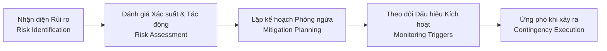

# Quản lý Rủi ro Dự án (Project Risk Management)

Thư mục này là nơi lưu trữ hồ sơ theo dõi, đánh giá và các phương án ứng phó với toàn bộ rủi ro kỹ thuật, nghiệp vụ, bảo mật và vận hành trong dự án **GenViet**.

---

## 1. Cấu trúc thư mục

- `README.md`: Hướng dẫn quản lý rủi ro (file này).
- `risk-register.md`: **Sổ đăng ký rủi ro dự án (Risk Register)** theo dõi chi tiết toàn bộ các rủi ro từ lúc phát hiện đến khi đóng.

---

## 2. Quy trình Quản lý Rủi ro

1. **Nhận diện (Identify):** Tại Cổng G0 của mỗi Phase, rà soát và phát hiện các yếu tố có khả năng gây chậm tiến độ, mất mát dữ liệu, lỗ hổng bảo mật hoặc vượt chi phí.
2. **Đánh giá (Assess):** Xác định Xác suất (Thấp / Vừa / Cao) và Tác động (Thấp / Vừa / Nghiêm trọng) để gán mức ưu tiên (`P0` đến `P3`).
3. **Phòng ngừa (Mitigate):** Xây dựng các biện pháp kỹ thuật và quy trình để giảm thiểu khả năng xảy ra rủi ro.
4. **Ứng phó (Contingency):** Chuẩn bị sẵn kịch bản xử lý nếu rủi ro thực sự biến thành sự cố (Incident).
5. **Cập nhật định kỳ:** Đối soát và cập nhật Risk Register tại Cổng G6 của mỗi phase.
