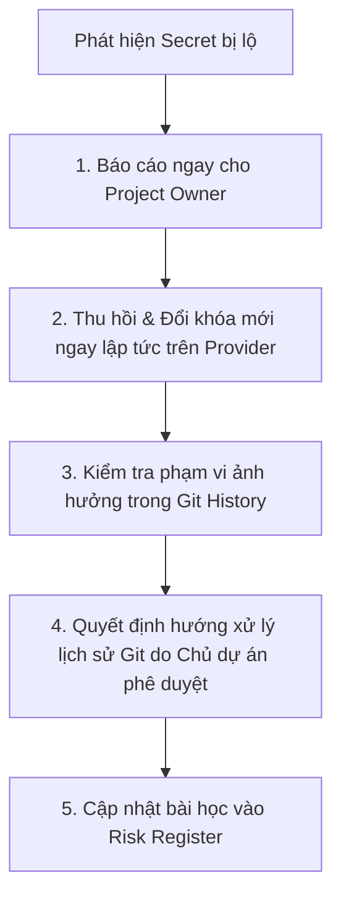

# Quy tắc Bảo mật Dự án & Quản lý Secret (Project Security Rules)

Tài liệu này xác lập các nguyên tắc bảo mật bắt buộc áp dụng cho toàn bộ thành viên phát triển và các trợ lý AI (AI Agents) tham gia vào dự án **GenViet**.

---

## 1. Nguyên tắc Quản lý Secret & Biến Môi trường

1. **Tuyệt đối không commit file cấu hình chứa Secret:**
   - Cấm commit các file: `.env`, `.env.local`, `.env.production`, `.env.development.local`, `*.pem`, `*.key`.
   - Tất cả các file này bắt buộc phải nằm trong `.gitignore`.
2. **Chỉ commit file mẫu `.env.example`:**
   - File `.env.example` chỉ chứa tên các biến môi trường và giá trị mẫu giả lập (ví dụ: `NEXT_PUBLIC_SUPABASE_URL=https://your-project.supabase.co`, `NEXT_PUBLIC_SUPABASE_ANON_KEY=your-anon-key-placeholder`).
   - Cấm đưa token, password thật vào `.env.example`.
3. **Phân quyền Supabase Keys (Public vs Private):**
   - `NEXT_PUBLIC_SUPABASE_ANON_KEY`: Được phép sử dụng ở Frontend Client (chỉ có quyền hạn theo chính sách RLS).
   - `SUPABASE_SERVICE_ROLE_KEY`: **TUYỆT ĐỐI BẢO MẬT**. Đây là khóa quản trị tối cao (bỏ qua RLS). Khóa này chỉ được phép tồn tại trên backend an toàn (Server Action / Route Handler bảo vệ) và **KHÔNG BAO GIỜ** được import vào component React chạy ở trình duyệt client.
4. **Không ghi Token/Secret vào Log:**
   - Không sử dụng `console.log(token)`, `console.log(user_credentials)` hoặc in headers chứa Bearer token vào terminal/cloud logs.

---

## 2. Bảo vệ Quyền Riêng tư Dữ liệu Gia tộc (Privacy Protection)

1. **100% Mock Data trong Kiểm thử & Tài liệu:**
   - Tuyệt đối không sử dụng thông tin thật của các gia đình, dòng họ, người sống hoặc người đã mất vào issue, PR, mock fixture hoặc tài liệu kỹ thuật.
   - Luôn dùng dữ liệu giả lập (ví dụ: "Nguyễn Văn Test A", "Trần Thị Mock B", năm sinh 1900, 1950...).
2. **Ngăn chặn rò rỉ dữ liệu chéo (Cross-tenant Isolation):**
   - Mọi bảng dữ liệu liên quan đến cây gia phả (`trees`, `persons`, `relationships`, `media`) bắt buộc phải bật Row Level Security (RLS) trên PostgreSQL.
   - Bất kỳ PR nào thêm bảng mới mà không có chính sách RLS sẽ bị từ chối ngay lập tức (Cổng G4).

---

## 3. Rà soát Diff trước khi Commit (Pre-Commit Diff Review)

- Trước khi tạo bất kỳ commit nào, người thi công / AI Agent bắt buộc phải kiểm tra `git diff` và `git status`:
  - Đảm bảo không có file lạ ngoài ý muốn.
  - Đảm bảo không có chuỗi nhạy cảm (JWT token, password, private key).
  - Đảm bảo không có đường dẫn file tuyệt đối chứa username máy tính cá nhân (`C:\Users\username\...`).

---

## 4. Quy trình Ứng phó Khẩn cấp khi Lộ Secret (Incident Response)

Nếu phát hiện một Secret (API Key, Supabase Key, Token) bị lộ trong mã nguồn hoặc commit:

### Các bước bắt buộc:
1. **Thu hồi khóa lập tức (Immediate Revocation):** Đăng nhập vào bảng điều khiển nhà cung cấp (Supabase / Cloudflare / Vercel) và thu hồi (Revoke/Regenerate) khóa bị lộ ngay lập tức. Khóa cũ phải bị vô hiệu hóa trong vòng 5 phút.
2. **Không tự ý xóa lịch sử Git:** Nếu secret đã bị commit vào lịch sử Git, việc tạo một commit mới để xóa file **KHÔNG ĐỦ** để bảo vệ secret. Tuy nhiên, AI **TUYỆT ĐỐI KHÔNG ĐƯỢC TỰ Ý** dùng `git filter-branch`, `BFG` hoặc force-push để sửa lịch sử mà phải thông báo để Project Owner quyết định phương án xử lý.
3. **Đánh giá thiệt hại:** Kiểm tra audit log xem khóa bị lộ có bị truy cập bất thường hay không.

---

## 5. Quy tắc An toàn dành cho AI Agents

- **Không gửi dữ liệu repository ra ngoài:** AI không được tự ý gửi nội dung mã nguồn, tài liệu nội bộ sang các dịch vụ web bên ngoài khi chưa có sự cho phép tường minh của người dùng.
- **Không tự động giải quyết sự cố bảo mật bằng force push:** Báo cáo ngay trạng thái `BLOCKED` với mức độ `CRITICAL` khi phát hiện lỗ hổng bảo mật.
