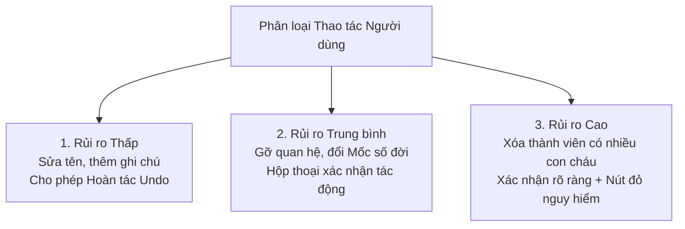

# Bộ Quy chuẩn Xác nhận Thao tác Nguy hiểm (Dangerous Action UX Patterns)

- **Mã tài liệu:** `UX-PATTERNS-DANGER-01`
- **Phiên bản:** `v0.1-baseline`
- **Trạng thái:** `PROVISIONAL`
- **Ngày ban hành:** 2026-08-29

---

## 1. Phân loại 3 Mức độ Rủi ro của Thao tác

---

## 2. Danh mục Mẫu Xác nhận Thao tác Chi tiết

### 2.1. Thao tác Mức Cao: Xóa Mềm Thành viên có Quan hệ (`CONF-002`)
- **Nguyên tắc:**
  - Nút xác nhận có nhãn hành động cụ thể: `[ 🗑️ XÁC NHẬN XÓA MỀM ]` (Màu đỏ mờ hoặc viền cảnh báo).
  - Nút `[ HỦY BỎ ]` là lựa chọn an toàn được **nhận Focus mặc định** khi mở hộp thoại hoặc khi người dùng bấm phím `ESC` / `Enter`.
  - Phải hiển thị bảng xem trước tác động ngắt liên kết và câu cam kết bảo toàn dữ liệu người thân (`INV-015`).

### 2.2. Thao tác Mức Trung bình: Thay đổi Mốc Đánh Số Đời (`CONF-003`)
- **Tình huống:** Người dùng đổi Mốc Đời 1 từ Cụ A sang Cụ B.
- **Hộp thoại Thông báo:**
  > *"⚠️ **Lưu ý thay đổi số đời:** Việc chọn [Tên Cụ B] làm Mốc mới sẽ tính toán lại số đời hiển thị cho toàn bộ con cháu theo Cụ B. Mối quan hệ huyết thống giữa các thành viên vẫn được giữ nguyên vẹn."*
  > `[ Hủy bỏ ]`   `[ XÁC NHẬN ĐỔI MỐC ĐỜI ]`

### 2.3. Thao tác Thoát khi có Dữ liệu Chưa Lưu (`CONF-001`)
- **Tình huống:** Người dùng đang nhập dở hồ sơ hoặc form quan hệ rồi bấm nút đóng / bấm ra ngoài.
- **Hộp thoại Thông báo:**
  > *"Bạn có các thay đổi chưa được lưu. Bạn có chắc chắn muốn thoát mà không lưu lại?"*
  > `[ Tiếp tục chỉnh sửa ]`   `[ Rời khỏi không lưu ]`
