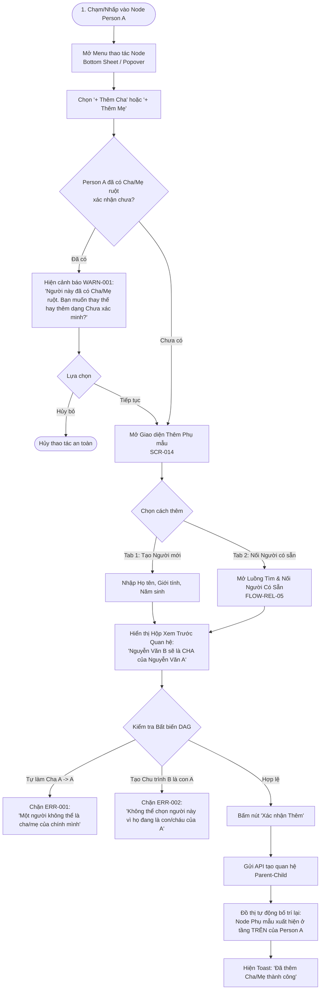

# Luồng Trải nghiệm: Thêm Cha & Thêm Mẹ (Add Parent Flow)

- **Mã Flow:** `FLOW-REL-01` (Thêm Cha) & `FLOW-REL-02` (Thêm Mẹ)
- **Mã Màn hình liên quan:** `SCR-014` (Add Parent Dialog / Sheet), `SCR-017` (Link Existing Person)
- **Actor:** Người quản trị cây gia phả
- **Mức độ Ưu tiên:** `MUST`

---

## 1. Sơ đồ Luồng Thêm Phụ Mẫu (Mermaid Flowchart)

---

## 2. Đặc tả Chi tiết Trải nghiệm Thao tác

### 2.1. Hai Phương thức Thêm Phụ Mẫu
1. **Phương thức 1: Tạo Người Mới (Mặc định):**
   - Form điền nhanh Họ tên và Năm sinh.
   - Giới tính được tự động chọn trước theo hành động (`MALE` khi bấm Thêm Cha, `FEMALE` khi bấm Thêm Mẹ).
2. **Phương thức 2: Liên kết Người Đã Có trong Cây:**
   - Người dùng chuyển sang tab *"Chọn người có sẵn"*.
   - Nhập tên tìm kiếm và chọn từ danh sách hiển thị kèm năm sinh để đối chiếu.

### 2.2. Hành vi Bố trí Đồ thị Sau khi Thêm Tổ tiên
- **Mở rộng Đa chiều Tự nhiên:** Node Cha/Mẹ mới lập tức xuất hiện ở **hàng ngang phía trên** của Person A với đường nối huyết thống hướng xuống A.
- **Bảo toàn Khung nhìn (`UXR-008`):** Trọng tâm màn hình vẫn giữ nguyên quanh Person A, người dùng có thể nhấp vào Node Cha/Mẹ mới để tiếp tục bấm `+ Thêm Ông/Bà` lên cao hơn nữa.
