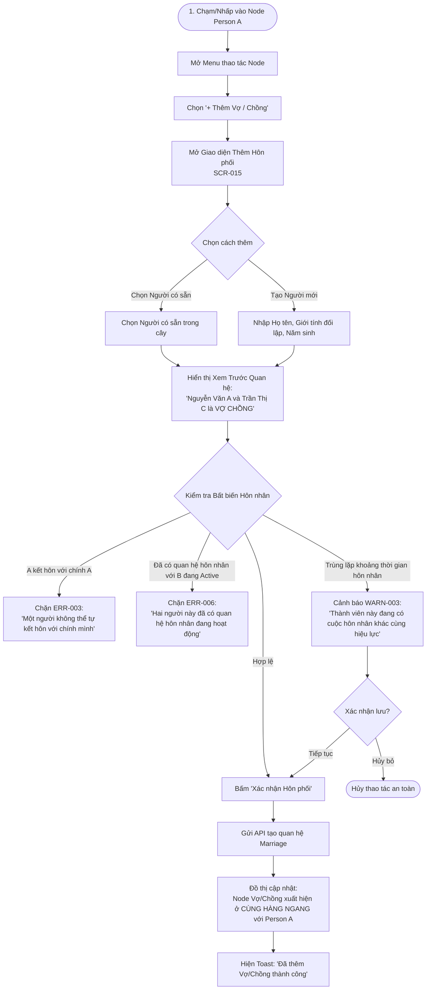

# Luồng Trải nghiệm: Thêm Vợ / Chồng (Add Spouse Flow)

- **Mã Flow:** `FLOW-REL-03`
- **Mã Màn hình liên quan:** `SCR-015` (Add Spouse Dialog / Sheet), `SCR-017` (Link Existing Person)
- **Actor:** Người quản trị cây gia phả
- **Mức độ Ưu tiên:** `MUST`

---

## 1. Sơ đồ Luồng Thêm Người Phối ngẫu (Mermaid Flowchart)

---

## 2. Đặc tả Chi tiết Trải nghiệm Thao tác

### 2.1. Hành vi Đồ thị và Dữ liệu
- **Bố trí Ngang Cùng Thế hệ:** Node Người phối ngẫu được xếp cạnh bên Person A, nối với nhau bằng đường liên kết hôn nhân ngang (`Marriage line`).
- **Không Tự động Gán Con Chung (`INV-016`):** Thêm vợ/chồng mới cho Person A không tự động gán các con riêng đã có của A thành con của người vợ/chồng mới này.
- **Hỗ trợ Nhiều lần Kết hôn:** Nếu Person A đã có vợ/chồng trước đó (đã ly hôn hoặc đã mất), giao diện hiển thị danh sách các người phối ngẫu theo thứ tự thời gian.
