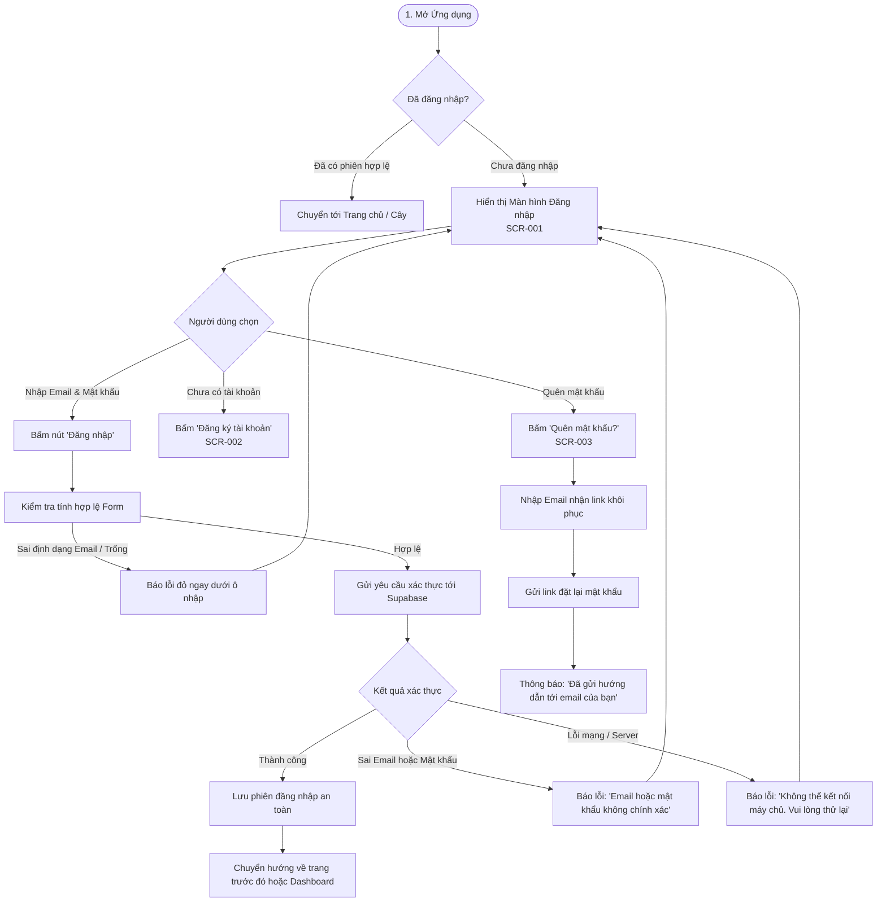

# Luồng Trải nghiệm: Xác thực & Đăng nhập (Authentication Flow)

- **Mã Flow:** `FLOW-AUTH-01`
- **Mã Màn hình liên quan:** `SCR-001` (Login), `SCR-002` (Sign-up), `SCR-003` (Forgot Password), `SCR-004` (Reset Password)
- **Actor:** Người dùng vãng lai / Người quản trị dòng họ
- **Mức độ Ưu tiên:** `MUST`

---

## 1. Sơ đồ Luồng Đăng nhập & Xác thực (Mermaid Flowchart)

---

## 2. Đặc tả Chi tiết Các Bước Tương tác

### 2.1. Đường dẫn Chính (Happy Path)
1. Người dùng mở đường dẫn `genviet.app` $\rightarrow$ Hệ thống kiểm tra phiên $\rightarrow$ Nếu chưa đăng nhập, chuyển tới `SCR-001` (`/login`).
2. Người dùng nhập `Email` (có gợi ý bàn phím email trên mobile) và `Mật khẩu`.
3. Bấm **"Đăng nhập"** $\rightarrow$ Nút chuyển sang trạng thái Loading (Spinner nhỏ, vô hiệu hóa click lặp).
4. Hệ thống xác thực thành công $\rightarrow$ Chuyển tiếp ngay tới Dashboard `SCR-005` hoặc Cây gia phả đang mở gần nhất.

### 2.2. Xử lý Lỗi & Khôi phục (Error & Recovery Path)
- **Sai thông tin đăng nhập:** Hiển thị thông báo thân thiện: *"Email hoặc mật khẩu không chính xác. Vui lòng kiểm tra lại hoặc bấm Quên mật khẩu."* (Không để lộ email có tồn tại hay không).
- **Mất kết nối mạng:** Hiển thị Toast cảnh báo màu vàng kèm nút *"Thử lại"*.
- **Phiên hết hạn (Session Expired):** Tự động mở modal đăng nhập lại nhẹ nhàng, giữ nguyên dữ liệu form chưa kịp lưu nếu có thể.

### 2.3. Trải nghiệm trên Mobile vs Desktop
- **Mobile ($375\text{px}$):** Form full-width, nút Đăng nhập to $\ge 48\text{px}$, bật `autocomplete="email"`, tự động cuộn màn hình khi bàn phím ảo xuất hiện.
- **Desktop ($1440\text{px}$):** Form căn giữa màn hình với hình ảnh minh họa cây gia phả mang phong cách văn hóa truyền thống ở nửa bên trái.
