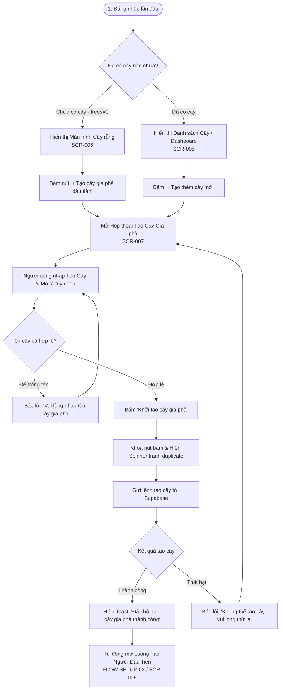

# Luồng Trải nghiệm: Tạo Cây Gia phả Mới (Create Family Tree Flow)

- **Mã Flow:** `FLOW-SETUP-01`
- **Mã Màn hình liên quan:** `SCR-005` (Dashboard), `SCR-006` (Empty State), `SCR-007` (Create Tree Modal)
- **Actor:** Người dùng mới đăng ký / Người quản trị cây
- **Mức độ Ưu tiên:** `MUST`

---

## 1. Sơ đồ Luồng Khởi tạo Cây Gia phả (Mermaid Flowchart)

---

## 2. Đặc tả Chi tiết Các Bước Tương tác

### 2.1. Các Trường Thông tin Form Tạo Cây (`SCR-007`)
- **Tên Cây Gia phả (Bắt buộc):** Ví dụ: *"Gia phả họ Nguyễn (Chi phái Nam Định)"* (Giới hạn tối đa 100 ký tự).
- **Mô tả / Ghi chú (Tùy chọn):** Ghi chú nguồn gốc, quê quán hoặc chi nhánh dòng họ.
- **Quyền Riêng tư (Cố định mặc định):** Gắn nhãn *"Riêng tư (Chỉ tài khoản của bạn có quyền xem & chỉnh sửa)"*.

### 2.2. Hành vi Chuyển tiếp Sau khi Tạo Cây
- **Chuyển tiếp Tự nhiên (Zero-friction Onboarding):** Ngay sau khi bấm tạo cây thành công, hệ thống không để người dùng rơi vào màn hình canvas trống trơn mà **tự động mở ngay hộp thoại Tạo Người Đầu Tiên (`FLOW-SETUP-02`)** với thông điệp:
  > *"Cây gia phả đã sẵn sàng! Hãy bắt đầu bằng cách nhập thành viên đầu tiên (có thể là bạn, cha mẹ hoặc cụ tổ dòng họ)."*
