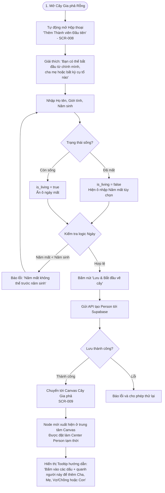

# Luồng Trải nghiệm: Tạo Người Đầu Tiên trên Cây (Create Initial Person Flow)

- **Mã Flow:** `FLOW-SETUP-02`
- **Mã Màn hình liên quan:** `SCR-008` (Create Initial Person Dialog), `SCR-009` (Tree Canvas)
- **Actor:** Người quản trị cây gia phả
- **Mức độ Ưu tiên:** `MUST`

---

## 1. Sơ đồ Luồng Khởi tạo Thành viên Đầu tiên (Mermaid Flowchart)

---

## 2. Đặc tả Chi tiết Trải nghiệm

### 2.1. Các Nguyên tắc Thiết kế Cốt lõi
1. **Không Áp đặt Danh hiệu Thủy tổ (`INV-008`):** Tiêu đề form là *"Thêm thành viên đầu tiên"*, tuyệt đối không ghi *"Nhập cụ Thủy tổ dòng họ"*.
2. **Hỗ trợ Ngày tháng Mềm dẻo (`INV-010`):** Trường ngày sinh cho phép người dùng chỉ nhập năm (ví dụ: `1985`) hoặc chọn ngày đầy đủ nếu nhớ chính xác.
3. **Chuyển tiếp Vào Trạng thái Sẵn sàng Tương tác:** Sau khi lưu thành công, node vừa tạo xuất hiện ở chính giữa Canvas React Flow với 4 nút tắt tiện ích nhanh xung quanh:
   - `[ ↑ Thêm Cha / Mẹ ]` ở phía trên
   - `[ ↔ Thêm Vợ / Chồng ]` ở bên cạnh
   - `[ ↓ Thêm Con cái ]` ở phía dưới
