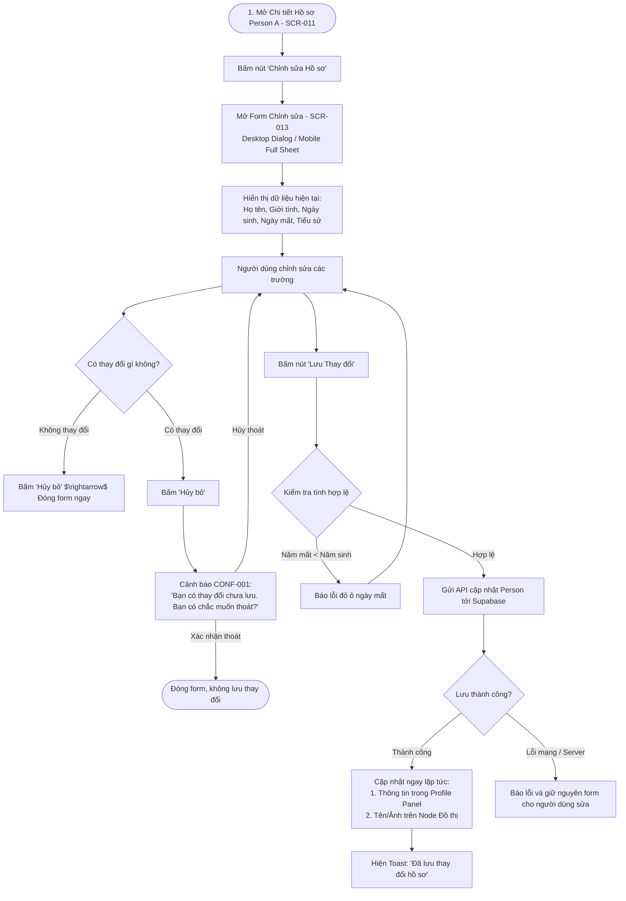

# Luồng Trải nghiệm: Chỉnh sửa Hồ sơ Thành viên (Edit Person Flow)

- **Mã Flow:** `FLOW-PERSON-01`
- **Mã Màn hình liên quan:** `SCR-011` (Person Profile), `SCR-013` (Edit Person Form)
- **Actor:** Người quản trị cây gia phả
- **Mức độ Ưu tiên:** `MUST`

---

## 1. Sơ đồ Luồng Chỉnh sửa Hồ sơ (Mermaid Flowchart)

---

## 2. Đặc tả Chi tiết Trải nghiệm

### 2.1. Bảo toàn Ngữ cảnh Không Gian
- Khi chỉnh sửa tên hoặc ảnh của một người, vị trí của họ trên Canvas đồ thị và trọng tâm `Center Person` **hoàn toàn được giữ nguyên**, không gây xáo trộn đồ thị.
- Form phân nhóm gọn gàng:
  1. *Thông tin cơ bản:* Họ tên, Giới tính, Trạng thái còn sống/đã mất.
  2. *Niên đại:* Ngày sinh và Ngày mất (kèm bộ chọn cấp độ chính xác Date Precision).
  3. *Tiểu sử & Ghi chú:* Quê quán, nơi an táng, sự nghiệp.
