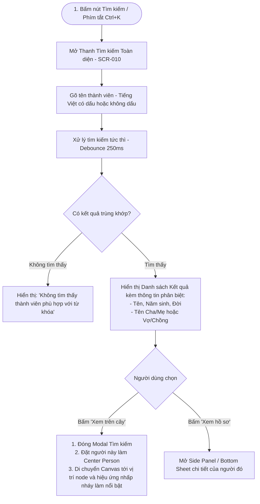

# Luồng Trải nghiệm: Tra cứu & Tìm kiếm Thành viên (Search Person Flow)

- **Mã Flow:** `FLOW-SEARCH-01`
- **Mã Màn hình liên quan:** `SCR-010` (Search Modal / Page), `SCR-009` (Tree Canvas Focus)
- **Actor:** Người dùng tra cứu gia phả
- **Mức độ Ưu tiên:** `MUST`

---

## 1. Sơ đồ Luồng Tìm kiếm Thành viên (Mermaid Flowchart)

---

## 2. Đặc tả Chi tiết Trải nghiệm

### 2.1. Tìm kiếm Tiếng Việt Linh hoạt
- Hệ thống hỗ trợ tìm kiếm cả tiếng Việt có dấu (`Nguyễn Văn Nam`) và không dấu (`nguyen van nam`), không phân biệt chữ hoa / chữ thường.
- Kết quả tra cứu hiển thị tức thì với độ trễ phản hồi $\le 100\text{ms}$.
- Khi chọn *"Xem trên cây"*, Canvas mượt mà di chuyển (Smooth Pan) đưa nhân vật được chọn vào đúng giữa màn hình với hiệu ứng sáng viền trong 2 giây.
