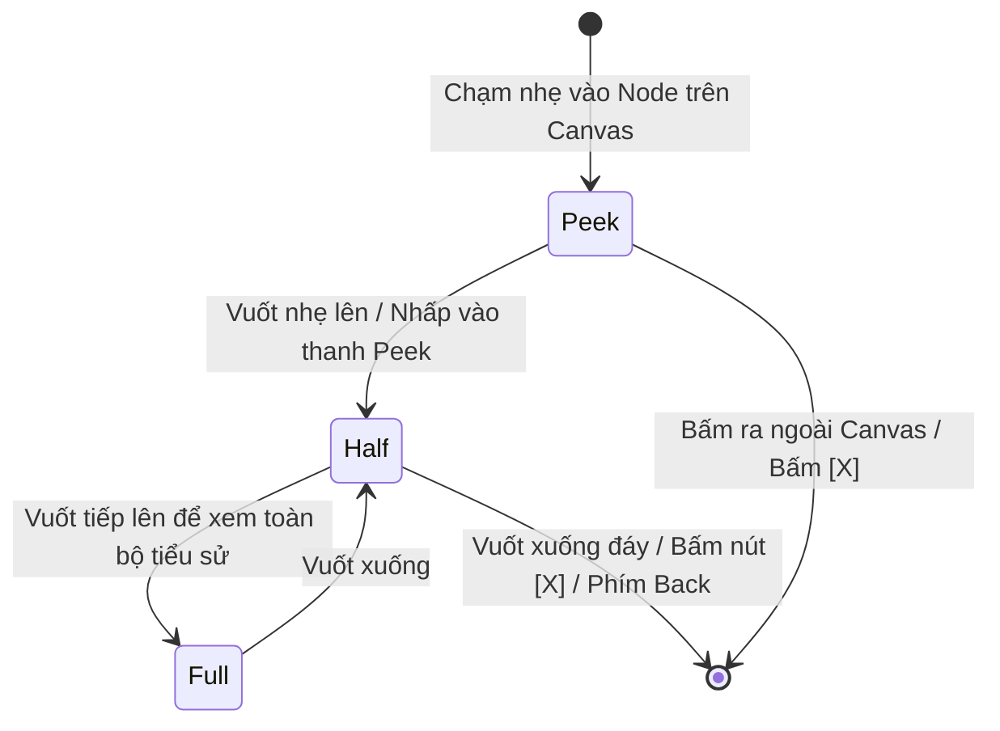

# Đặc tả Ngăn Kéo Đáy Di động (Mobile Bottom Sheet Specification)

- **Mã tài liệu:** `UX-SHEET-01`
- **Phiên bản:** `v0.1-baseline`
- **Trạng thái:** `PROVISIONAL`
- **Ngày ban hành:** 2026-08-29

---

## 1. 3 Nấc Trạng thái của Bottom Sheet (3-Tier Heights)

1. **Nấc 1: Thanh Thu gọn (Peek Bar - Chiều cao $\sim 80\text{px}$):**
   - Hiển thị Họ tên, năm sinh và nút `[ 🎯 Đặt làm trung tâm ]`.
   - Giúp người dùng vừa xem tên vừa quan sát được toàn cảnh đồ thị cây.
2. **Nấc 2: Nửa Màn hình (Half Sheet - Chiều cao $\sim 45\%$ Viewport):**
   - Hiển thị thông tin cha mẹ, vợ chồng, con cái và các nút thao tác chính (`+ Thêm Cha`, `+ Thêm Mẹ`, `+ Thêm Vợ/Chồng`, `+ Thêm Con`).
3. **Nấc 3: Toàn màn hình (Full Sheet - Chiều cao $\sim 90\%$ Viewport):**
   - Dành cho việc đọc toàn bộ tiểu sử, công đức, xem ảnh chân dung lớn hoặc điền form chỉnh sửa hồ sơ dài.

---

## 2. Các Quy chuẩn Tương tác Bắt buộc

1. **Luôn có Nút Đóng Rõ ràng (`A11Y-008`):** Luôn có nút `[X]` ở góc trên bên phải để đóng sheet, không bắt buộc người dùng phải biết cử chỉ vuốt (drag gesture).
2. **Quản lý Nút Back Di động:** Khi người dùng bấm phím Back vật lý trên Android hoặc vuốt mép màn hình: Sheet sẽ đóng lại trước, giữ người dùng ở lại trang Cây gia phả (không bị thoát ứng dụng).
3. **Không Lồng Sheet Phức tạp (No Nested Bottom Sheets):** Khi người dùng đang ở Sheet xem hồ sơ và bấm *"Thêm Con"*, hệ thống chuyển đổi mượt mà nội dung bên trong sheet sang form thêm con, không mở thêm một sheet thứ hai đè lên sheet thứ nhất.
